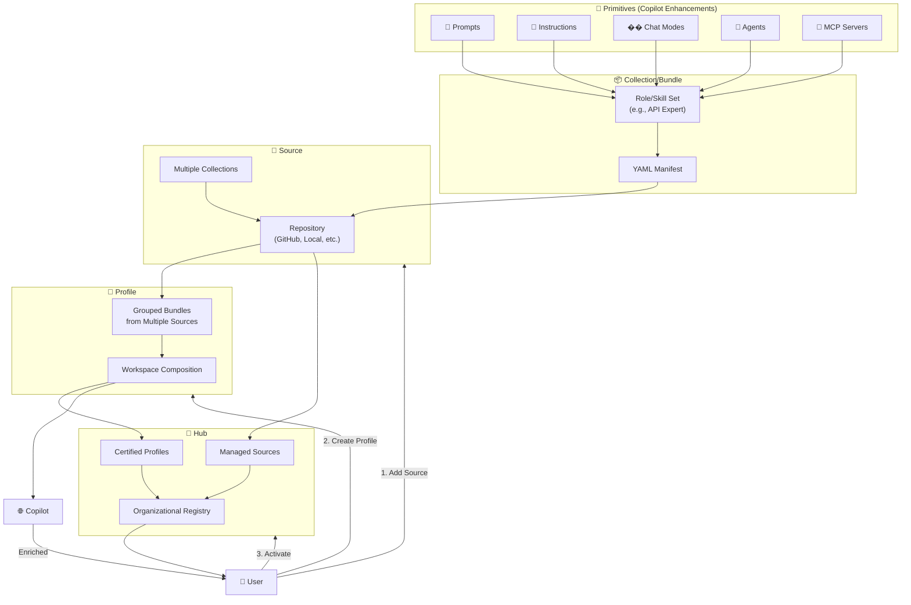
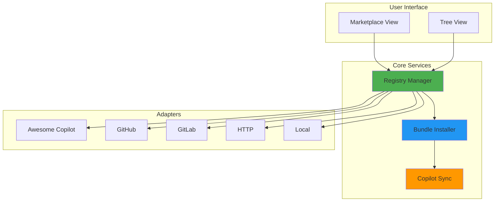
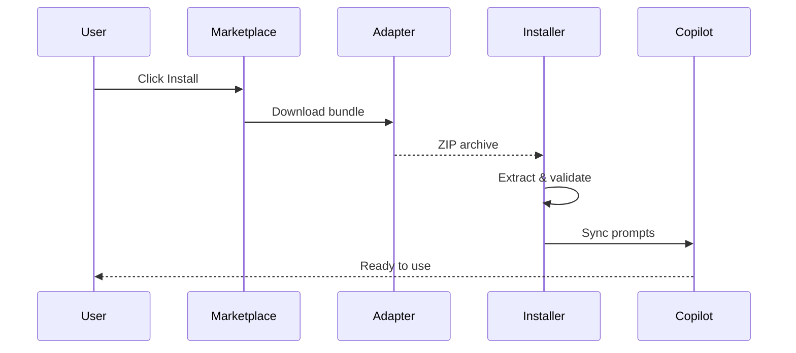

# 🎨 Prompt Registry

> A visual marketplace for discovering, installing, and managing GitHub Copilot prompt libraries from multiple sources.

[](https://marketplace.visualstudio.com/items?itemName=AmadeusITGroup.prompt-registry)
[](https://opensource.org/licenses/Apache-2.0)
[](https://github.com/AmadeusITGroup/prompt-registry)

---

## 📋 Table of Contents

- [Overview](#overview)
- [Terminology & Architecture](#terminology--architecture)
- [Features](#features)
- [Installation](#installation)
- [Quick Start](#quick-start)
- [Usage](#usage)
  - [Browsing the Marketplace](#browsing-the-marketplace)
  - [Installing Bundles](#installing-bundles)
  - [Managing Sources](#managing-sources)
  - [Working with Profiles](#working-with-profiles)
- [Supported Sources](#supported-sources)
- [Architecture](#architecture)
- [Configuration](#configuration)
- [Troubleshooting](#troubleshooting)
- [Contributing](#contributing)
- [License](#license)

---

## 🌟 Overview

**Prompt Registry** transforms how you discover and manage GitHub Copilot prompts. Instead of manually copying prompt files or cloning repositories, browse a visual marketplace, search by tags, and install curated prompt libraries with a single click.


### Why Prompt Registry?

- 🎯 **Discover** - Browse curated prompt collections from multiple sources
- ⚡ **Install** - One-click installation with automatic Copilot sync
- 🔄 **Manage** - Update, organize, and uninstall bundles easily
- 👥 **Share** - Create and distribute your own prompt libraries
- 🌍 **Multi-Platform** - Works on macOS, Linux, and Windows

---

## 📚 Terminology & Architecture

Understanding how Prompt Registry organizes your Copilot enhancements:

### Core Concepts

**Primitives** (Bottom Layer)
- **Prompts** - Reusable prompt templates for specific tasks
- **Instructions** - System instructions and guidelines
- **Chat Modes** - Conversation configurations
- **Agents** - Autonomous task execution patterns
- **MCP Servers** - Model Context Protocol integrations

**Collection** (Organization Layer)
A logical grouping of primitives around a specific role, persona, or job function. Think of it as a skill set or expertise area—e.g., "API Documentation Expert" or "Code Review Specialist". Collections live in repositories (sources) exposed via YAML manifests.

**Bundle** (Deployment Unit)
A deployable package representing a collection. Currently used interchangeably with "collection," but enables future support for non-collection source types.

**Source** (Repository Layer)
A repository hosting one or more bundles/collections. Examples: GitHub repo, local directory, or Awesome Copilot registry.

**Profile** (Composition Layer)
A logical grouping of bundles from multiple sources. Allows you to compose skills from different teams/organizations into a unified workspace setup—activate with a single click.

**Hub** (Enterprise Layer)
A centralized repository of versioned, certified profiles and sources. Like an OS release: pre-tested combinations of tools guaranteed to work well together. Share across your organization to simplify setup and ensure consistency.

### Architecture Diagram



### Real-Life Example: Enterprise AI Engineering Hub

**Scenario:** Your organization wants to standardize AI engineering across teams.

```
🏢 Corporate AI Hub (Central Management)
├── 📁 Source: DataTeam/ml-prompts (GitHub)
│   └── 📦 Bundle: "ML Model Training"
│       ├── 📝 Prompts: Training scripts, debugging tips
│       ├── 📖 Instructions: Best practices
│       └── 🔌 MCP: Model evaluation servers
│
├── 📁 Source: SecurityTeam/secure-coding (GitHub)
│   └── 📦 Bundle: "Security Code Review"
│       ├── 📝 Prompts: Vulnerability patterns
│       ├── 📖 Instructions: OWASP guidelines
│       └── �� Chat Mode: Interactive security audit
│
└── 👥 Profile: "Junior Engineer Onboarding"
    ├── ✅ Bundle: ML Model Training (v2.1.0)
    ├── ✅ Bundle: Security Code Review (v1.5.0)
    ├── ✅ Bundle: API Documentation (v3.0.0)
    └── ✅ Bundle: Testing Best Practices (v1.8.0)

👤 New Engineer Workflow:
1. Opens VS Code
2. Opens Prompt Registry → "Import Hub"(optional)
3. Clicks "Activate Profile: Junior Engineer Onboarding"
4. ✅ All skills installed in one click
5. Ready to code with Copilot enhancements from day 1!
```

**Benefits:**
- ⏱️ **Onboarding:** Minutes instead of days
- 🎯 **Consistency:** All engineers use certified versions
- 🔄 **Updates:** Hub maintainers update once, everyone gets new versions
- 👥 **Collaboration:** Cross-team skills easily shared

---

## ✨ Features

### 🎨 Visual Marketplace

Browse prompt bundles in a modern, tile-based interface inspired by VS Code's extension marketplace:

- **Rich Metadata**: See descriptions, tags, content breakdown, and installation status
- **Search & Filter**: Find prompts by keywords, tags, or content type
- **Content Preview**: View detailed information before installing
- **One-Click Install**: Install bundles instantly from the marketplace

### 🔌 Multi-Source Support

Connect to various prompt sources:

*Note:* some of the flows are still experimental and may not work perfectly.

| Source Type | Description | Use Case |
|------------|-------------|----------|
| **Awesome Copilot** | Curated community collections | Discover popular prompts |
| **Local Awesome Copilot** | Local awesome-copilot collections | Develop/test collections locally |
| **GitHub** | Direct from GitHub repositories | Team/project-specific prompts |
| **Local** | File system directories | Private/offline prompts |

### 📦 Bundle Management

- **Install/Uninstall**: Manage bundles through UI or commands
- **Version Control**: Track installed versions
- **Auto-Sync**: Automatic synchronization with GitHub Copilot
- **Conflict Resolution**: Handle duplicate bundles gracefully

### 👥 Profile Management

Organize prompts by project, team, or environment:

```
Work Projects Profile
  ├── testing-automation (v1.0.0)
  ├── code-review (v2.1.0)
  └── api-documentation (v1.5.0)

Personal Profile
  ├── creative-writing (v1.0.0)
  └── learning-resources (v0.9.0)
```

### ⚙️ Settings Management

Export and import your entire Prompt Registry configuration:

- **📤 Export** - Save sources, profiles, and settings to JSON/YAML
- **📥 Import** - Restore configuration with merge or replace strategies
- **🔄 Backup** - Keep configuration safe before changes
- **👥 Share** - Distribute team configurations easily
- **💾 Version Control** - Track settings in Git with YAML format


### 🌍 Cross-Platform

Automatically detects and uses the correct directories:

- **macOS**: `~/Library/Application Support/Code/User/prompts`
- **Linux**: `~/.config/Code/User/prompts`
- **Windows**: `%APPDATA%/Code/User/prompts`

Supports all VS Code flavors: Stable, Insiders, and Windsurf.

---

## 📦 Installation

### From VS Code Marketplace

1. Open VS Code
2. Press `Ctrl+Shift+X` (or `Cmd+Shift+X` on macOS)
3. Search for "Prompt Registry"
4. Click **Install**

### From VSIX

```bash
# Download the latest .vsix file
code --install-extension prompt-registry-2.0.0.vsix
```

### From Source

```bash
git clone https://github.com/AmadeusITGroup/prompt-registry.git
cd prompt-registry
npm install
npm run compile
code --install-extension .
```

---

## 🚀 Quick Start

### 1. Add a Source

First, add a prompt source to the registry:

```
Ctrl+Shift+P → "Prompt Registry: Add Source"
```

Choose a source type:
- **Awesome Copilot Collection** - Pre-configured curated prompts
- **GitHub Repository** - Enter repository URL
- **Local Directory** - Select a folder

### 2. Browse the Marketplace

Open the Prompt Registry Marketplace:

```
Click "MARKETPLACE" in the Prompt Registry sidebar
```

Or use the command:

```
Ctrl+Shift+P → "Prompt Registry: Open Marketplace"
```

### 3. Install a Bundle

Click on any bundle tile to view details, then click **Install**.

Your prompts are now available in GitHub Copilot! 🎉

---

## 📖 Usage

### Browsing the Marketplace

The marketplace provides multiple ways to discover prompts:

#### Search
```
Type in the search box to filter by:
- Bundle name
- Description keywords
- Tags
```

#### Filter by Content Type
```
Click filter buttons to show only:
- Prompts
- Instructions
- Chat Modes
- Agents
```

#### View Details
```
Click on any bundle tile to see:
- Full description
- Content breakdown (prompts, instructions, etc.)
- Installation information
- Tags and metadata
- List of included files
```

### Installing Bundles

#### From Marketplace

1. **Browse** - Find a bundle in the marketplace
2. **Review** - Click the tile to view details
3. **Install** - Click the **Install** button
4. **Verify** - Check the installed badge appears

#### From Tree View

1. **Navigate** - Go to Registry Explorer in sidebar
2. **Find** - Locate a bundle under a source
3. **Install** - Right-click → "Install Bundle"

#### From Command Palette

```bash
Ctrl+Shift+P → "Prompt Registry: Install Bundle"
# Select source → Select bundle → Confirm
```

### Managing Sources

#### Add Source

```bash
Ctrl+Shift+P → "Prompt Registry: Add Source"
```

**Awesome Copilot Collection** (Recommended for beginners):
- Pre-configured
- Curated community prompts
- Automatically updated

**GitHub Repository**:
- Repository URL: `https://github.com/owner/repo`
- Branch: `main` (optional)
- Collections Path: `collections` (optional)

**Local Directory**:
- Select a folder containing `deployment-manifest.yml`

#### Edit Source

```bash
Right-click source in tree view → "Edit Source"
```


---

## 🎨 Creating Prompt Projects

### Scaffold Command

Quickly create a new GitHub Copilot prompt project with proper structure:

```
Ctrl+Shift+P → "Prompt Registry: Scaffold Awesome Copilot Project"
```

The scaffold will create:
- **Prompts** - Sample prompt files
- **Instructions** - Getting started guides
- **Chat Modes** - Conversation configurations
- **Collections** - Organized prompt collections
- **Workflows** - Validation scripts
- **Documentation** - README and best practices

### Project Types

| Type | Description | Status |
|------|-------------|--------|
| **Awesome Copilot** | Full-featured template with all resource types | ✅ Available |
| **Basic** | Minimal template for quick starts | 🔜 Coming Soon |
| **Enterprise** | Advanced template with governance | 🔜 Coming Soon |

### Collection Validation

Validate your collections against the schema:

```
Ctrl+Shift+P → "Prompt Registry: Validate Collections"
```

Features:
- ✅ **JSON Schema Validation** - Ensures proper structure
- 🔍 **File Reference Checking** - Verifies all files exist
- ⚠️ **Best Practice Warnings** - Helpful suggestions
- 📊 **Detailed Reports** - Clear error messages

#### Remove Source

```bash
Right-click source in tree view → "Remove Source"
```

### Working with Profiles

Profiles help organize bundles by project, team, or environment.

#### Create Profile

```bash
Ctrl+Shift+P → "Prompt Registry: Create Profile"
# Enter profile name (e.g., "Work Projects")
```

#### Install to Profile

```bash
When installing a bundle:
1. Choose "Profile" scope
2. Select target profile
3. Bundle installs only to that profile
```

#### Switch Profile

```bash
Ctrl+Shift+P → "Prompt Registry: Switch Profile"
# Select active profile
```

#### View Profile Contents

```bash
Sidebar → "My Profiles" → Select profile
# See all bundles in that profile
```


### Working with Hubs

Hubs provide centralized configuration management for sources and profiles.

#### Export Hub

Create a hub configuration from your current sources and profiles:

```bash
Ctrl+Shift+P → "Prompt Registry: Export Hub Configuration"
# Provide hub details:
#   - Hub Name
#   - Description
#   - Maintainer Name>
# Save as hub-config.yml
# Commit to version control or share with your team
```

**Use Cases:**
- Share team configurations across organization
- Version control your prompt setup
- Create reusable hub templates
- Backup your current configuration


#### Import Hub

```bash
Ctrl+Shift+P → "Prompt Registry: Import Hub"
# Choose source type: GitHub or Local
# Provide hub location
```

#### Browse Hub Profiles

```bash
Ctrl+Shift+P → "Prompt Registry: Browse Hub Profiles"
# View and activate profiles from imported hubs
```

#### Sync Hub

```bash
Right-click hub in Registry Explorer → "Sync Hub"
# Updates hub configuration and profiles
```

#### Hub Configuration

Hubs use YAML format with metadata, sources, and profiles:
>
```yaml
version: "1.0.0"
metadata:
  name: "Team Hub"
  description: "Shared prompt configuration"
sources:
  - id: "team-prompts"
    type: "github"
    repository: "org/prompts"
profiles:
  - id: "backend"
    name: "Backend Developer"
    bundles:
      - id: "api-design"
        version: "latest"
```

### Using Registry Explorer

The **Registry Explorer** sidebar provides a comprehensive view of your Prompt Registry ecosystem.

#### Overview

Access via the sidebar icon or:
```bash
Ctrl+Shift+P → "View: Show Prompt Registry Explorer"
```

#### Features

**📦 Installed Bundles**
- View all installed bundles by scope (User/Workspace)
- Right-click for actions: View Details, Update, Uninstall, Check Updates
- See installation status and version information

**👥 My Profiles**
- Manage profile-based installations
- Right-click for actions: Activate, Edit, Export, Delete
- Quick profile switching

**📡 Sources**
- View all configured sources with priority and status
- Right-click context menu for quick actions:
  - **Edit Source** - Modify configuration, change priority, toggle enabled/disabled
  - **Sync Source** - Refresh bundle listings from source
  - **Toggle Enabled/Disabled** - Quick enable/disable without editing
  - **Remove Source** - Delete source configuration
- Status indicators: ✓ (enabled) or ○ (disabled)

**⚙️ Settings Management**
- **Export Settings** - Save complete configuration (sources, profiles, settings)
  - JSON format: Pretty-printed, easy to read
  - YAML format: Human-friendly, version control compatible
- **Import Settings** - Restore or share configuration
  - Merge strategy: Add new sources/profiles, keep existing
  - Replace strategy: Clear all, restore from file
  - Format auto-detection from file extension

#### Settings Export/Import

Export your entire Prompt Registry configuration for backup, sharing, or migration:

```bash
# Export
1. Click Export button in Registry Explorer toolbar
2. Choose format: JSON or YAML
3. Select save location
4. Optionally open file after export

# Import
1. Click Import button in Registry Explorer toolbar
2. Select settings file (.json, .yaml, .yml)
3. Choose strategy:
   - Merge: Add new items, keep existing
   - Replace: Clear all, restore from file
4. Confirm operation
```

**What's Included in Export:**
- All sources with URLs, types, priorities, and credentials
- All profiles with their bundle associations
- Extension settings (auto-updates, logging, etc.)
- Timestamp and version information

**Use Cases:**
- 🔄 **Backup** - Save configuration before major changes
- 👥 **Team Sharing** - Distribute standard source configurations
- �� **Multi-Machine** - Sync settings across workstations
- 🔧 **Version Control** - Track configuration changes in Git


## 🔌 Supported Sources

### Awesome Copilot Collection

**Pre-configured curated source for community prompts.**

```yaml
Type: awesome-copilot
URL: https://github.com/github/awesome-copilot
Branch: main
Collections Path: collections
```

Features:
- ✅ Community-curated collections
- ✅ Well-tested prompts
- ✅ Regular updates
- ✅ Wide variety of use cases


### Local Awesome Copilot Collection

**Local filesystem-based awesome-copilot collections for development and testing.**

```yaml
Type: local-awesome-copilot
URL: /path/to/collections  # or file:///path/to/collections
Collections Path: collections (default)
```

Features:
- ✅ Develop collections locally before publishing
- ✅ Test collection structure and content
- ✅ No network dependencies
- ✅ Fast iteration during development
- ✅ Same format as awesome-copilot adapter

**Directory Structure:**
```
/path/to/collections/
├── collections/
│   ├── azure-cloud.collection.yml
│   └── python-dev.collection.yml
├── prompts/
│   ├── azure-resource-health.prompt.md
│   └── python-testing.prompt.md
└── instructions/
    └── bicep-best-practices.instructions.md
```

**Collection File Format (.collection.yml):**
```yaml
id: my-collection
name: My Collection
description: Description of your collection
tags: [tag1, tag2, tag3]
items:
  - path: prompts/example.prompt.md
    kind: prompt
  - path: instructions/guidelines.instructions.md
    kind: instruction
  - path: chatmodes/mode.chatmode.md
    kind: chat-mode
```

**Add Local Collection Source:**
1. Open Command Palette (`Ctrl+Shift+P`)
2. Run `Prompt Registry: Add Source`
3. Select type: `local-awesome-copilot`
4. Enter path: `/path/to/your/collections`
5. Bundles appear in Registry Explorer

**Use Cases:**
- 🔧 **Development** - Build and test collections locally
- 🧪 **Testing** - Validate structure before GitHub push
- 🚀 **Prototyping** - Quick experimentation with prompts
- 📝 **Documentation** - Create examples for contributors

### GitHub Repository

**Any GitHub repository with collections.**

```yaml
Type: github
URL: https://github.com/owner/repo
Branch: main
Collections Path: prompts/collections
```

Requirements:
- Repository must be public (or provide authentication)
- Collections directory with `.collection.yml` files
- Each collection references prompt files


## 🏗️ Architecture

### High-Level Overview



**For detailed architecture, see [ARCHITECTURE.md](./docs/ARCHITECTURE.md)**

### Key Components

- **Registry Manager**: Orchestrates sources, bundles, and installations
- **Bundle Installer**: Handles extraction, validation, and installation
- **Copilot Sync**: Syncs bundles to GitHub Copilot directories
- **Adapters**: Source-specific implementations (GitHub, GitLab, etc.)
- **UI Providers**: Marketplace and tree view interfaces

### Installation Flow



---

## ⚙️ Configuration

### Extension Settings

Access via `File → Preferences → Settings → Extensions → Prompt Registry`

| Setting | Description | Default |
|---------|-------------|---------|
| `promptRegistry.autoSync` | Auto-sync to Copilot on install | `true` |
| `promptRegistry.cacheTimeout` | Bundle cache TTL (minutes) | `5` |
| `promptRegistry.defaultScope` | Default installation scope | `user` |
| `promptRegistry.showNotifications` | Show success notifications | `true` |

### Source Configuration

Sources are stored in `~/.vscode/extensions/.../registry.json`:

```json
{
  "sources": [
    {
      "id": "awesome-copilot",
      "name": "Awesome Copilot Collection",
      "type": "awesome-copilot",
      "url": "https://github.com/microsoft/prompt-bundle-spec",
      "enabled": true
    }
  ]
}
```


---

## 🔧 Troubleshooting

### Common Issues

#### Bundles Not Showing in Copilot

**Problem**: Installed bundles don't appear in GitHub Copilot.

**Solution**:
1. Check sync completed: View extension logs
2. Verify directory: Check OS-specific path exists
3. Restart VS Code: Reload window (`Ctrl+R`)
4. Manual sync: Run "Prompt Registry: Sync All Bundles"

#### Installation Fails

**Problem**: "Failed to install bundle" error.

**Solutions**:
- **Network Error**: Check internet connection
- **Permission Error**: Ensure write access to user directory
- **Invalid Bundle**: Verify bundle has valid manifest
- **Disk Space**: Check available storage

#### Source Connection Failed

**Problem**: Cannot fetch bundles from source.

**Solutions**:
- **GitHub**: Check repository URL and visibility
- **Authentication**: Add access token if needed
- **Network**: Verify HTTPS access not blocked
- **Rate Limiting**: Wait before retrying

#### Wrong Installation Path (macOS)

**Problem**: Prompts install to `~/.config/Code` instead of `~/Library/Application Support/Code`.

**Solution**: Update to latest version (2.0.0+) with proper macOS support.

### Debug Mode
>
Enable debug logging:

```json
{
  "promptRegistry.debug": true
}
```

View logs in Output panel: `View → Output → Prompt Registry`

### Getting Help

- 📖 [Documentation](./docs/)
- 🐛 [Report Issues](https://github.com/AmadeusITGroup/prompt-registry/issues)
- 💬 [Discussions](https://github.com/AmadeusITGroup/prompt-registry/discussions)
- 📧 [Email Support](mailto:support@example.com)

---

## 🤝 Contributing

We welcome contributions! See [CONTRIBUTING.md](./CONTRIBUTING.md) for guidelines.

### Development Setup

```bash
# Clone repository
git clone https://github.com/AmadeusITGroup/prompt-registry.git
cd prompt-registry

# Install dependencies
npm install

# Compile
npm run compile

# Watch mode (auto-compile)
npm run watch

# Run tests
npm test

# Package extension
vsce package
```

### Creating a New Adapter

See [ARCHITECTURE.md#extension-points](./docs/ARCHITECTURE.md#extension-points) for details on implementing custom adapters.

### Project Structure

```
prompt-registry/
├── src/
│   ├── adapters/          # Source adapters
│   ├── commands/          # Command implementations
│   ├── services/          # Core services
│   ├── ui/               # UI providers
│   ├── types/            # TypeScript types
│   └── utils/            # Utilities
├── docs/                  # Documentation
├── test/                  # Test suites
└── package.json          # Extension manifest
```

---

## 📚 Documentation

- **[Architecture](./docs/ARCHITECTURE.md)**
- **[Quick Start](./docs/QUICK_START.md)**
- **[Developer Guide](./docs/DEVELOPER_GUIDE.md)**
- **[Testing Strategy](./docs/TESTING_STRATEGY.md)**

---

## 🗺️ Roadmap

### Current Version

- ✅ Visual marketplace interface
- ✅ Multi-source support (6 adapter types)
- ✅ Profile management
- ✅ Cross-platform support (macOS, Linux, Windows)
- ✅ Auto-sync with GitHub Copilot
- ✅ Search and filtering
- ✅ Clickable marketplace tiles

### Upcoming

- 🔄 Community ratings and reviews
- 🔄 Repository level installation support
- 🔄 MCP Support (experimental at the moment)


### Future

- 📋 More package types (APM, Packmind..)
- 📋 Bundle authoring tools
- 📋 AI-powered recommendations
- 📋 Collaborative prompt sharing
- 📋 Bundle analytics
- 📋 Proper adapters for GitLab, HTTP ..

---

## 📄 License

This project is licensed under the Apache License 2.0 - see the [LICENSE](./LICENSE) file for details.

---

## 🙏 Acknowledgments

- **Microsoft** - For GitHub Copilot and VS Code
- **Awesome Copilot Community** - For curated prompt collections
- **Contributors** - Everyone who has contributed to this project

---

## 📊 Stats

- **Supported Source Types**: 4 (GitHub, Local, Awesome Copilot, Local Awesome Copilot)
- **Platforms**: macOS, Linux, Windows
- **VS Code Flavors**: Stable, Insiders, Windsurf
- **Architecture**: Adapter pattern with extensible design
- **Bundle Format**: YAML-based deployment manifests

---

## 🔗 Links

- **Homepage**: [https://prompt-registry.dev](https://prompt-registry.dev)
- **Documentation**: [https://docs.prompt-registry.dev](https://docs.prompt-registry.dev)
- **GitHub**: [https://github.com/AmadeusITGroup/prompt-registry](https://github.com/AmadeusITGroup/prompt-registry)
- **Issues**: [https://github.com/AmadeusITGroup/prompt-registry/issues](https://github.com/AmadeusITGroup/prompt-registry/issues)
- **Marketplace**: [VS Code Marketplace](https://marketplace.visualstudio.com/)

---

<div align="center">

**Made with ❤️ by the Prompt Registry Team**

[Report Bug](https://github.com/AmadeusITGroup/prompt-registry/issues) · [Request Feature](https://github.com/AmadeusITGroup/prompt-registry/issues) · [Documentation](./docs/)

</div>
