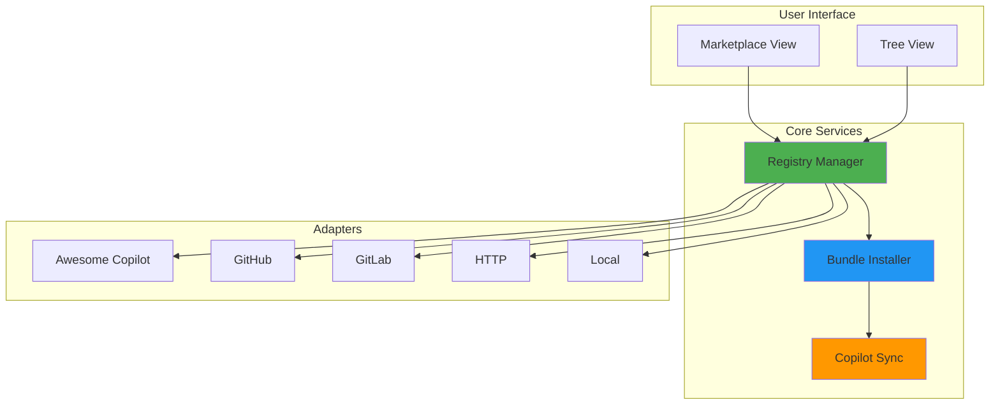
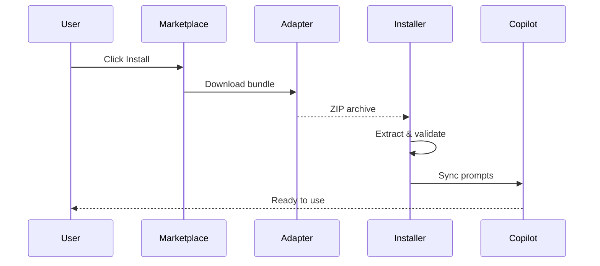

# 🎨 Prompt Registry

> A visual marketplace for discovering, installing, and managing GitHub Copilot prompt libraries from multiple sources.

[](https://marketplace.visualstudio.com/items?itemName=AmadeusITGroup.prompt-registry)
[](https://opensource.org/licenses/Apache-2.0)
[](https://github.com/AmadeusITGroup/prompt-registry)

---

## 📋 Table of Contents

- [Overview](#overview)
- [Features](#features)
- [Installation](#installation)
- [Quick Start](#quick-start)
- [Usage](#usage)
  - [Browsing the Marketplace](#browsing-the-marketplace)
  - [Installing Bundles](#installing-bundles)
  - [Managing Sources](#managing-sources)
  - [Working with Profiles](#working-with-profiles)
- [Supported Sources](#supported-sources)
- [Architecture](#architecture)
- [Configuration](#configuration)
- [Troubleshooting](#troubleshooting)
- [Contributing](#contributing)
- [License](#license)

---

## 🌟 Overview

**Prompt Registry** transforms how you discover and manage GitHub Copilot prompts. Instead of manually copying prompt files or cloning repositories, browse a visual marketplace, search by tags, and install curated prompt libraries with a single click.


### Why Prompt Registry?

- 🎯 **Discover** - Browse curated prompt collections from multiple sources
- ⚡ **Install** - One-click installation with automatic Copilot sync
- 🔄 **Manage** - Update, organize, and uninstall bundles easily
- 👥 **Share** - Create and distribute your own prompt libraries
- 🌍 **Multi-Platform** - Works on macOS, Linux, and Windows

---

## ✨ Features

### 🎨 Visual Marketplace

Browse prompt bundles in a modern, tile-based interface inspired by VS Code's extension marketplace:

- **Rich Metadata**: See descriptions, tags, content breakdown, and installation status
- **Search & Filter**: Find prompts by keywords, tags, or content type
- **Content Preview**: View detailed information before installing
- **One-Click Install**: Install bundles instantly from the marketplace

### 🔌 Multi-Source Support

Connect to various prompt sources:

| Source Type | Description | Use Case |
|------------|-------------|----------|
| **Awesome Copilot** | Curated community collections | Discover popular prompts |
| **GitHub** | Direct from GitHub repositories | Team/project-specific prompts |
| **GitLab** | GitLab repositories and releases | Enterprise GitLab users |
| **HTTP** | Any HTTP/HTTPS URL | Custom hosting |
| **Local** | File system directories | Private/offline prompts |

### 📦 Bundle Management

- **Install/Uninstall**: Manage bundles through UI or commands
- **Version Control**: Track installed versions
- **Auto-Sync**: Automatic synchronization with GitHub Copilot
- **Conflict Resolution**: Handle duplicate bundles gracefully

### 👥 Profile Management

Organize prompts by project, team, or environment:

```
Work Projects Profile
  ├── testing-automation (v1.0.0)
  ├── code-review (v2.1.0)
  └── api-documentation (v1.5.0)

Personal Profile
  ├── creative-writing (v1.0.0)
  └── learning-resources (v0.9.0)
```

### 🌍 Cross-Platform

Automatically detects and uses the correct directories:

- **macOS**: `~/Library/Application Support/Code/User/prompts`
- **Linux**: `~/.config/Code/User/prompts`
- **Windows**: `%APPDATA%/Code/User/prompts`

Supports all VS Code flavors: Stable, Insiders, and Windsurf.

---

## 📦 Installation

### From VS Code Marketplace

1. Open VS Code
2. Press `Ctrl+Shift+X` (or `Cmd+Shift+X` on macOS)
3. Search for "Prompt Registry"
4. Click **Install**

### From VSIX

```bash
# Download the latest .vsix file
code --install-extension prompt-registry-2.0.0.vsix
```

### From Source

```bash
git clone https://github.com/AmadeusITGroup/prompt-registry.git
cd prompt-registry
npm install
npm run compile
code --install-extension .
```

---

## 🚀 Quick Start

### 1. Add a Source

First, add a prompt source to the registry:

```
Ctrl+Shift+P → "Prompt Registry: Add Source"
```

Choose a source type:
- **Awesome Copilot Collection** - Pre-configured curated prompts
- **GitHub Repository** - Enter repository URL
- **Local Directory** - Select a folder

### 2. Browse the Marketplace

Open the Prompt Registry Marketplace:

```
Click "MARKETPLACE" in the Prompt Registry sidebar
```

Or use the command:

```
Ctrl+Shift+P → "Prompt Registry: Open Marketplace"
```

### 3. Install a Bundle

Click on any bundle tile to view details, then click **Install**.

Your prompts are now available in GitHub Copilot! 🎉

---

## 📖 Usage

### Browsing the Marketplace

The marketplace provides multiple ways to discover prompts:

#### Search
```
Type in the search box to filter by:
- Bundle name
- Description keywords
- Tags
```

#### Filter by Content Type
```
Click filter buttons to show only:
- Prompts
- Instructions
- Chat Modes
- Agents
```

#### View Details
```
Click on any bundle tile to see:
- Full description
- Content breakdown (prompts, instructions, etc.)
- Installation information
- Tags and metadata
- List of included files
```

### Installing Bundles

#### From Marketplace

1. **Browse** - Find a bundle in the marketplace
2. **Review** - Click the tile to view details
3. **Install** - Click the **Install** button
4. **Verify** - Check the installed badge appears

#### From Tree View

1. **Navigate** - Go to Registry Explorer in sidebar
2. **Find** - Locate a bundle under a source
3. **Install** - Right-click → "Install Bundle"

#### From Command Palette

```bash
Ctrl+Shift+P → "Prompt Registry: Install Bundle"
# Select source → Select bundle → Confirm
```

### Managing Sources

#### Add Source

```bash
Ctrl+Shift+P → "Prompt Registry: Add Source"
```

**Awesome Copilot Collection** (Recommended for beginners):
- Pre-configured
- Curated community prompts
- Automatically updated

**GitHub Repository**:
- Repository URL: `https://github.com/owner/repo`
- Branch: `main` (optional)
- Collections Path: `collections` (optional)

**Local Directory**:
- Select a folder containing `deployment-manifest.yml`

#### Edit Source

```bash
Right-click source in tree view → "Edit Source"
```

#### Remove Source

```bash
Right-click source in tree view → "Remove Source"
```

### Working with Profiles

Profiles help organize bundles by project, team, or environment.

#### Create Profile

```bash
Ctrl+Shift+P → "Prompt Registry: Create Profile"
# Enter profile name (e.g., "Work Projects")
```

#### Install to Profile

```bash
When installing a bundle:
1. Choose "Profile" scope
2. Select target profile
3. Bundle installs only to that profile
```

#### Switch Profile

```bash
Ctrl+Shift+P → "Prompt Registry: Switch Profile"
# Select active profile
```

#### View Profile Contents

```bash
Sidebar → "My Profiles" → Select profile
# See all bundles in that profile
```

---

## 🔌 Supported Sources

### Awesome Copilot Collection

**Pre-configured curated source for community prompts.**

```yaml
Type: awesome-copilot
URL: https://github.com/microsoft/prompt-bundle-spec
Collections Path: examples
```

Features:
- ✅ Community-curated collections
- ✅ Well-tested prompts
- ✅ Regular updates
- ✅ Wide variety of use cases

### GitHub Repository

**Any GitHub repository with collections.**

```yaml
Type: github
URL: https://github.com/owner/repo
Branch: main
Collections Path: prompts/collections
```

Requirements:
- Repository must be public (or provide authentication)
- Collections directory with `.collection.yml` files
- Each collection references prompt files

### GitLab Repository

**GitLab repositories and releases.**

```yaml
Type: gitlab
URL: https://gitlab.com/owner/repo
Branch: main
```

### HTTP/HTTPS Source

**Any web-accessible ZIP bundles.**

```yaml
Type: http
URL: https://example.com/bundles/
```

Bundles must:
- Be ZIP files
- Contain `deployment-manifest.yml`
- Be accessible via HTTPS (recommended)

### Local Directory

**File system directories.**

```yaml
Type: local
Path: /path/to/prompts
```

Useful for:
- Private prompt libraries
- Offline development
- Testing custom bundles

---

## 🏗️ Architecture

### High-Level Overview



**For detailed architecture, see [ARCHITECTURE.md](./docs/ARCHITECTURE.md)**

### Key Components

- **Registry Manager**: Orchestrates sources, bundles, and installations
- **Bundle Installer**: Handles extraction, validation, and installation
- **Copilot Sync**: Syncs bundles to GitHub Copilot directories
- **Adapters**: Source-specific implementations (GitHub, GitLab, etc.)
- **UI Providers**: Marketplace and tree view interfaces

### Installation Flow



---

## ⚙️ Configuration

### Extension Settings

Access via `File → Preferences → Settings → Extensions → Prompt Registry`

| Setting | Description | Default |
|---------|-------------|---------|
| `promptRegistry.autoSync` | Auto-sync to Copilot on install | `true` |
| `promptRegistry.cacheTimeout` | Bundle cache TTL (minutes) | `5` |
| `promptRegistry.defaultScope` | Default installation scope | `user` |
| `promptRegistry.showNotifications` | Show success notifications | `true` |

### Source Configuration

Sources are stored in `~/.vscode/extensions/.../registry.json`:

```json
{
  "sources": [
    {
      "id": "awesome-copilot",
      "name": "Awesome Copilot Collection",
      "type": "awesome-copilot",
      "url": "https://github.com/microsoft/prompt-bundle-spec",
      "enabled": true
    }
  ]
}
```

### Bundle Manifest

Bundles must include `deployment-manifest.yml`:

```yaml
version: "1.0"
id: "testing-automation"
name: "Testing & Test Automation"
version: "1.0.0"
description: "Comprehensive prompts for testing"
author: "github"
tags:
  - testing
  - automation
  - qa

prompts:
  - id: "unit-tests"
    name: "Unit Test Generator"
    type: "prompt"
    file: "prompts/unit-tests.prompt.md"
    tags:
      - unit-testing
      - tdd
```

---

## 🔧 Troubleshooting

### Common Issues

#### Bundles Not Showing in Copilot

**Problem**: Installed bundles don't appear in GitHub Copilot.

**Solution**:
1. Check sync completed: View extension logs
2. Verify directory: Check OS-specific path exists
3. Restart VS Code: Reload window (`Ctrl+R`)
4. Manual sync: Run "Prompt Registry: Sync All Bundles"

#### Installation Fails

**Problem**: "Failed to install bundle" error.

**Solutions**:
- **Network Error**: Check internet connection
- **Permission Error**: Ensure write access to user directory
- **Invalid Bundle**: Verify bundle has valid manifest
- **Disk Space**: Check available storage

#### Source Connection Failed

**Problem**: Cannot fetch bundles from source.

**Solutions**:
- **GitHub**: Check repository URL and visibility
- **Authentication**: Add access token if needed
- **Network**: Verify HTTPS access not blocked
- **Rate Limiting**: Wait before retrying

#### Wrong Installation Path (macOS)

**Problem**: Prompts install to `~/.config/Code` instead of `~/Library/Application Support/Code`.

**Solution**: Update to latest version (2.0.0+) with proper macOS support.

### Debug Mode

Enable debug logging:

```json
{
  "promptRegistry.debug": true
}
```

View logs in Output panel: `View → Output → Prompt Registry`

### Getting Help

- 📖 [Documentation](./docs/)
- 🐛 [Report Issues](https://github.com/AmadeusITGroup/prompt-registry/issues)
- 💬 [Discussions](https://github.com/AmadeusITGroup/prompt-registry/discussions)
- 📧 [Email Support](mailto:support@example.com)

---

## 🤝 Contributing

We welcome contributions! See [CONTRIBUTING.md](./CONTRIBUTING.md) for guidelines.

### Development Setup

```bash
# Clone repository
git clone https://github.com/AmadeusITGroup/prompt-registry.git
cd prompt-registry

# Install dependencies
npm install

# Compile
npm run compile

# Watch mode (auto-compile)
npm run watch

# Run tests
npm test

# Package extension
vsce package
```

### Creating a New Adapter

See [ARCHITECTURE.md#extension-points](./docs/ARCHITECTURE.md#extension-points) for details on implementing custom adapters.

### Project Structure

```
prompt-registry/
├── src/
│   ├── adapters/          # Source adapters
│   ├── commands/          # Command implementations
│   ├── services/          # Core services
│   ├── ui/               # UI providers
│   ├── types/            # TypeScript types
│   └── utils/            # Utilities
├── docs/                  # Documentation
├── test/                  # Test suites
└── package.json          # Extension manifest
```

---

## 📚 Documentation

- **[Architecture Guide](./docs/ARCHITECTURE.md)** - Detailed system architecture
- **[API Reference](./docs/API.md)** - Extension API documentation
- **[Bundle Format](./docs/BUNDLE_FORMAT.md)** - Creating custom bundles
- **[Adapter Development](./docs/ADAPTERS.md)** - Building new adapters
- **[Awesome Copilot Implementation](./docs/AWESOME_COPILOT_IMPLEMENTATION.md)** - Awesome Copilot adapter details

---

## 🗺️ Roadmap

### Current Version (2.0.0)

- ✅ Visual marketplace interface
- ✅ Multi-source support (5 adapter types)
- ✅ Profile management
- ✅ Cross-platform support (macOS, Linux, Windows)
- ✅ Auto-sync with GitHub Copilot
- ✅ Search and filtering
- ✅ Clickable marketplace tiles

### Upcoming (2.1.0)

- 🔄 Automatic bundle updates
- 🔄 Bundle versioning and rollback
- 🔄 Dependency management
- 🔄 Bundle analytics

### Future (3.0.0)

- 📋 Bundle authoring tools
- 📋 Community ratings and reviews
- 📋 AI-powered recommendations
- 📋 Collaborative prompt sharing
- 📋 Marketplace API for third-party tools

---

## 📄 License

This project is licensed under the Apache License 2.0 - see the [LICENSE](./LICENSE) file for details.

---

## 🙏 Acknowledgments

- **Microsoft** - For GitHub Copilot and VS Code
- **Awesome Copilot Community** - For curated prompt collections
- **Contributors** - Everyone who has contributed to this project

---

## 📊 Stats

- **Supported Source Types**: 5 (GitHub, GitLab, HTTP, Local, Awesome Copilot)
- **Platforms**: macOS, Linux, Windows
- **VS Code Flavors**: Stable, Insiders, Windsurf
- **Architecture**: Adapter pattern with extensible design
- **Bundle Format**: YAML-based deployment manifest

---

## 🔗 Links

- **Homepage**: [https://prompt-registry.dev](https://prompt-registry.dev)
- **Documentation**: [https://docs.prompt-registry.dev](https://docs.prompt-registry.dev)
- **GitHub**: [https://github.com/AmadeusITGroup/prompt-registry](https://github.com/AmadeusITGroup/prompt-registry)
- **Issues**: [https://github.com/AmadeusITGroup/prompt-registry/issues](https://github.com/AmadeusITGroup/prompt-registry/issues)
- **Marketplace**: [VS Code Marketplace](https://marketplace.visualstudio.com/)

---

<div align="center">

**Made with ❤️ by the Prompt Registry Team**

[Report Bug](https://github.com/AmadeusITGroup/prompt-registry/issues) · [Request Feature](https://github.com/AmadeusITGroup/prompt-registry/issues) · [Documentation](./docs/)

</div>
