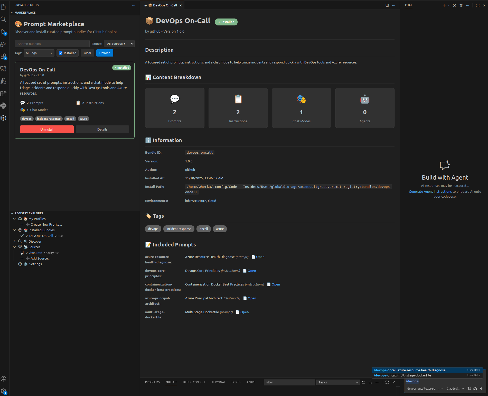

# 🎨 Prompt Registry

> A visual marketplace for discovering, installing, and managing GitHub Copilot prompt libraries from multiple sources.

[](https://marketplace.visualstudio.com/items?itemName=AmadeusITGroup.prompt-registry)
[](https://opensource.org/licenses/Apache-2.0)
[](https://github.com/AmadeusITGroup/prompt-registry)

---

**Prompt Registry** transforms how you discover and manage GitHub Copilot prompts. Browse a visual marketplace, search by tags, and install curated prompt libraries with a single click—no manual file copying or repository cloning required.



---

## 🚀 Quick Start

1. **Install** — Search "Prompt Registry" in VS Code Extensions (`Ctrl+Shift+X`)
2. **Select Hub** — On first launch, choose a hub from the welcome dialog (or skip to configure later)
3. **Browse** — Click "MARKETPLACE" in the Prompt Registry sidebar
4. **Install** — Click any bundle tile, then click **Install**
5. **Use** — Your prompts are now available in GitHub Copilot! 🎉

The extension automatically adds the Awesome Copilot source and syncs your selected hub's profiles on startup.

→ [Full Getting Started Guide](./docs/user-guide/getting-started.md)

---

## ✨ Key Features

- **🎨 Visual Marketplace** — Browse bundles in a tile-based interface with search, filters, and one-click install ([details](./docs/user-guide/marketplace.md))
- **🔌 Multi-Source Support** — Connect to GitHub, local directories, APM repositories, or Awesome Copilot collections ([details](./docs/user-guide/sources.md))
- **📦 Version Management** — Track versions, detect updates, and enable automatic background updates ([details](./docs/user-guide/configuration.md))
- **👥 Profiles & Hubs** — Organize bundles by project/team and share configurations across your organization ([details](./docs/user-guide/profiles-and-hubs.md))
- **🌍 Cross-Platform** — Works on macOS, Linux, and Windows with all VS Code flavors

---

## 📚 Documentation

| Audience | Description | Link |
|----------|-------------|------|
| **Users** | Installation, marketplace, sources, profiles, troubleshooting | [User Guide](./docs/user-guide/getting-started.md) |
| **Authors** | Creating, validating, and publishing prompt collections | [Author Guide](./docs/author-guide/creating-source-bundle.md) |
| **Contributors** | Development setup, architecture, testing, coding standards | [Contributor Guide](./docs/contributor-guide/development-setup.md) |
| **Reference** | Commands, settings, adapter API, hub schema | [Reference Docs](./docs/reference/commands.md) |

→ [Full Documentation Index](./docs/README.md)

---

## 📦 Installation

**From VS Code Marketplace:**
1. Open VS Code → Press `Ctrl+Shift+X`
2. Search "Prompt Registry" → Click **Install**

**From VSIX:**
```bash
code --install-extension prompt-registry-0.0.2.vsix
```

**From Source:**
```bash
git clone https://github.com/AmadeusITGroup/prompt-registry.git
cd prompt-registry
npm install
npm run package:vsix
code --install-extension prompt-registry-0.0.2.vsix
```

**For custom VS Code instances** (with custom user-data-dir/extensions-dir):
```bash
# After building the VSIX above, install to your custom VS Code instance
code --user-data-dir "$ud" --extensions-dir "$ed" --install-extension prompt-registry-0.0.2.vsix
```

---

## 🔌 Supported Sources

| Source Type | Description |
|-------------|-------------|
| **Awesome Copilot** | Curated community collections |
| **GitHub** | Direct from GitHub repositories |
| **Local** | File system directories |
| **APM** | APM package repositories |

→ [Source Configuration Guide](./docs/user-guide/sources.md)

---

## 🏗️ Architecture Overview

```
Marketplace/Tree View → Registry Manager → Adapters (GitHub, Local, etc.)
                              ↓
                       Bundle Installer → Copilot Sync
```

→ [Full Architecture Documentation](./docs/contributor-guide/architecture.md)

---

## 🔧 Troubleshooting

**Bundles not showing in Copilot?**
- Check sync completed in extension logs
- Run "Prompt Registry: Sync All Bundles"
- Restart VS Code (`Ctrl+R`)

**Installation fails?**
- Verify network connection and repository access
- Check bundle has valid `deployment-manifest.yml`

→ [Full Troubleshooting Guide](./docs/user-guide/troubleshooting.md)

---

## 🤝 Contributing

We welcome contributions! See [CONTRIBUTING.md](./CONTRIBUTING.md) for guidelines.

→ [Development Setup](./docs/contributor-guide/development-setup.md) | [Coding Standards](./docs/contributor-guide/coding-standards.md)

---

## 📄 License

[Apache 2.0](./LICENSE.txt) — See [SECURITY.md](./SECURITY.md) for security policy.

---

## 🙏 Acknowledgments

- **Microsoft** - For GitHub Copilot and VS Code
- **Awesome Copilot Community** - For curated prompt collections
- **Contributors** - Everyone who has contributed to this project
---

## 🔗 Links

- [VS Code Marketplace](https://marketplace.visualstudio.com/items?itemName=AmadeusITGroup.prompt-registry)
- [GitHub Repository](https://github.com/AmadeusITGroup/prompt-registry)
- [Report Issues](https://github.com/AmadeusITGroup/prompt-registry/issues)
- [Discussions](https://github.com/AmadeusITGroup/prompt-registry/discussions)
