# Prompt Registry Architecture

**Version:** 2.1  
**Last Updated:** November 9, 2025  
**Status:** Active Development

---

## Table of Contents

1. [System Overview](#system-overview)
2. [Architecture Principles](#architecture-principles)
3. [Component Architecture](#component-architecture)
4. [Data Flow](#data-flow)
5. [Adapter Pattern](#adapter-pattern)
6. [Authentication Model](#authentication-model)
7. [Installation Flow](#installation-flow)
8. [UI Components](#ui-components)
9. [Cross-Platform Support](#cross-platform-support)
10. [Security Model](#security-model)
11. [Extension Points](#extension-points)

---

## System Overview

The Prompt Registry is a VS Code extension that provides a marketplace-style interface for discovering, installing, and managing GitHub Copilot prompt libraries from multiple sources (GitHub, GitLab, HTTP, local files, and curated collections).

### Key Features

- 🎨 **Visual Marketplace** - Browse and install prompts with rich metadata
- 🔌 **Multi-Source Support** - GitHub, GitLab, HTTP, local, and curated collections
- 📦 **Bundle Management** - Install, update, and uninstall prompt bundles
- 🔄 **Auto-Sync** - Automatic synchronization with GitHub Copilot
- 🌍 **Cross-Platform** - macOS, Linux, and Windows support
- 🔍 **Search & Filter** - Discover prompts by tags, content type, installed status, and keywords
- 🔐 **Private Repository Support** - VSCode auth, gh CLI, or explicit tokens
- ✅ **Collection Validation** - YAML validation and scaffolding tools

---

## Architecture Principles

### 1. **Separation of Concerns**
- **UI Layer**: WebView-based marketplace and tree views
- **Service Layer**: Business logic (installation, sync, registry management)
- **Adapter Layer**: Source-specific implementations
- **Storage Layer**: Persistent state management

### 2. **Adapter Pattern**
- Unified interface for different prompt sources
- Easy to extend with new source types
- Source-agnostic core services

### 3. **Event-Driven**
- React to bundle installations/uninstallations
- Update UI dynamically
- Fire events for extensibility

### 4. **Cross-Platform by Design**
- OS-specific path handling
- Platform-agnostic file operations
- Consistent behavior across environments

---

## Component Architecture

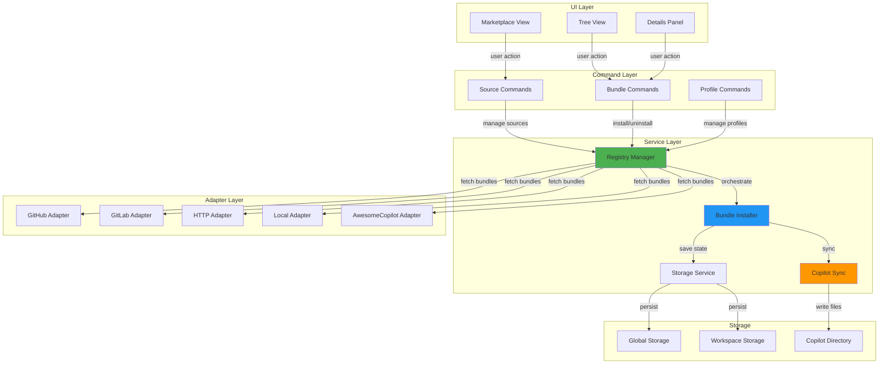

### Component Responsibilities

#### **UI Layer**

| Component | Responsibility |
|-----------|---------------|
| **MarketplaceViewProvider** | Visual marketplace with tiles, search, filters |
| **RegistryTreeProvider** | Hierarchical tree view of sources and bundles |
| **Details Panel** | Full bundle information with content breakdown |

#### **Service Layer**

| Component | Responsibility |
|-----------|---------------|
| **RegistryManager** | Orchestrates sources, bundles, and installations |
| **BundleInstaller** | Handles bundle extraction, validation, and installation |
| **CopilotSyncService** | Syncs installed bundles to Copilot directories |
| **StorageService** | Manages persistent state (sources, installations, profiles) |

#### **Adapter Layer**

| Component | Source Type | Capabilities |
|-----------|------------|--------------|
| **GitHubAdapter** | GitHub repos | Fetches releases, assets, with authentication |
| **GitLabAdapter** | GitLab repos | Fetches releases, raw files |
| **HTTPAdapter** | HTTP/HTTPS | Downloads zip bundles from URLs |
| **LocalAdapter** | File system | Installs from local directories |
| **AwesomeCopilotAdapter** | GitHub collections | Fetches YAML collections with authentication, builds zips on-the-fly |

---

## Authentication Model

### Overview

Both `GitHubAdapter` and `AwesomeCopilotAdapter` support private GitHub repositories through a three-tier authentication fallback chain implemented in November 2025.

### Authentication Chain

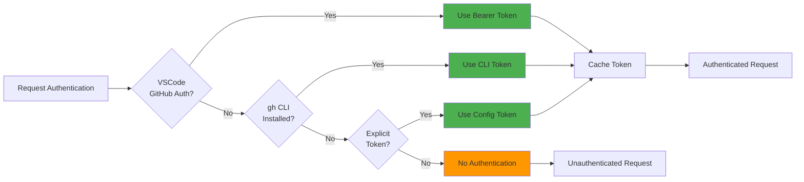

### Implementation Details

**Method**: `getAuthenticationToken()`  
**Location**: `src/adapters/GitHubAdapter.ts`, `src/adapters/AwesomeCopilotAdapter.ts`

```typescript
private async getAuthenticationToken(): Promise<string | undefined> {
    // 1. Try VSCode GitHub authentication
    const session = await vscode.authentication.getSession('github', ['repo'], { silent: true });
    if (session) return session.accessToken;
    
    // 2. Try GitHub CLI
    const { stdout } = await execAsync('gh auth token');
    if (stdout.trim()) return stdout.trim();
    
    // 3. Try explicit token from source config
    const explicitToken = this.getAuthToken();
    if (explicitToken) return explicitToken;
    
    // 4. No authentication
    return undefined;
}
```

### Token Format

**Bearer Token** (OAuth 2.0 standard):
```typescript
headers['Authorization'] = `Bearer ${token}`;
```

**Not** the deprecated format:
```typescript
// ❌ Deprecated
headers['Authorization'] = `token ${token}`;
```

### Logging

Authentication status is logged for debugging:

```
[GitHubAdapter] Attempting authentication...
[GitHubAdapter] ✓ Using VSCode GitHub authentication
[GitHubAdapter] Token preview: gho_abc12...
[GitHubAdapter] Request to https://api.github.com/... with auth (method: vscode)
```

Failures are also logged:

```
[GitHubAdapter] ✗ No authentication available
[GitHubAdapter] HTTP 404: Not Found - Repository not found or not accessible
```

### Token Caching

Tokens are cached after first successful retrieval:
- Reduces authentication overhead
- Persists for adapter instance lifetime
- Tracks which method was successful

---

## Data Flow

### Bundle Discovery Flow

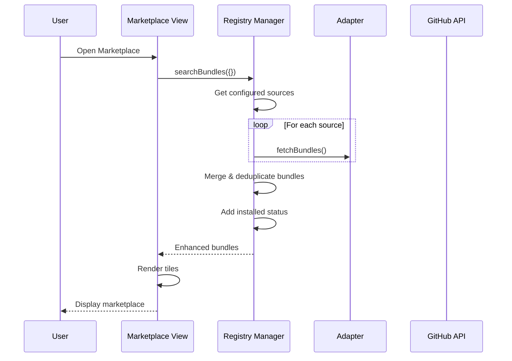

### Bundle Installation Flow (AwesomeCopilot)

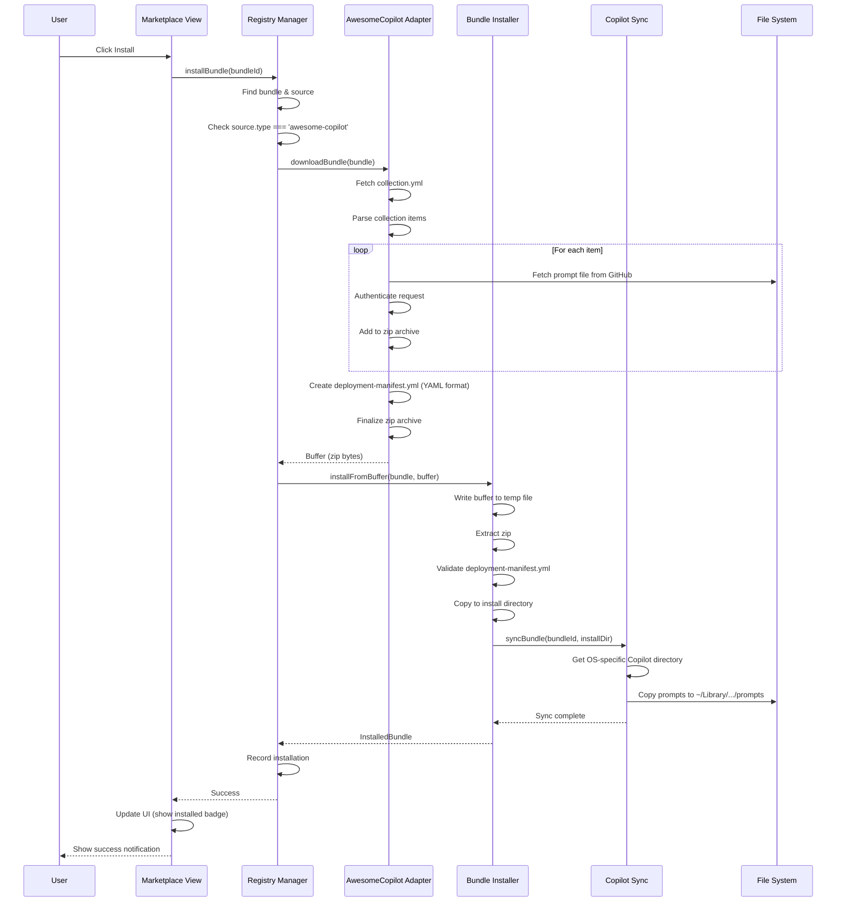

### Bundle Installation Flow (URL-based)

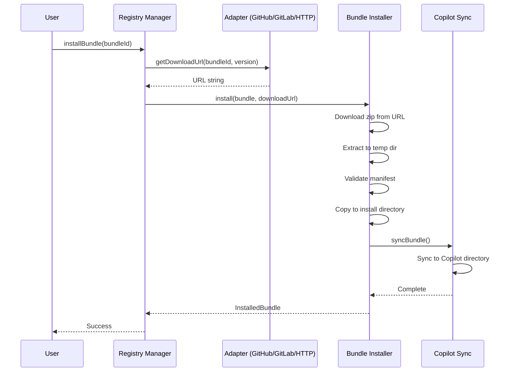

---

## Adapter Pattern

### IRepositoryAdapter Interface

```typescript
interface IRepositoryAdapter {
    // Fetch all bundles from this source
    fetchBundles(): Promise<Bundle[]>;
    
    // Download a specific bundle (returns zip Buffer)
    downloadBundle(bundle: Bundle): Promise<Buffer>;
    
    // Get metadata about the source
    fetchMetadata(): Promise<SourceMetadata>;
    
    // Validate source configuration
    validate(): Promise<ValidationResult>;
    
    // Get URLs for bundles
    getManifestUrl(bundleId: string, version: string): string;
    getDownloadUrl(bundleId: string, version: string): string;
}
```

### Adapter Comparison

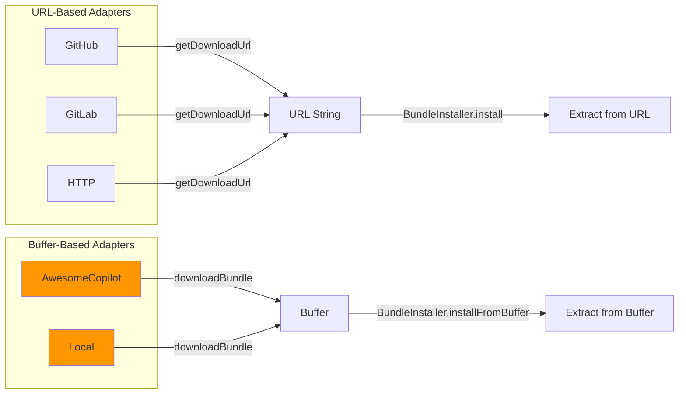

### Why Two Installation Paths?

**URL-Based Installation** (`install()`):
- For pre-packaged zip bundles on remote servers
- Direct download from URL
- Used by: GitHub, GitLab, HTTP adapters

**Buffer-Based Installation** (`installFromBuffer()`):
- For dynamically created bundles
- Builds zip in memory
- Used by: AwesomeCopilot (builds from YAML), Local (zips directory)

---

## Installation Flow

### Directory Structure

```
Extension Storage
├── bundles/                          # Installed bundles
│   ├── testing-automation/
│   │   ├── deployment-manifest.yml
│   │   └── prompts/
│   │       └── testing-prompt.prompt.md
│   └── code-review/
│       ├── deployment-manifest.yml
│       └── prompts/
│           ├── review.prompt.md
│           └── checklist.instructions.md
└── registry.json                     # Sources and installation records

Copilot Directory (macOS)
~/Library/Application Support/Code/User/prompts/
├── testing-automation/
│   └── testing-prompt.prompt.md
└── code-review/
    ├── review.prompt.md
    └── checklist.instructions.md
```

### Installation Steps

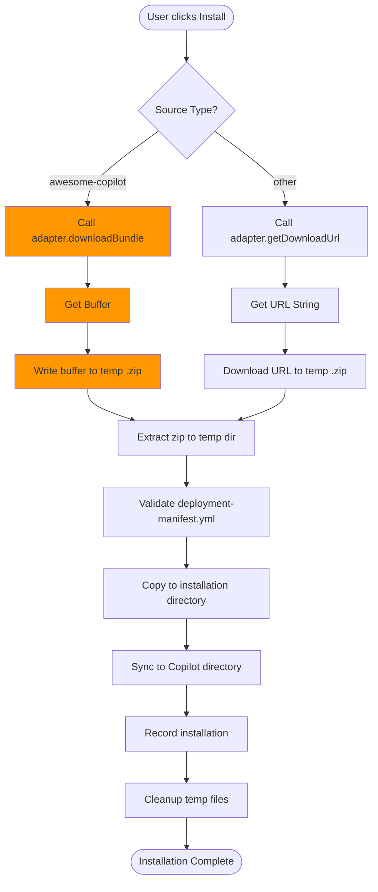

---

## UI Components

### Marketplace View Architecture

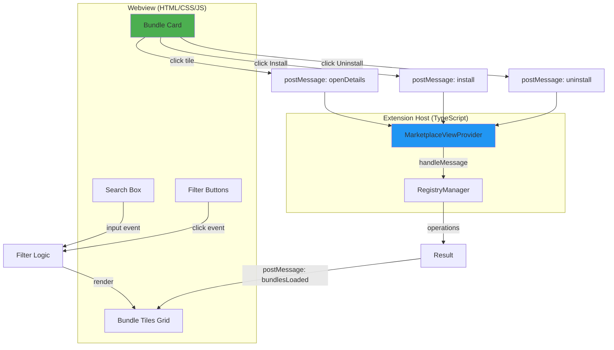

### Marketplace Interactions

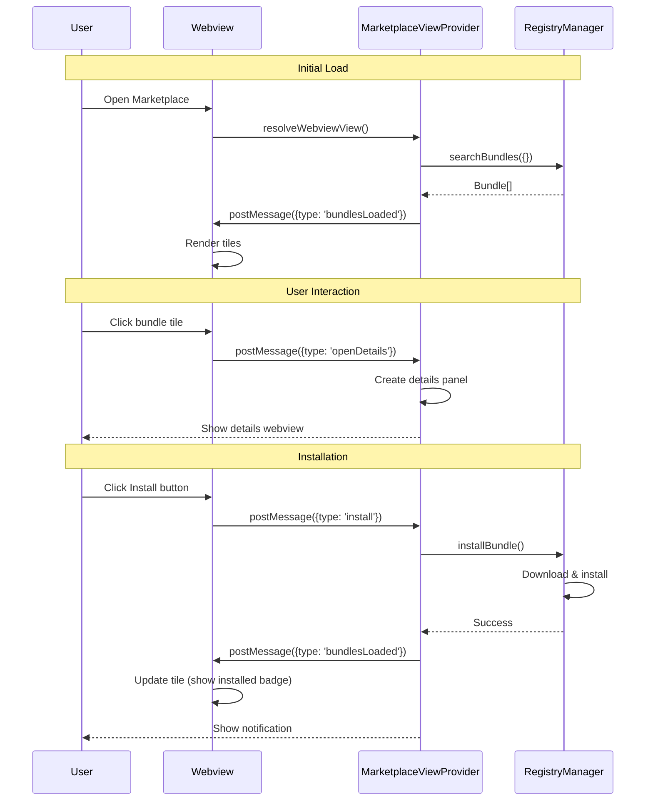

### Tree View Structure

```
PROMPT REGISTRY
├── 📦 MARKETPLACE (virtual node)
├── 🌍 REGISTRY EXPLORER
│   ├── 📁 My Profiles
│   │   ├── 🏢 Work Projects
│   │   │   ├── ✅ testing-automation (v1.0.0)
│   │   │   └── ✅ code-review (v1.2.0)
│   │   └── 🏠 Personal
│   └── 📁 QA
│       └── ✅ awesome-copilot (Awesome Copilot Collection)
└── 🔧 Sources
    ├── ✅ awesome-copilot (Awesome Copilot Collection)
    └── ✅ local-prompts (Local Directory)
```

---

## Cross-Platform Support

### Path Resolution Strategy

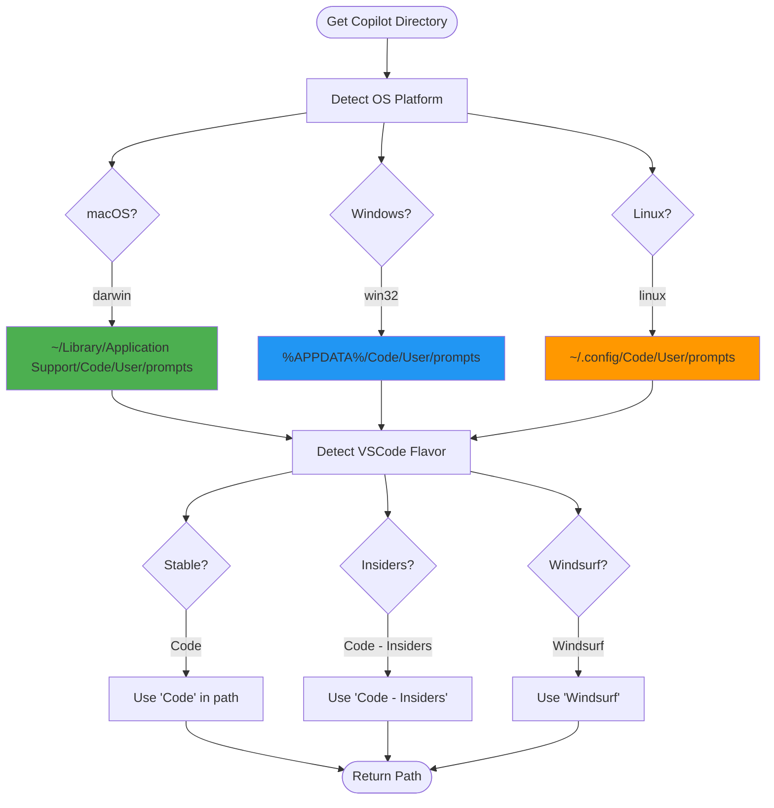

### Platform-Specific Considerations

| Platform | Base Directory | Path Separator | Special Handling |
|----------|---------------|----------------|------------------|
| **macOS** | `~/Library/Application Support/` | `/` | Space in path requires proper escaping |
| **Windows** | `%APPDATA%/` | `\` or `/` | Use `path.join()` for cross-compatibility |
| **Linux** | `~/.config/` | `/` | Standard Unix paths |

---

## Security Model

### Trust Boundaries

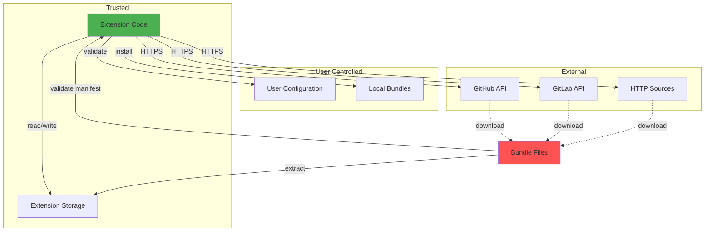

### Validation Steps

1. **Source Validation**
   - Verify URL format
   - Check repository accessibility
   - Validate authentication tokens

2. **Bundle Validation**
   - Verify zip archive integrity
   - Validate `deployment-manifest.yml` schema
   - Check for required fields
   - Verify file paths (no `../` escaping)

3. **Content Validation**
   - Validate file extensions (`.prompt.md`, `.instructions.md`, etc.)
   - Check file size limits
   - Scan for malicious content patterns

4. **Installation Validation**
   - Verify installation directory permissions
   - Check disk space availability
   - Ensure no conflicts with existing bundles

---

## Extension Points

### Adding a New Adapter

```typescript
// 1. Implement IRepositoryAdapter
export class MyCustomAdapter implements IRepositoryAdapter {
    constructor(private config: MyAdapterConfig) {}
    
    async fetchBundles(): Promise<Bundle[]> {
        // Fetch from your source
    }
    
    async downloadBundle(bundle: Bundle): Promise<Buffer> {
        // Return zip Buffer or throw for URL-based
    }
    
    // ... implement other methods
}

// 2. Register in RegistryManager
RepositoryAdapterFactory.register('my-custom', MyCustomAdapter);

// 3. Add to SourceType union
export type SourceType = 'github' | 'gitlab' | 'http' | 'local' | 'awesome-copilot' | 'my-custom';
```

### Custom Bundle Format

```yaml
# deployment-manifest.yml (YAML format, not JSON)
version: "1.0"
id: "my-bundle"
name: "My Custom Bundle"
prompts:
  - id: "my-prompt"
    name: "My Prompt"
    type: "prompt"
    file: "prompts/my-prompt.prompt.md"
    tags: ["custom", "example"]
```

**Note**: The manifest uses YAML format (`.yml`), not JSON.

### Event Hooks

```typescript
// Listen for bundle installations
registryManager.onBundleInstalled((installed: InstalledBundle) => {
    console.log(`Bundle installed: ${installed.bundleId}`);
});

// Listen for bundle uninstallations
registryManager.onBundleUninstalled((bundleId: string) => {
    console.log(`Bundle uninstalled: ${bundleId}`);
});
```

---

## Performance Considerations

### Caching Strategy

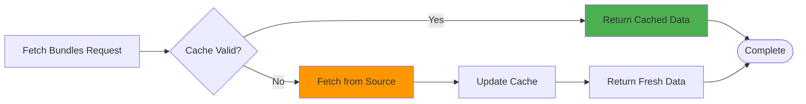

### Cache Settings

- **TTL**: 5 minutes for bundle listings
- **Invalidation**: Manual refresh or source changes
- **Storage**: In-memory cache + persistent storage

### Optimization Techniques

1. **Lazy Loading**: Load bundle details only when needed
2. **Parallel Fetching**: Fetch from multiple sources concurrently
3. **Incremental Search**: Filter locally before remote search
4. **Debounced Search**: Wait for user to finish typing
5. **Virtual Scrolling**: Render only visible tiles (for large lists)

---

## Error Handling

### Error Categories

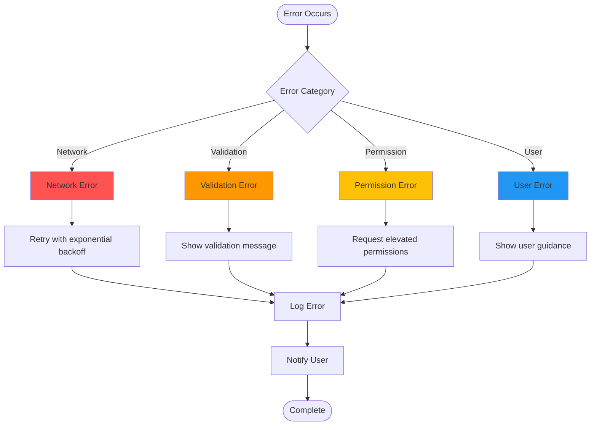

### Error Recovery

- **Transient Errors**: Automatic retry with backoff
- **Permanent Errors**: Clear error message + recovery steps
- **Partial Failures**: Continue with successful operations
- **Rollback**: Cleanup on installation failure

---

## Testing Strategy

### Test Pyramid

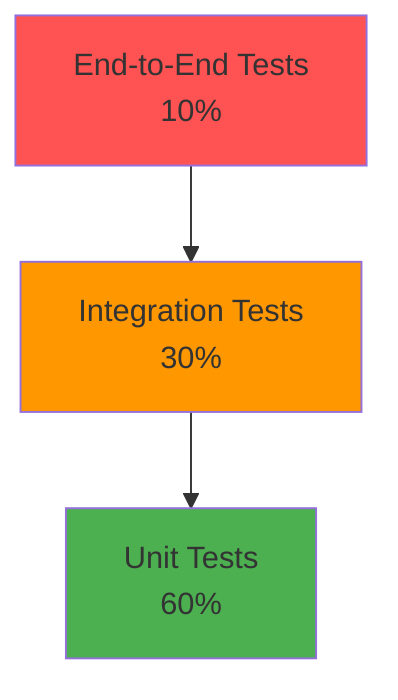

### Test Coverage

- **Unit Tests**: Adapters, services, utilities
- **Integration Tests**: Full installation flow, sync operations
- **UI Tests**: Webview interactions, command execution
- **Platform Tests**: macOS, Linux, Windows paths

---

## Deployment

### Release Process

1. **Version Bump**: Update `package.json` version
2. **Changelog**: Update `CHANGELOG.md`
3. **Build**: `npm run compile`
4. **Test**: `npm test`
5. **Package**: `vsce package`
6. **Publish**: `vsce publish` or manual upload

### Distribution Channels

- **VS Code Marketplace**: Primary distribution
- **Open VSX**: Alternative marketplace
- **GitHub Releases**: Manual installation
- **Enterprise**: Private registry

---

## Future Enhancements

### Roadmap

1. **Phase 1** (Current)
   - ✅ Multi-source support
   - ✅ Visual marketplace
   - ✅ Profile management
   - ✅ Cross-platform support

2. **Phase 2** (Planned)
   - 🔄 Automatic updates
   - 🔄 Bundle versioning
   - 🔄 Dependency management
   - 🔄 Bundle analytics

3. **Phase 3** (Future)
   - 📋 Bundle authoring tools
   - 📋 Community ratings/reviews
   - 📋 AI-powered recommendations
   - 📋 Collaborative prompt sharing

---

## Glossary

| Term | Definition |
|------|------------|
| **Bundle** | A package containing prompts, instructions, chat modes, and/or agents |
| **Source** | A configured repository or location for fetching bundles |
| **Adapter** | Implementation for a specific source type (GitHub, GitLab, etc.) |
| **Profile** | A collection of installed bundles grouped by project or team |
| **Manifest** | YAML file describing bundle contents and metadata |
| **Sync** | Copying installed bundles to GitHub Copilot's native directory |

---

## References

- [VS Code Extension API](https://code.visualstudio.com/api)
- [GitHub Copilot Documentation](https://docs.github.com/copilot)
- [Awesome Copilot Collection Spec](https://github.com/github/awesome-copilot)
- [Developer Guide](./DEVELOPER_GUIDE.md)
- [Quick Start Guide](./QUICK_START.md)
- [Testing Strategy](./TESTING_STRATEGY.md)

---

**Document Maintained By**: Development Team  
**For Questions**: See [CONTRIBUTING.md](./CONTRIBUTING.md)
