# Architecture Overview

VS Code extension providing a marketplace for GitHub Copilot prompt bundles from multiple sources.

## Key Features

- Visual Marketplace with search/filter
- Multi-source support (GitHub, GitLab, HTTP, Local, AwesomeCopilot, APM)
- Bundle management (install, update, uninstall)
- Auto-sync with GitHub Copilot
- Cross-platform (macOS, Linux, Windows)
- MCP server integration

## Architecture Principles

1. **Separation of Concerns** — UI / Service / Adapter / Storage layers
2. **Adapter Pattern** — Unified interface for different sources
3. **Event-Driven** — React to installations, update UI dynamically
4. **Cross-Platform** — OS-specific path handling

## Component Architecture

```mermaid
graph TD
    subgraph UI["🎨 UI Layer"]
        A[Marketplace & Tree Views<br/>StatusBar]
    end
    
    subgraph CMD["⚡ Command Layer"]
        B[VS Code Commands<br/>Bundle • Source • Profile • Hub]
    end
    
    subgraph SVC["🔧 Service Layer"]
        C1[RegistryManager<br/>Central Orchestrator]
        C2[BundleInstaller<br/>Download & Install]
        C3[CopilotSyncService<br/>Sync to Copilot]
        C4[UpdateService<br/>Auto Updates]
        C5[McpServerManager<br/>MCP Integration]
    end
    
    subgraph ADP["🔌 Adapter Layer"]
        D[Source Adapters<br/>GitHub • GitLab • HTTP • Local • APM]
    end
    
    subgraph STG["💾 Storage Layer"]
        E[Persistent Storage<br/>Registry & Hub Data]
    end
    
    UI --> CMD
    CMD --> SVC
    SVC --> ADP
    ADP --> STG
    
    C1 -.-> C2
    C1 -.-> C3
    C1 -.-> C4
    C1 -.-> C5
```

## Component Responsibilities

| Component | Responsibility |
|-----------|---------------|
| **RegistryManager** | Orchestrates sources, bundles, installations |
| **BundleInstaller** | Extraction, validation, installation, MCP integration |
| **CopilotSyncService** | Syncs bundles to Copilot directories |
| **UpdateScheduler** | Manages timing of update checks |
| **UpdateChecker** | Detects available updates |
| **AutoUpdateService** | Background bundle updates with rollback |
| **McpServerManager** | MCP server installation/tracking |
| **McpConfigService** | Reads/writes VS Code's mcp.json |
| **HubManager** | Hub configuration and profile management |
| **SchemaValidator** | JSON Schema validation using AJV |
| **TemplateEngine** | Scaffold template loading and rendering |
| **NotificationManager** | User notifications and update alerts |

## Cross-Platform Paths

| Platform | Copilot Directory |
|----------|-------------------|
| macOS | `~/Library/Application Support/Code/User/prompts` |
| Linux | `~/.config/Code/User/prompts` |
| Windows | `%APPDATA%/Code/User/prompts` |

Supports: VS Code Stable, Insiders, Windsurf

## Glossary

| Term | Definition |
|------|------------|
| **Bundle** | Package of prompts, instructions, chat modes, agents |
| **Source** | Repository/location for fetching bundles |
| **Adapter** | Implementation for a source type |
| **Profile** | Collection of bundles grouped by project/team |
| **Manifest** | YAML file describing bundle contents |

## Deep Dives

- [Adapters](./architecture/adapters.md) — Adapter pattern and implementations
- [Authentication](./architecture/authentication.md) — Auth chain for private repos
- [Installation Flow](./architecture/installation-flow.md) — Bundle installation process
- [Update System](./architecture/update-system.md) — Auto-update architecture
- [UI Components](./architecture/ui-components.md) — Marketplace and TreeView
- [MCP Integration](./architecture/mcp-integration.md) — MCP server management
- [Scaffolding](./architecture/scaffolding.md) — Project templates
- [Validation](./architecture/validation.md) — Schema validation
