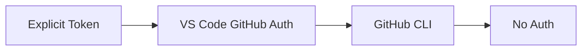

# Authentication

GitHubAdapter and AwesomeCopilotAdapter support private repos via a three-tier auth chain.

## Authentication Chain



## Implementation

```typescript
private async performAuthentication(): Promise<string | undefined> {
    // 1. Explicit token from source configuration (highest priority)
    const explicitToken = this.getAuthToken();
    if (explicitToken?.trim()) return explicitToken.trim();
    
    // 2. VS Code GitHub authentication
    const session = await vscode.authentication.getSession('github', ['repo'], { createIfNone: true });
    if (session) return session.accessToken;
    
    // 3. GitHub CLI
    const { stdout } = await execAsync('gh auth token');
    if (stdout.trim()) return stdout.trim();
    
    // 4. No authentication
    return undefined;
}
```

## Token Format

Uses GitHub token format:
```typescript
headers['Authorization'] = `token ${token}`;
```

## Logging

Success:
```
[GitHubAdapter] ✓ Using explicit token from configuration
[GitHubAdapter] Token preview: ghp_abc1...
```

Or:
```
[GitHubAdapter] ✓ Using VSCode GitHub authentication
[GitHubAdapter] Token preview: gho_abc1...
```

Failure:
```
[GitHubAdapter] ✗ No authentication available - API rate limits will apply and private repos will be inaccessible
[GitHubAdapter] HTTP 404: Not Found
```

## Token Caching

- Cached after first successful retrieval
- Persists for adapter instance lifetime
- Tracks which method was successful

## See Also

- [Adapters](./adapters.md) — Adapter implementations
- [User Guide: Sources](../../user-guide/sources.md) — Configuring authentication
