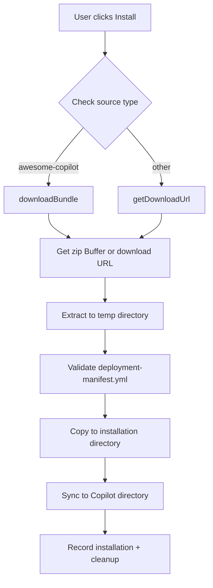

# Installation Flow

## Directory Structure

```
Extension Storage/
├── bundles/                          # Installed bundles
│   └── testing-automation/
│       ├── deployment-manifest.yml
│       └── prompts/
│           └── testing-prompt.prompt.md
└── registry.json                     # Sources and records

Copilot Directory (macOS)/
~/Library/Application Support/Code/User/prompts/
└── testing-automation/
    └── testing-prompt.prompt.md
```

## Installation Steps



## AwesomeCopilot Flow

1. Fetch `collection.yml` from GitHub
2. Parse collection items
3. Fetch each prompt file (with auth)
4. Create `deployment-manifest.yml` (YAML)
5. Build zip archive in memory
6. Return Buffer to BundleInstaller

## Bundle Manifest

```yaml
# deployment-manifest.yml
version: "1.0"
id: "my-bundle"
name: "My Bundle"
prompts:
  - id: "my-prompt"
    name: "My Prompt"
    type: "prompt"
    file: "prompts/my-prompt.prompt.md"
    tags: ["example"]
```

## See Also

- [Adapters](./adapters.md) — URL vs Buffer installation
- [MCP Integration](./mcp-integration.md) — MCP server installation
