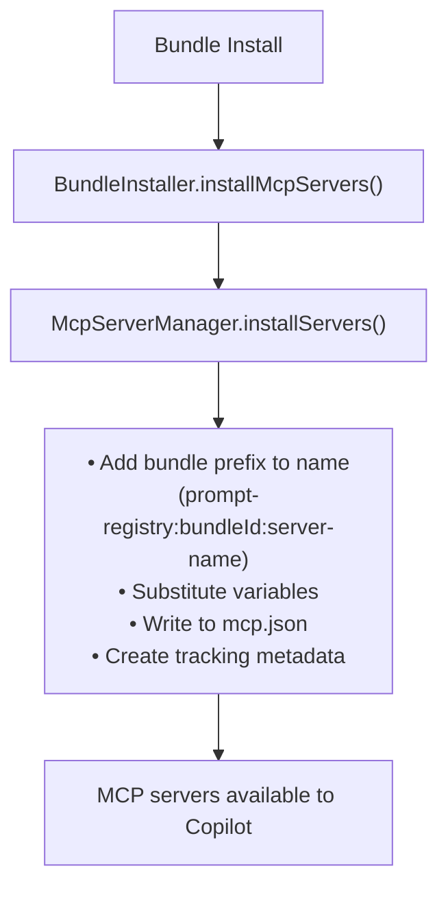
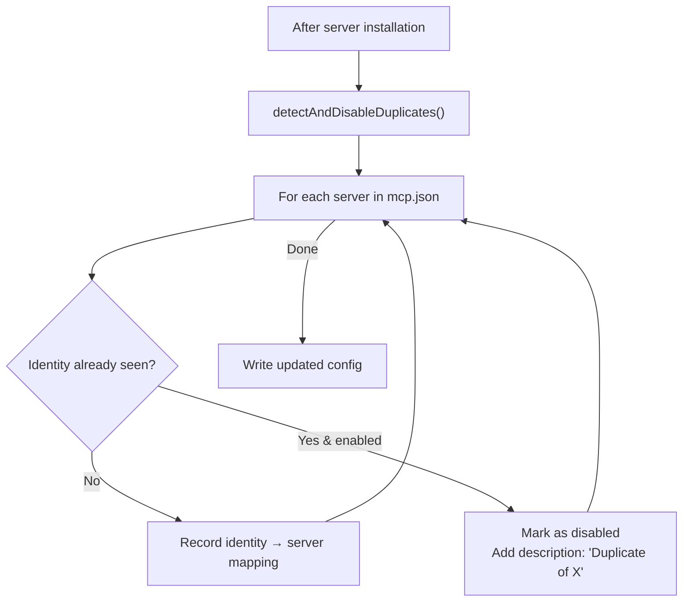

# MCP Integration

Bundles can include MCP (Model Context Protocol) servers that extend Copilot's capabilities.

## Components

| Component | Responsibility |
|-----------|---------------|
| **BundleInstaller** | Calls MCP install/uninstall during bundle lifecycle |
| **McpServerManager** | Orchestrates installation, naming, tracking |
| **McpConfigService** | Reads/writes VS Code's `mcp.json` |

## Installation Flow



## Server Types

### Stdio Servers (Local Process)

```yaml
mcpServers:
  server-name:
    type: stdio              # Optional (default)
    command: string          # Required
    args: string[]           # Optional
    env: Record<string, string>  # Optional
    envFile: string          # Optional - path to .env file
    disabled: boolean        # Optional (default: false)
    description: string      # Optional
```

### Remote Servers (HTTP/SSE)

```yaml
mcpServers:
  api-server:
    type: http               # Required: 'http' or 'sse'
    url: string              # Required - supports http://, https://, unix://, pipe://
    headers: Record<string, string>  # Optional - for authentication
    disabled: boolean        # Optional
    description: string      # Optional
```

## Variable Substitution

| Variable | Description |
|----------|-------------|
| `${bundlePath}` | Absolute path to bundle directory |
| `${bundleId}` | Bundle identifier |
| `${bundleVersion}` | Bundle version |
| `${env:VAR_NAME}` | Environment variable |

## Example

```yaml
mcpServers:
  custom-server:
    command: node
    args:
      - "${bundlePath}/servers/custom.js"
    env:
      BUNDLE_ID: "${bundleId}"
      API_KEY: "${env:MY_API_KEY}"
    description: Custom operations
```

## Uninstallation

1. Read tracking metadata for bundle's servers
2. Remove servers from `mcp.json`
3. Update tracking metadata
4. Atomic operations with backup/rollback

## Duplicate Detection Algorithm

When multiple bundles define the same MCP server, duplicates are automatically detected and disabled.

### Server Identity Computation

```typescript
computeServerIdentity(config: McpServerConfig): string {
    if (isRemoteServerConfig(config)) {
        return `remote:${config.url}`;
    } else {
        const argsStr = config.args?.join('|') || '';
        return `stdio:${config.command}:${argsStr}`;
    }
}
```

| Server Type | Identity Format | Example |
|-------------|-----------------|----------|
| Stdio | `stdio:{command}:{args joined by \|}` | `stdio:node:server.js\|--port\|3000` |
| Remote | `remote:{url}` | `remote:https://api.example.com/mcp` |

### Detection Flow



### Lifecycle Behavior

1. **Install**: First server with identity stays enabled; duplicates disabled
2. **Uninstall**: When active server's bundle is removed, remaining duplicates are re-evaluated
3. **Invariant**: At least one server per identity remains active until all bundles are removed

### Type Guards

```typescript
// Discriminate server types
isStdioServerConfig(config)  // true if has 'command', no 'url'
isRemoteServerConfig(config) // true if has 'url' and type is 'http'|'sse'
```

## See Also

- [Installation Flow](./installation-flow.md) — Bundle installation
- [Author Guide: Collection Schema](../../author-guide/collection-schema.md) — MCP in manifests
