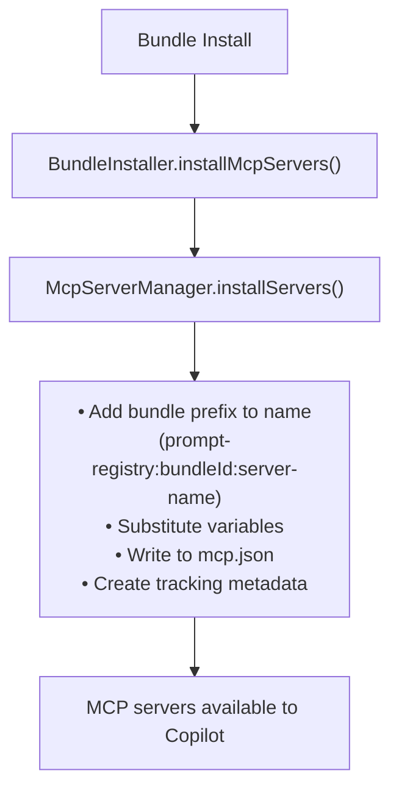

# MCP Integration

Bundles can include MCP (Model Context Protocol) servers that extend Copilot's capabilities.

## Components

| Component | Responsibility |
|-----------|---------------|
| **BundleInstaller** | Calls MCP install/uninstall during bundle lifecycle |
| **McpServerManager** | Orchestrates installation, naming, tracking |
| **McpConfigService** | Reads/writes VS Code's `mcp.json` |

## Installation Flow



## Bundle Manifest Schema

```yaml
mcpServers:
  server-name:
    command: string          # Required
    args: string[]           # Optional
    env: Record<string, string>  # Optional
    disabled: boolean        # Optional (default: false)
    description: string      # Optional
```

## Variable Substitution

| Variable | Description |
|----------|-------------|
| `${bundlePath}` | Absolute path to bundle directory |
| `${bundleId}` | Bundle identifier |
| `${bundleVersion}` | Bundle version |
| `${env:VAR_NAME}` | Environment variable |

## Example

```yaml
mcpServers:
  custom-server:
    command: node
    args:
      - "${bundlePath}/servers/custom.js"
    env:
      BUNDLE_ID: "${bundleId}"
      API_KEY: "${env:MY_API_KEY}"
    description: Custom operations
```

## Uninstallation

1. Read tracking metadata for bundle's servers
2. Remove servers from `mcp.json`
3. Update tracking metadata
4. Atomic operations with backup/rollback

## See Also

- [Installation Flow](./installation-flow.md) — Bundle installation
- [Author Guide: Collection Schema](../../author-guide/collection-schema.md) — MCP in manifests
