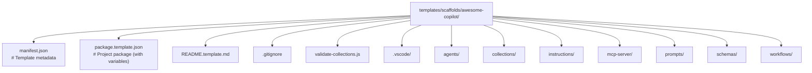
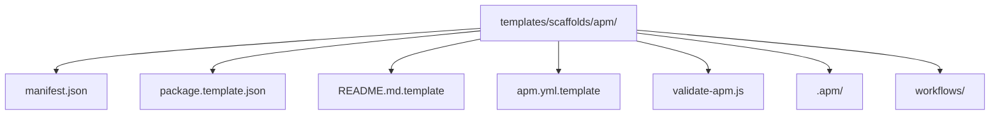

# Scaffolding

Project templates for creating GitHub Copilot prompt projects.

## Components

| Component | Responsibility |
|-----------|---------------|
| **ScaffoldCommand** | Prompts user, orchestrates scaffolding |
| **TemplateEngine** | Loads, renders, copies templates |

## Scaffold Types

```typescript
export enum ScaffoldType {
    AwesomeCopilot = 'awesome-copilot',
    Apm = 'apm'
}
```

## Template Structure

**Awesome Copilot Template:**


**APM Template:**


## Variable Substitution

Templates use `{{variableName}}` format (processed by `replaceVariables` utility in `src/utils/regexUtils.ts`):

| Variable | Description |
|----------|-------------|
| `{{projectName}}` | Project name |
| `{{collectionId}}` | Collection ID (kebab-case from project name) |
| `{{packageName}}` | Package name (computed from projectName, kebab-case) |
| `{{description}}` | Description (defaults to "A new APM package") |
| `{{author}}` | Author name (defaults to `$USER` env var) |
| `{{tags}}` | Tags array (formatted as JSON string) |
| `{{name}}` | Alias for packageName if not provided |

## TemplateEngine API

```typescript
class TemplateEngine {
    constructor(templateRoot: string);
    async loadManifest(): Promise<TemplateManifest>;
    async renderTemplate(name: string, context: TemplateContext): Promise<string>;
    async copyTemplate(name: string, targetPath: string | vscode.Uri, context: TemplateContext): Promise<void>;
    async scaffoldProject(targetPath: string | vscode.Uri, context: TemplateContext): Promise<void>;
    async getTemplates(): Promise<{ [key: string]: TemplateInfo }>;
}

interface TemplateContext {
    projectName: string;
    collectionId: string;
    [key: string]: any;
}
```

## Usage

```bash
Ctrl+Shift+P → "Prompt Registry: Scaffold Project"
```

## See Also

- [Author Guide: Creating Collections](../../author-guide/creating-source-bundle.md)
