# UI Components

## Marketplace View

WebView-based marketplace with tiles, search, and filters.

### Architecture

### Message Types

| Message | Direction | Purpose |
|---------|-----------|---------|
| `bundlesLoaded` | Host → Webview | Send bundle data |
| `refresh` | Webview → Host | Refresh bundle list |
| `install` | Webview → Host | Install bundle |
| `installVersion` | Webview → Host | Install specific version |
| `update` | Webview → Host | Update bundle |
| `uninstall` | Webview → Host | Uninstall bundle |
| `openDetails` | Webview → Host | Open bundle details |
| `openPromptFile` | Webview → Host | Open prompt file |
| `getVersions` | Webview → Host | Get available versions |
| `toggleAutoUpdate` | Webview → Host | Toggle auto-update |
| `openSourceRepository` | Webview → Host | Open source repo |

### Interaction Flow

1. User opens Marketplace
2. `resolveWebviewView()` called
3. `searchBundles({})` fetches bundles
4. `postMessage({type: 'bundlesLoaded'})` sends to webview
5. Webview renders tiles
6. User clicks Install → `postMessage({type: 'install'})`
7. Host calls `RegistryManager.installBundle()`
8. Success → refresh tiles with installed badge

## Tree View

Hierarchical view displaying profiles, bundles, and sources with two view modes: "All Hubs" and "Favorites".

### Structure

The tree view has two modes controlled by `toggleViewMode()`:

#### All Hubs Mode (Default)

```mermaid
graph TD
    A["📁 Shared Profiles"] 
    B["📦 Installed Bundles"]
    C["📁 Sources"]
    
    A --> D["Hub Name 1"]
    A --> E["Hub Name 2"]
    D --> F["📁 Folder (if nested)"]
    D --> G["🔷 Profile Name"]
    F --> H["🔷 Nested Profile"]
    G --> I["📦 Profile Bundle"]
    
    B --> J["✅ bundle-name (v1.0.0)"]
    B --> K["⬆️ updatable-bundle (v1.0.0 → v1.1.0)"]
    B --> L["🔄 auto-update-bundle (v1.0.0)"]
    
    C --> M["📡 source-name"]
    C --> N["➕ Add Source..."]
```

#### Favorites Mode

```mermaid
graph TD
    A["⭐ Favorites"]
    B["📦 Installed Bundles"] 
    C["📁 Sources"]
    
    A --> D["Active Profile"]
    A --> E["Hub Name (favorites only)"]
    A --> F["📁 Local Profiles"]
    A --> G["➕ Create New Profile..."]
    
    D --> H["🔷 Current Active Profile"]
    D --> I["None"]
    
    E --> J["⭐ 🔷 Favorited Hub Profile"]
    F --> K["🔷 Local Profile"]
    
    B --> L["✅ bundle-name (v1.0.0)"]
    C --> M["📡 source-name"]
```

### Components

| Component | Responsibility |
|-----------|---------------|
| **RegistryTreeProvider** | Main tree data provider implementing `vscode.TreeDataProvider<RegistryTreeItem>` |
| **RegistryTreeItem** | Individual tree nodes extending `vscode.TreeItem` with type, data, and context |
| **TreeItemType** | Enum defining 20+ node types (profiles, hubs, bundles, sources, folders, etc.) |

### Key Features

#### View Mode Toggle
- **All Hubs Mode**: Shows all imported hubs and their profiles
- **Favorites Mode**: Shows only favorited profiles, active profile section, and local profiles
- Toggle via `promptRegistry.toggleProfileView` command in view title

#### Bundle Status Indicators
- **✅**: Installed bundle (up-to-date)
- **⬆️**: Update available
- **🔄**: Auto-update enabled
- Version display shows current version or "current → latest" when updates available

#### Profile Organization
- **Hub Profiles**: Organized by hub with folder structure support
- **Local Profiles**: User-created profiles stored locally
- **Active Profile**: Special section showing currently active profile
- **Favorites**: Star-marked hub profiles for quick access

#### Context Menus
Extensive right-click menus defined in `package.json` with context-sensitive actions:

| Context Value | Available Actions |
|---------------|-------------------|
| `profile`, `profile-active` | Activate, Deactivate, Edit, Export, Delete |
| `hub_profile` | Activate, Deactivate, Edit, Export, Delete, Toggle Favorite, Open Repository |
| `installed_bundle_*` | View, Update, Check Updates, Enable/Disable Auto-Update, Uninstall, Open Repository |
| `source` | Edit, Sync, Remove, Toggle, Open Repository |
| `hub` | Sync, Delete, Open Repository |

### Implementation Details

#### Tree Data Provider
- Implements `vscode.TreeDataProvider<RegistryTreeItem>`
- Registered as `promptRegistryExplorer` in `package.json`
- Supports collapse/expand states and refresh events
- Debounced refresh on source sync events (500ms)

#### Event Handling
Listens to multiple registry and hub manager events:
- Bundle events: installed, uninstalled, updated
- Profile events: activated, deactivated, created, updated, deleted
- Source events: added, removed, updated, synced
- Hub events: imported, deleted, synced, favorites changed

#### Update Detection
- Tracks available updates via `onUpdatesDetected()`
- Maps bundle IDs to `UpdateCheckResult` objects
- Updates tree icons and descriptions when updates available
- Integrates with auto-update preferences

#### Tree Item Types
20+ distinct `TreeItemType` enum values including:
- Root sections: `PROFILES_ROOT`, `HUBS_ROOT`, `FAVORITES_ROOT`, `INSTALLED_ROOT`, `SOURCES_ROOT`
- Profile items: `PROFILE`, `HUB_PROFILE`, `PROFILE_BUNDLE`, `CREATE_PROFILE`
- Bundle items: `INSTALLED_BUNDLE`, `BUNDLE`
- Hub items: `HUB`, `PROFILE_FOLDER`, `LOCAL_PROFILES_FOLDER`
- Source items: `SOURCE`, `ADD_SOURCE`
- Discovery items: `DISCOVER_ROOT`, `DISCOVER_CATEGORY`, etc.

## See Also

- [Installation Flow](./installation-flow.md) — What happens on install
- [User Guide: Marketplace](../../user-guide/marketplace.md) — User documentation
