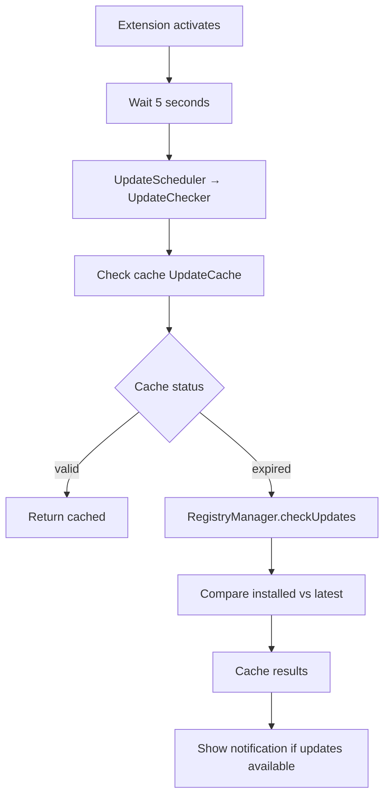

# Update System

Automatic detection and installation of bundle updates.

## Components

| Component | Responsibility |
|-----------|---------------|
| **UpdateScheduler** | Timing of checks (startup, daily/weekly) |
| **UpdateChecker** | Compare installed vs latest versions |
| **AutoUpdateService** | Background updates with rollback |
| **UpdateCache** | Cache results with configurable TTL |

## Configuration

| Setting | Default | Description |
|---------|---------|-------------|
| `promptregistry.updateCheck.enabled` | `true` | Enable update checks |
| `promptregistry.updateCheck.frequency` | `daily` | `daily`, `weekly`, `manual` |
| `promptregistry.updateCheck.autoUpdate` | `false` | Global gate for auto-updates |
| `promptregistry.updateCheck.cacheTTL` | `300000` | Cache TTL (5 min) |
| `promptregistry.updateCheck.notificationPreference` | `all` | `all`, `major`, `none` |

## Update Check Flow



## Auto-Update Logic

**Hybrid approach**: Global `autoUpdate` setting + per-bundle opt-in

For auto-update to occur:
1. Global `updateCheck.autoUpdate` = `true`
2. Per-bundle auto-update enabled (via "Enable Auto-Update" command)

## Concurrency Control

- **Batch Size**: 3 concurrent updates
- **Active Updates Set**: Prevents duplicate operations
- **Check-in-Progress Flag**: Prevents overlapping cycles

## Dependency Injection

Uses interfaces to avoid circular dependencies:

```typescript
interface BundleOperations {
    updateBundle(bundleId: string, version?: string): Promise<void>;
    listInstalledBundles(): Promise<InstalledBundle[]>;
}

class AutoUpdateService {
    constructor(
        private readonly bundleOps: BundleOperations,
        private readonly sourceOps: SourceOperations
    ) {}
}
```

## See Also

- [Installation Flow](./installation-flow.md) — How updates are installed
- [User Guide: Marketplace](../../user-guide/marketplace.md) — User-facing updates
