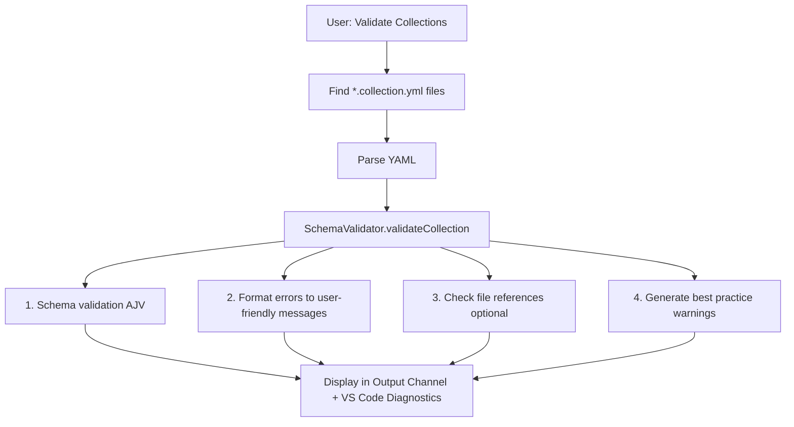
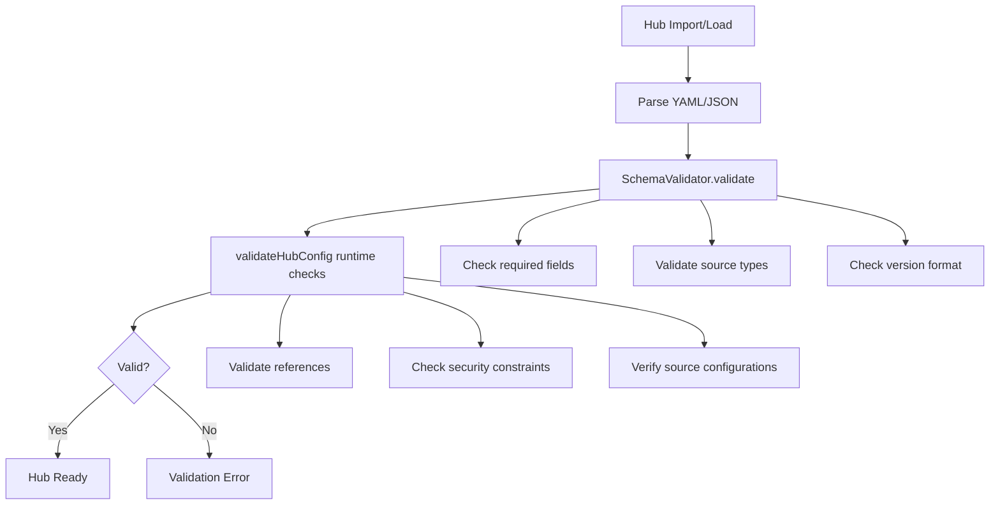

# Validation Architecture

JSON Schema validation for collections, APM packages, and hub configurations.

## Components

| Component | Responsibility |
|-----------|---------------|
| **SchemaValidator** | JSON schema validation using AJV |
| **ValidateCollectionsCommand** | Command handler for collection validation |
| **ValidateApmCommand** | Command handler for APM package validation |
| **HubManager** | Hub configuration validation and runtime checks |

## SchemaValidator API

```typescript
interface ValidationResult {
    valid: boolean;
    errors: string[];
    warnings: string[];
}

interface ValidationOptions {
    checkFileReferences?: boolean;
    workspaceRoot?: string;
}

class SchemaValidator {
    constructor(extensionPath?: string);
    async validate(data: any, schemaPath: string, options?: ValidationOptions): Promise<ValidationResult>;
    async validateCollection(data: any, options?: ValidationOptions): Promise<ValidationResult>;
    async validateApm(data: any, options?: ValidationOptions): Promise<ValidationResult>;
    clearCache(): void;
}

// Hub validation is handled by HubManager
class HubManager {
    async validateHub(config: HubConfig): Promise<ValidationResult>;
}
```

## Validation Flow



## Error Formatting

| Error Type | Example |
|------------|---------|
| Required field | `Missing required field: description` |
| Pattern mismatch | `/id: must match pattern ^[a-z0-9-]+$` |
| Enum violation | `kind: must be one of: prompt, instruction, chat-mode, agent` |
| Type mismatch | `/version: must be string` |
| Length violation | `description: must be at most 500 characters` |
| Additional property | `/: has unexpected property 'foo'` |

## Performance

- **Schema Caching**: Compiled schemas cached in Map
- **Lazy Loading**: Schemas loaded on first use
- **Efficient File Checking**: Only when `checkFileReferences` enabled

## Validation Schemas

The extension provides JSON Schema validation for all major configuration file types. Each schema enforces structure, data types, and business rules specific to its component.

### Collection Schema

**Location:** `schemas/collection.schema.json`  
**Validates:** Copilot prompt collection files (`.collection.yml`)

**Required fields:**
- `id` — Unique identifier (lowercase letters, numbers, hyphens only)
- `name` — Human-readable collection name (1-100 characters)
- `description` — Detailed purpose description (1-500 characters)
- `items` — Array of collection resources (0-50 items)

**Optional fields:**
- `version` — Semantic version string
- `author` — Collection author information
- `tags` — Array of categorization tags
- `mcp` — Model Context Protocol server configurations
- `display` — UI display preferences (color, icon, ordering)

**Item types supported:** `prompt`, `instruction`, `chat-mode`, `agent`

**Validation features:**
- File reference checking (when `checkFileReferences` enabled)
- Best practice warnings (long descriptions, empty collections, missing metadata)
- MCP server configuration validation

See [Author Guide: Collection Schema](../../author-guide/collection-schema.md) for complete reference.

### APM Schema

**Location:** `schemas/apm.schema.json`  
**Validates:** APM (Awesome Prompt Manager) package manifests

**Required fields:**
- `name` — Package name (lowercase letters, numbers, dots, underscores, hyphens)
- `version` — Semantic version with optional pre-release suffix
- `description` — Package description (max 500 characters)
- `author` — Package author

**Optional fields:**
- `license` — License identifier
- `tags` — Array of tags (max 20 items, 30 characters each)
- `dependencies` — Package dependencies (`apm`, `mcp` arrays)
- `scripts` — Build/lifecycle scripts object

**Validation features:**
- Semantic version format enforcement
- Package name pattern validation
- Dependency structure validation

### Hub Configuration Schema

**Location:** `schemas/hub-config.schema.json`  
**Validates:** Hub configuration files that define bundle sources and profiles

**Required fields:**
- `version` — Semantic version of hub config format
- `metadata` — Hub metadata object
  - `name` — Hub name (1-100 characters)
  - `description` — Hub description (1-500 characters)
  - `maintainer` — Maintainer identifier (1-100 characters)
  - `updatedAt` — ISO 8601 timestamp
- `sources` — Array of bundle sources (minimum 1)

**Optional fields:**
- `profiles` — Predefined bundle collections
- `configuration` — Hub-level settings (autoSync, syncInterval, strictMode)
- `metadata.checksum` — Integrity checksum (sha256/sha512 format)

**Source types supported:**
- `github`, `gitlab` — Git repository sources
- `http`, `url` — HTTP-based sources  
- `local` — Local filesystem sources
- `awesome-copilot`, `local-awesome-copilot` — Awesome Copilot collections
- `apm`, `local-apm` — APM package sources

**Profile structure:**
- Bundle references with version constraints
- Source mapping and dependency resolution
- Activation state management

**Validation features:**
- Two-phase validation (schema + runtime)
- Source type compatibility checking
- Profile bundle reference validation
- Security constraint enforcement

### Default Hubs Schema

**Location:** `schemas/default-hubs-config.schema.json`  
**Validates:** Default hub configurations for extension first-run setup

**Required fields:**
- `defaultHubs` — Array of hub options
  - `name` — Display name for hub selection
  - `description` — Description shown in selector UI
  - `icon` — VS Code codicon name (without `$()` wrapper)
  - `reference` — Hub reference configuration
    - `type` — Source type (`github`, `local`, `url`)
    - `location` — Hub location (repo path, local path, or URL)

**Optional fields:**
- `reference.ref` — Git reference (branch, tag, commit) for GitHub sources
- `reference.autoSync` — Automatic synchronization flag
- `recommended` — Recommended default hub flag
- `enabled` — Visibility in first-run selector

**Validation features:**
- Hub reference structure validation
- Icon name format checking
- Source type compatibility validation

## Schema Usage Patterns

### Direct Schema Validation

```typescript
// Collection validation
const result = await validator.validateCollection(collectionData, {
    checkFileReferences: true,
    workspaceRoot: '/path/to/workspace'
});

// APM validation  
const result = await validator.validateApm(apmManifest);

// Hub validation (two-phase)
const result = await hubManager.validateHub(hubConfig);
```

### Command-Based Validation

```typescript
// Validate all collections in workspace
await vscode.commands.executeCommand('promptRegistry.validateCollections');

// Validate APM packages
await vscode.commands.executeCommand('promptRegistry.validateApm');
```

### Runtime Integration

Hub validation occurs automatically during:
- Hub import/installation
- Configuration updates
- Profile activation/deactivation
- Source synchronization

## Hub Validation Flow

Hub validation occurs in two phases:

1. **Schema Validation** — JSON Schema validation using AJV
2. **Runtime Validation** — Additional business logic checks



## Validation Commands

| Command | Purpose | Schema Used |
|---------|---------|-------------|
| `promptRegistry.validateCollections` | Validate collection files | `collection.schema.json` |
| `promptRegistry.validateApm` | Validate APM packages | `apm.schema.json` |
| Hub validation | Automatic during import/load | `hub-config.schema.json` |

## See Also

- [Author Guide: Collection Schema](../../author-guide/collection-schema.md)
- [Contributor Guide: Validation](../validation.md) — Local validation commands
- [Reference: Hub Schema](../../reference/hub-schema.md) — Hub config format details
