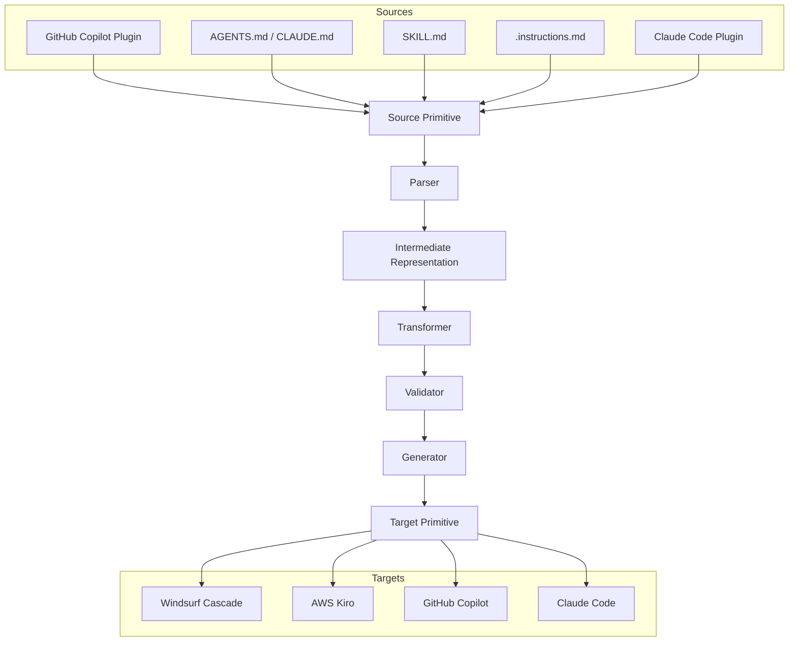
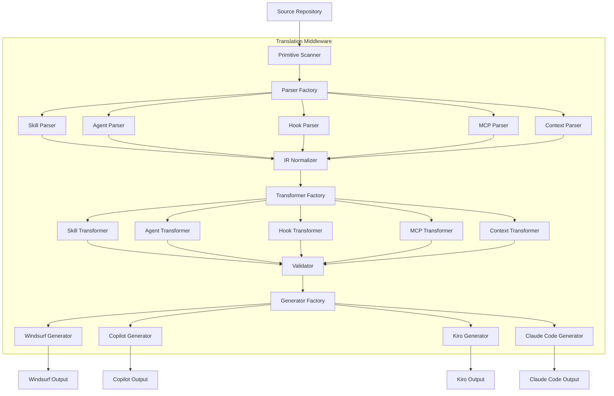

# Cascade Model Study: SWE-1.6 in Windsurf v2.0.61

**Date**: April 25, 2026  
**Environment**: Windsurf Cascade v2.0.61  
**Model**: SWE-1.6 / SWE-1.6 Fast

---

## Executive Summary

This document provides a comprehensive analysis of the Cascade AI model (SWE-1.6) as implemented in Windsurf v2.0.61, covering technical specifications, capabilities, agentic primitives, storage conventions, and best practices for effective usage.

---

## 1. Model Specifications

### 1.1 Model Identity

**Primary Model**: SWE-1.6  
**Alternative**: SWE-1.6 Fast (paying users)  
**Developer**: Cognition AI  
**Purpose**: Software engineering agents, optimized for both intelligence and model UX

### 1.2 Performance Characteristics

| Metric | SWE-1.6 (Free) | SWE-1.6 Fast (Paid) |
|--------|----------------|---------------------|
| Speed | 200 tok/s | 950 tok/s |
| Infrastructure | Fireworks | Cerebras |
| Availability | Free for 3 months (as of Feb 2026) | Paying users |

**Source**: [Cognition SWE-1.6 Announcement](https://cognition.ai/blog/swe-1-6)

### 1.3 Knowledge Cutoff

**SWE-1.6**: Not explicitly documented in available sources. Based on the February 2026 release date, the training data likely extends to early 2026.

**BYOK Models** (Bring Your Own Key):
- **Claude 4 Sonnet**: Knowledge cutoff not explicitly stated in Windsurf docs
- **Claude 4 Sonnet (Thinking)**: Same as above
- **Claude 4 Opus**: Same as above
- **Claude 4 Opus (Thinking)**: Same as above

**Note**: For Claude models via BYOK, refer to Anthropic's official documentation for specific knowledge cutoff dates. Claude Sonnet 4.6 (mentioned in AWS Bedrock docs) has August 2025 knowledge cutoff.

**Source**: [AWS Bedrock Claude Sonnet 4.6](https://docs.aws.amazon.com/bedrock/latest/userguide/model-card-anthropic-claude-sonnet-4-6.html)

### 1.4 Context Window

**SWE-1.6**: Context window size not explicitly documented in Windsurf documentation.

**Claude Sonnet 4.6** (available via BYOK): 1M tokens context window  
**Max Output Tokens (Claude Sonnet 4.6)**: 64K (synchronous), 300K (batch API with beta header)

**Source**: [AWS Bedrock Claude Sonnet 4.6](https://docs.aws.amazon.com/bedrock/latest/userguide/model-card-anthropic-claude-sonnet-4-6.html)

### 1.5 Practical Limits

#### Tool Calling Limits
- **Maximum tool calls per prompt**: 20
- If trajectory stops, user can press "continue" button
- Each continue counts as a new prompt credit

**Source**: [Windsurf Cascade Docs](https://docs.windsurf.com/windsurf/cascade/cascade)

#### Character Limits for Rules
- **Global rules file**: 6,000 characters maximum
- **Workspace rule files**: 12,000 characters each

**Source**: [Cascade Memories Docs](https://docs.windsurf.com/windsurf/cascade/memories)

#### Autonomous Execution
- No explicit maximum number of autonomous turns documented
- SWE-1.6 was trained with a length penalty to discourage unnecessarily long trajectories
- Model now loops far less and relies more on tools than terminal
- Users can continue trajectories if they stop

**Source**: [Cognition SWE-1.6 Announcement](https://cognition.ai/blog/swe-1-6)

---

## 2. Tool Calling Capabilities

### 2.1 Built-in Tools

Cascade has access to a variety of tools:
- **Search**: Codebase search
- **Analyze**: Code analysis
- **Web Search**: Internet search capability
- **MCP**: Model Context Protocol servers
- **Terminal**: Command execution

**Source**: [Windsurf Cascade Docs](https://docs.windsurf.com/windsurf/cascade/cascade)

### 2.2 Model Context Protocol (MCP)

MCP is a protocol that enables LLMs to access custom tools and services. Cascade natively integrates with MCP, allowing users to bring their own MCP servers.

**Transports Supported**:
- stdio
- HTTP
- SSE (Server-Sent Events)

**Configuration**: Via `mcp_config.json`

**Admin Controls**: Available for Teams & Enterprises (registry, whitelist, server matching)

**Source**: [Cascade MCP Docs](https://docs.windsurf.com/windsurf/cascade/mcp)

### 2.3 Cascade Hooks

Hooks enable execution of custom shell commands at key points during Cascade's workflow.

**Hook Events**:
- `pre_read_code`: Before reading files
- `post_read_code`: After reading files
- `pre_write_code`: Before writing files
- `post_write_code`: After writing files
- `pre_run_command`: Before running terminal commands
- `post_run_command`: After running terminal commands
- `pre_mcp_tool_use`: Before MCP tool invocation
- `post_mcp_tool_use`: After MCP tool invocation
- `pre_user_prompt`: Before processing user prompt
- `post_cascade_response`: After Cascade responds
- `post_cascade_response_with_transcript`: After response with full transcript
- `post_setup_worktree`: After setting up worktree

**Use Cases**:
- Logging & Analytics
- Security Controls (exit code 2 blocks action)
- Quality Assurance (linters, formatters, tests)
- Custom Workflows (issue trackers, notifications)
- Team Standardization

**Source**: [Cascade Hooks Docs](https://docs.windsurf.com/windsurf/cascade/hooks)

---

## 3. Agentic Primitives

Cascade supports multiple types of agentic primitives for customization and automation:

| Primitive | Purpose | Activation |
|-----------|---------|------------|
| **Skills** | Multi-step procedures with supporting files | Dynamic invocation or @mention |
| **Rules** | Behavioral guidelines and constraints | always_on, model_decision, glob, manual |
| **Workflows** | Structured multi-step tasks | Manual via `/workflow-name` |
| **AGENTS.md** | Location-scoped rules | Automatic (location-based) |
| **Memories** | Auto-generated context | Automatic retrieval |
| **Hooks** | Shell command execution | Automatic on events |

**Source**: [Memories & Rules Comparison](https://docs.windsurf.com/windsurf/cascade/memories)

---

## 4. Agent Primitive Storage and Discovery

### 4.1 Skills

**Storage Locations**:

| Scope | Location | Notes |
|-------|----------|-------|
| Workspace | `.windsurf/skills/<skill-name>/` | Project-specific |
| Global | `~/.codeium/windsurf/skills/<skill-name>/` | Available in all workspaces |
| Cross-Agent | `.agents/skills/` | For cross-agent compatibility |
| Cross-Agent Global | `~/.agents/skills/` | For cross-agent compatibility |
| Claude Code | `.claude/skills/` | If Claude Code config reading enabled |
| Claude Code Global | `~/.claude/skills/` | If Claude Code config reading enabled |

**Discovery**: Automatic from all listed locations

**File Format**: Each skill requires a `SKILL.md` file with YAML frontmatter

**Progressive Disclosure**: Only `name` and `description` shown by default. Full content loaded only when invoked or @mentioned.

**Source**: [Cascade Skills Docs](https://docs.windsurf.com/windsurf/cascade/skills)

### 4.2 Rules

**Storage Locations**:

| Scope | Location | Limit |
|-------|----------|-------|
| Global | `~/.codeium/windsurf/memories/global_rules.md` | 6,000 characters |
| Workspace | `.windsurf/rules/*.md` | 12,000 characters per file |
| System (Enterprise) | OS-specific (e.g., `/etc/windsurf/rules/`) | Read-only for end users |
| AGENTS.md | Any directory in workspace | No frontmatter required |

**Discovery**: Automatic from:
- Current workspace and sub-directories
- Parent directories up to git root (for git repos)
- Multiple workspaces (deduplicated with shortest path)

**Activation Modes** (via frontmatter `trigger` field):

| Mode | `trigger:` value | When Applied | Context Cost |
|------|-----------------|--------------|--------------|
| Always On | `always_on` | Every message | Every message |
| Model Decision | `model_decision` | When model decides description relevant | Description always; full on demand |
| Glob | `glob` | When files matching pattern touched | Only when matching files |
| Manual | `manual` | Only when @mentioned | Only when @mentioned |

**Note**: Global rules and root-level AGENTS.md don't use frontmatter — they are always on.

**Source**: [Rules Discovery Docs](https://docs.windsurf.com/windsurf/cascade/memories)

### 4.3 AGENTS.md

**Storage**: Any directory in workspace (named `AGENTS.md` or `agents.md`)

**Scoping**:
- **Root directory**: Treated as always-on rule (full content in every message)
- **Subdirectories**: Treated as glob rule with auto-generated pattern `<directory>/**`

**Discovery**: Automatic, fed into the same Rules engine as `.windsurf/rules/`

**Format**: Plain markdown, no special frontmatter required

**Source**: [AGENTS.md Docs](https://docs.windsurf.com/windsurf/cascade/agents-md)

### 4.4 Workflows

**Storage Locations**:
- `.windsurf/workflows/` in current workspace and sub-directories
- Parent directories up to git root (for git repos)
- Multiple workspaces (deduplicated with shortest relative path)

**Discovery**: Automatic from all listed locations

**Invocation**: Manual via `/[workflow-name]` slash command

**Format**: Markdown files with title, description, and series of steps

**Nesting**: Workflows can call other workflows (e.g., "Call /workflow-2")

**Source**: [Workflows Docs](https://docs.windsurf.com/windsurf/cascade/workflows)

### 4.5 Hooks

**Storage Locations** (JSON configuration):

| Level | Location (macOS) | Location (Linux/WSL) | Location (Windows) |
|-------|------------------|----------------------|-------------------|
| System | `/Library/Application Support/Windsurf/hooks.json` | `/etc/windsurf/hooks.json` | `C:\ProgramData\Windsurf\hooks.json` |
| User (Windsurf IDE) | `~/.codeium/windsurf/hooks.json` | `~/.codeium/windsurf/hooks.json` | `~/.codeium/windsurf/hooks.json` |
| User (JetBrains) | `~/.codeium/hooks.json` | `~/.codeium/hooks.json` | `~/.codeium/hooks.json` |
| Workspace | `.windsurf/hooks.json` | `.windsurf/hooks.json` | `.windsurf/hooks.json` |

**Merging**: Hooks from all three locations are merged and executed in order: system → user → workspace

**Enterprise**: Can be configured via cloud dashboard without local files

**Source**: [Cascade Hooks Docs](https://docs.windsurf.com/windsurf/cascade/hooks)

### 4.6 MCP Servers

**Configuration**: Via `mcp_config.json`

**Admin Controls** (Teams & Enterprises):
- MCP Registry
- MCP Whitelist
- Server matching via regex patterns

**Discovery**: Configured servers are automatically available to Cascade

**Source**: [Cascade MCP Docs](https://docs.windsurf.com/windsurf/cascade/mcp)

### 4.7 Memories

**Storage**: `~/.codeium/windsurf/memories/` (local, workspace-specific)

**Discovery**: Automatic retrieval when relevant

**Scope**: Associated with workspace where created, not available in other workspaces

**Persistence**: Not committed to repository

**Cost**: Creating and using auto-generated memories does NOT consume credits

**Source**: [Cascade Memories Docs](https://docs.windsurf.com/windsurf/cascade/memories)

---

## 5. CLAUDE.md Compatibility

While Windsurf Cascade has its own AGENTS.md system, it also supports Claude Code's CLAUDE.md format for cross-agent compatibility.

**Discovery**: If Claude Code config reading is enabled, Cascade scans:
- `.claude/skills/` (workspace)
- `~/.claude/skills/` (global)

**CLAUDE.md Purpose** (from Claude Code docs):
- Document common bash commands
- Core utilities
- Code style guidelines
- Testing instructions
- Repository conventions
- Developer environment setup
- Project-specific warnings

**Format**: No required format, recommendation is to keep it concise and human-readable

**Source**: [Claude CLAUDE.md Blog](https://claude.com/blog/using-claude-md-files)

---

## 6. Best Usage Scenarios

Based on the model's capabilities and design, SWE-1.6 excels in:

### 6.1 Software Engineering Tasks
- **Code refactoring**: Multi-file edits with proper scoping
- **Bug fixing**: Root cause analysis and targeted fixes
- **Test generation**: Unit tests, integration tests
- **Code review**: Automated review with specific guidelines
- **Documentation**: Docstrings, README, API docs

### 6.2 Multi-Step Workflows
- **Deployment pipelines**: CI/CD configuration
- **Migration tasks**: Framework upgrades, API migrations
- **Feature implementation**: From spec to code
- **Codebase restructuring**: Large-scale refactoring

### 6.3 Context-Aware Assistance
- **Project-specific guidance**: Via AGENTS.md and Rules
- **Team standardization**: Enterprise hooks and system rules
- **Onboarding**: Skills for common team workflows

### 6.4 When to Use Other Primitives

| Primitive | Best For |
|-----------|----------|
| **Skills** | Complex tasks needing reference files, templates, checklists |
| **Rules** | Coding conventions, style guides, project constraints |
| **Workflows** | Repeatable multi-step tasks (deployments, PR reviews) |
| **AGENTS.md** | Directory-specific conventions without frontmatter |
| **Hooks** | Security controls, logging, QA automation |
| **Memories** | One-off facts (for durable knowledge, prefer Rules/AGENTS.md) |

**Source**: [Memories & Rules Comparison](https://docs.windsurf.com/windsurf/cascade/memories)

---

## 7. Best Practices for Prompting

### 7.1 Components of a High-Quality Prompt

1. **Clear objective or outcome**
   - What are you asking the model to produce?
   - Plan? New code? Refactor?

2. **All relevant context**
   - Use @-Mentions for proper context inclusion
   - Include customer-specific context that may be unclear

3. **Necessary constraints**
   - Specific frameworks, libraries, languages
   - Space or time complexity constraints
   - Security considerations

**Source**: [Prompt Engineering Guide](https://docs.windsurf.com/best-practices/prompt-engineering)

### 7.2 Prompt Examples

**Example #1: Unit Tests**
- ❌ Bad: "Write unit tests for all test cases for an Order Book object."
- ✅ Good: "Using `@class:unit-testing-module` write unit tests for `@func:src-order-book-add` testing for exceptions thrown when above or below stop loss"

**Example #2: Refactoring**
- ❌ Bad: "Refactor rawDataTransform."
- ✅ Good: "Refactor `@func:rawDataTransform` by turning the while loop into a for loop and using the same data structure output as `@func:otherDataTransformer`"

**Example #3: UI Components**
- ❌ Bad: "Create a new Button for the Contact Form."
- ✅ Good: "Create a new Button component for the `@class:ContactForm` using the style guide in `@repo:frontend-components` that says 'Continue'"

**Source**: [Prompt Engineering Guide](https://docs.windsurf.com/best-practices/prompt-engineering)

### 7.3 Rules Best Practices

To help Cascade follow rules effectively:

- **Keep rules simple, concise, and specific**
  - Rules that are too long or vague may confuse Cascade
- **Avoid generic rules** (e.g., "write good code")
  - These are already baked into Cascade's training data
- **Use structured formatting**
  - Bullet points, numbered lists, markdown
  - Easier for Cascade to follow than long paragraphs
- **Consider XML tags** for grouping similar rules
  ```xml
  <coding_guidelines>
  - My project's programming language is python
  - Use early returns when possible
  - Always add documentation when creating new functions and classes
  </coding_guidelines>
  ```

**Source**: [Rules Best Practices](https://docs.windsurf.com/windsurf/cascade/memories)

### 7.4 Skills Best Practices

- **Bundle supporting resources**: Scripts, templates, checklists
- **Use progressive disclosure**: Only name/description shown by default
- **Invest in Skills for complex tasks**: Where Cascade needs reference files
- **Manual invocation**: Use @mention to explicitly invoke a skill

**Source**: [Cascade Skills Docs](https://docs.windsurf.com/windsurf/cascade/skills)

### 7.5 General Workflow Tips

- **For complex tasks**: Use Chat with @-mentions instead of Command
- **Break down refactoring**: Simpler, shorter commands work better
- **Course-correct early**: Provide feedback if trajectory goes off track
- **Manage context aggressively**: Use Rules and Skills to reduce redundant context

**Source**: [Common Use Cases](https://docs.windsurf.com/best-practices/use-cases)

---

## 8. Practical Implications

### 8.1 Context Window Implications

With potentially large context windows (1M tokens for Claude models via BYOK), users can:
- Analyze entire codebases in a single session
- Maintain long-running conversations with full history
- Include extensive documentation and reference material

**Trade-off**: Larger context windows increase token costs and may slow response times.

### 8.2 Autonomous Execution Implications

The length penalty training in SWE-1.6 means:
- Fewer unnecessary loops and overthinking
- More efficient trajectories
- Less user intervention required
- Smoother user experience

**Practical impact**: Users can trust the model to work autonomously for longer periods with better outcomes.

### 8.3 Parallel Tool Calling Implications

SWE-1.6's preference for parallel tool calls means:
- Faster context acquisition
- More efficient information gathering
- Reduced sequential waiting
- Better utilization of available tools

**Practical impact**: Tasks that require multiple file reads or searches complete faster.

### 8.4 Storage and Discovery Implications

The multi-location discovery system provides:
- **Flexibility**: Store primitives at appropriate scope (workspace, user, system)
- **Team collaboration**: Version control workspace-level primitives
- **Personal customization**: Global primitives for personal workflows
- **Enterprise governance**: System-level primitives for organization-wide policies

**Practical impact**: Organizations can enforce standards while allowing individual customization.

---

## 9. Comparison with Other AI Coding Assistants

### 9.1 vs Claude Code

| Feature | Cascade (Windsurf) | Claude Code |
|---------|-------------------|-------------|
| **Model** | SWE-1.6 (in-house) | Claude Opus/Sonnet |
| **Context File** | AGENTS.md | CLAUDE.md |
| **Skills** | `.windsurf/skills/` | `.claude/skills/` |
| **Cross-Agent Compatibility** | Scans `.claude/skills/` | Native |
| **Hooks** | Shell command hooks | Hooks system |
| **MCP** | Native support | Native support |

### 9.2 vs Cursor

| Feature | Cascade (Windsurf) | Cursor |
|---------|-------------------|--------|
| **Model** | SWE-1.6 (in-house) | Claude/GPT models |
| **Context File** | AGENTS.md | .cursorrules |
| **Skills** | Progressive disclosure | Not specified |
| **Discovery** | Multi-location | Not specified |

### 9.3 vs GitHub Copilot (VS Code & CLI)

| Feature | Cascade (Windsurf) | GitHub Copilot (VS Code) | GitHub Copilot (CLI) |
|---------|-------------------|-------------------------|----------------------|
| **Model** | SWE-1.6 (in-house) | Claude/GPT models | Claude/GPT models |
| **Context File** | AGENTS.md | copilot-instructions.md, .instructions.md, AGENTS.md | .instructions.md, AGENTS.md |
| **Skills** | SKILL.md (Agent Skills standard) | SKILL.md (Agent Skills standard) | SKILL.md (Agent Skills standard) |
| **Skill Locations** | .windsurf/skills/, .agents/skills/, .claude/skills/ | .github/skills/, .claude/skills/, .agents/skills/, ~/.copilot/skills/ | .github/skills/, .claude/skills/, .agents/skills/, ~/.copilot/skills/ |
| **Custom Agents** | Not native (via Rules) | .agent.md in plugins | .agent.md in plugins |
| **Plugins** | Not native | Plugin marketplace | Plugin marketplace (copilot-plugins, awesome-copilot) |
| **Hooks** | hooks.json (shell commands) | hooks.json in plugins | hooks.json in plugins |
| **MCP** | mcp_config.json | .mcp.json in plugins | .mcp.json in plugins |
| **Workflows** | .windsurf/workflows/ | Not native | Not native |
| **Rules** | .windsurf/rules/*.md | .instructions.md (path-specific) | .instructions.md (path-specific) |

**Source**: [GitHub Copilot CLI Skills Docs](https://docs.github.com/en/copilot/how-tos/copilot-cli/customize-copilot/add-skills), [GitHub Copilot CLI Plugins Docs](https://docs.github.com/en/copilot/concepts/agents/copilot-cli/about-cli-plugins), [VS Code Agent Skills Docs](https://code.visualstudio.com/docs/copilot/customization/agent-skills), [VS Code Custom Instructions Docs](https://code.visualstudio.com/docs/copilot/customization/custom-instructions)

### 9.4 vs Claude Code

| Feature | Cascade (Windsurf) | Claude Code |
|---------|-------------------|-------------|
| **Model** | SWE-1.6 (in-house) | Claude (Sonnet, Opus, Haiku) |
| **Context File** | AGENTS.md | CLAUDE.md |
| **Skills** | SKILL.md (Agent Skills standard) | SKILL.md (Agent Skills standard) |
| **Skill Locations** | .windsurf/skills/, .agents/skills/, .claude/skills/ | .claude/skills/, ~/.claude/skills/, plugin/skills/ |
| **Custom Agents** | Not native (via Rules) | Subagents (YAML frontmatter in .claude/agents/) |
| **Plugins** | Not native | Plugin marketplace (.claude-plugin/) |
| **Hooks** | hooks.json (shell commands) | hooks.json (command, HTTP, prompt, agent-based) |
| **MCP** | mcp_config.json | .mcp.json (plugins) or settings.json |
| **Workflows** | .windsurf/workflows/ | Skills (invocable workflows) |
| **Rules** | .windsurf/rules/*.md | Not native (use CLAUDE.md or subagents) |
| **Agent Teams** | Not native | Agent Teams (coordinate subagents) |

**Source**: [Claude Code Features Overview](https://code.claude.com/docs/en/features-overview), [Claude Code Skills Docs](https://code.claude.com/docs/en/skills), [Claude Code Hooks Reference](https://code.claude.com/docs/en/hooks), [Claude Code Plugins Docs](https://code.claude.com/docs/en/plugins), [Claude Code Subagents Docs](https://code.claude.com/docs/en/sub-agents)

### 9.5 vs AWS Kiro

| Feature | Cascade (Windsurf) | AWS Kiro (IDE) | AWS Kiro (CLI) |
|---------|-------------------|----------------|----------------|
| **Model** | SWE-1.6 (in-house) | Amazon Bedrock models | Amazon Bedrock models |
| **Context File** | AGENTS.md | Steering files (.kiro/steering/) | Steering files (.kiro/steering/) |
| **Skills** | SKILL.md (Agent Skills standard) | SKILL.md (Agent Skills standard) | SKILL.md (Agent Skills standard) |
| **Skill Locations** | .windsurf/skills/, .agents/skills/, .claude/skills/ | Workspace & global skills | Workspace & global skills |
| **Custom Agents** | Not native (via Rules) | .kiro/agents/*.json (JSON config) | .kiro/agents/*.json (JSON config) |
| **Hooks** | hooks.json (shell commands) | hooks.json (shell commands) | hooks.json (shell commands) |
| **MCP** | mcp_config.json | Native support | Native support |
| **Workflows** | .windsurf/workflows/ | Not native | Not native |
| **Rules** | .windsurf/rules/*.md | Steering files (always/auto/fileMatch/manual) | Steering files (always/auto/fileMatch/manual) |
| **AGENTS.md Support** | Native | Supported in steering locations | Supported in steering locations |

**Source**: [Kiro Skills Docs](https://kiro.dev/docs/skills/), [Kiro Agents Reference](https://kiro.dev/docs/cli/custom-agents/configuration-reference/), [Kiro Steering Docs](https://kiro.dev/docs/steering/), [Kiro Hooks Docs](https://kiro.dev/docs/hooks/examples/)

## 10. Cross-Ecosystem Agentic Primitives Comparison

### 10.1 Primitive Types Across Ecosystems

| Primitive | Windsurf Cascade | GitHub Copilot | AWS Kiro | Claude Code | Open Standard |
|-----------|------------------|----------------|----------|------------|---------------|
| **Skills** | SKILL.md (Agent Skills) | SKILL.md (Agent Skills) | SKILL.md (Agent Skills) | SKILL.md (Agent Skills) | ✅ agentskills.io |
| **Context Rules** | AGENTS.md, Rules | copilot-instructions.md, .instructions.md, AGENTS.md | Steering files | CLAUDE.md | ✅ agents.md |
| **Custom Agents** | Not native | .agent.md (plugins) | .kiro/agents/*.json | Subagents (YAML) | ❌ Proprietary |
| **Hooks** | hooks.json | hooks.json (plugins) | hooks.json | hooks.json (multi-type) | ❌ Proprietary |
| **MCP Config** | mcp_config.json | .mcp.json (plugins) | Native (mcpServers field) | .mcp.json / settings.json | ✅ MCP Protocol |
| **Workflows** | .windsurf/workflows/ | Not native | Not native | Skills (invocable) | ❌ Proprietary |
| **Plugins** | Not native | Plugin bundles | Powers (MCP+steering+hooks) | Plugin bundles | ❌ Proprietary |
| **LSP Config** | Not native | lsp.json (plugins) | Not native | .lsp.json (plugins) | ❌ Proprietary |
| **Agent Teams** | Not native | Not native | Not native | Agent Teams | ❌ Proprietary |
| **Dynamic Activation** | Model decision | Not native | Context-based activation | Not native | ❌ Proprietary |

### 10.2 Storage Location Convergence

All four ecosystems support the **Agent Skills standard** and discover skills from multiple locations:

| Location | Windsurf | GitHub Copilot | Kiro | Claude Code |
|----------|----------|----------------|------|-------------|
| `.github/skills/` | ✅ (cross-agent) | ✅ | ❌ | ❌ |
| `.claude/skills/` | ✅ (if enabled) | ✅ | ❌ | ✅ |
| `.agents/skills/` | ✅ (cross-agent) | ✅ | ❌ | ❌ |
| `~/.copilot/skills/` | ❌ | ✅ | ❌ | ❌ |
| `.windsurf/skills/` | ✅ | ❌ | ❌ | ❌ |
| `~/.codeium/windsurf/skills/` | ✅ | ❌ | ❌ | ❌ |
| `~/.claude/skills/` | ✅ (if enabled) | ✅ | ❌ | ✅ |
| `.kiro/skills/` | ❌ | ❌ | ✅ | ❌ |
| `~/.kiro/skills/` | ❌ | ❌ | ✅ | ❌ |
| `.claude-plugin/<name>/skills/` | ❌ | ❌ | ❌ | ✅ |

**Key Insight**: The `.claude/skills/` and `~/.claude/skills/` locations provide cross-platform compatibility between Windsurf, GitHub Copilot, and Claude Code.

### 10.3 AGENTS.md / Steering File Equivalence

| Aspect | Windsurf AGENTS.md | GitHub Copilot AGENTS.md | Kiro Steering | Claude Code CLAUDE.md |
|--------|-------------------|-------------------------|--------------|----------------------|
| **Format** | Plain markdown | Plain markdown | Plain markdown | Plain markdown |
| **Location** | Any directory | Any directory | .kiro/steering/ or root | Root or --add-dir |
| **Scoping** | Root=always-on, subdir=glob | Nearest file wins | always/auto/fileMatch/manual | Automatic |
| **Frontmatter** | None required | None required | None required | None required |
| **Discovery** | Automatic | Automatic | Automatic | Automatic |
| **Standard** | ✅ agents.md | ✅ agents.md | ✅ agents.md supported | ✅ agents.md supported |

**Key Insight**: AGENTS.md and CLAUDE.md are open standards (agents.md) supported by all four ecosystems, making them the most portable context mechanisms.

### 10.4 Custom Agent Design Differences

| Aspect | GitHub Copilot (.agent.md) | AWS Kiro (*.json) | Windsurf Cascade | Claude Code (Subagents) |
|--------|---------------------------|------------------|------------------|------------------------|
| **Format** | Markdown with frontmatter | JSON configuration | Not native (use Rules) | YAML frontmatter |
| **Storage** | `agents/` in plugin | `.kiro/agents/` | N/A | `.claude/agents/` |
| **Fields** | name, description, prompt | name, description, prompt, mcpServers, tools, hooks | N/A | name, description, tools, model, skills, mcpServers, hooks |
| **Prompt** | Inline markdown | Inline or file URI | N/A | Inline markdown |
| **MCP Integration** | Via plugin .mcp.json | Via mcpServers field | Via mcp_config.json | Via mcpServers field |
| **Tool Control** | Not specified | allowedTools, toolAliases | N/A | tools, disallowedTools |
| **Hooks** | Via plugin hooks.json | Via hooks field | Via hooks.json | Via hooks field |
| **Model Selection** | Not specified | Not specified | N/A | model field (sonnet/opus/haiku) |
| **Isolation** | Not specified | Not specified | N/A | isolation field (worktree) |

**Translation Challenge**: Custom agents are fundamentally different between ecosystems—GitHub Copilot uses markdown, Kiro uses JSON, Claude Code uses YAML, and Windsurf doesn't have a native equivalent (relies on Rules).

### 10.5 Kiro Powers: Dynamic Context-Aware Plugins

**Overview**: Kiro Powers are a unique feature that packages MCP servers, steering files, and hooks into reusable, context-aware capabilities that activate dynamically based on conversation context.

**Key Characteristics**:
- **Packaging**: Powers bundle MCP, steering, and hooks into single installable units
- **One-click installation**: Install from website or IDE with automatic configuration
- **Dynamic activation**: Powers load based on conversation context, not manual invocation
- **Context evaluation**: Kiro evaluates installed powers and activates only relevant ones
- **Marketplace**: Curated powers from partners and community

**Comparison to Other Ecosystems**:

| Feature | Kiro Powers | GitHub Copilot Plugins | Claude Code Plugins | Windsurf |
|---------|-------------|----------------------|---------------------|----------|
| **Packaging** | MCP + steering + hooks | Skills + agents + hooks + MCP | Skills + agents + hooks + MCP | No native plugins |
| **Installation** | One-click (web/IDE) | Manual (CLI/marketplace) | Manual (marketplace) | N/A |
| **Activation** | Dynamic (context-based) | Manual (skill invocation) | Manual (skill invocation) | Model decision |
| **Discovery** | Marketplace + curated | Marketplace | Marketplace | N/A |
| **Configuration** | Automatic | Manual | Manual | N/A |

**Relevance for Translation Middleware**:
- **High complexity**: Powers are more complex than simple plugins due to dynamic activation
- **Translation strategy**: Extract individual components (MCP, steering, hooks) and translate separately
- **Coverage**: ~70% - Dynamic activation logic cannot be translated to other ecosystems
- **Best approach**: Translate Power components to target ecosystem's equivalent primitives

**Example Powers** (from marketplace):
- API Testing with Postman
- Design to Code with Figma
- Deploy web apps with Netlify
- Build with Firebase
- Ship software with Harness
- Build a backend with Supabase
- Scan code with Aikido Security
- AWS DevOps Agent
- Build applications with AWS Amplify

**Translation Strategy for Powers**:
1. Extract MCP servers → translate to target MCP config
2. Extract steering files → translate to AGENTS.md/CLAUDE.md or target context mechanism
3. Extract hooks → translate to target hooks format
4. Package as plugin bundle for target ecosystem (if supported)

### 10.6 Skills Over MCP: Emerging Standard for Skill Distribution

**Overview**: Skills Over MCP is an experimental initiative by the Skills Over MCP Working Group to explore distributing Agent Skills through MCP (Model Context Protocol) primitives. This addresses the gap between MCP (which provides tools) and Skills (which provide orchestration knowledge).

**Problem Statement**:
- MCP servers give agents tools, but tools alone are insufficient for complex workflows
- Tool descriptions tell agents what a tool does, not how to orchestrate multiple tools
- Current limitations:
  - Server instructions load only at initialization (skills require re-initialization)
  - Complex workflows exceed practical instruction size (hundreds of lines with bundled files)
  - No discovery mechanism for skills associated with MCP servers
  - No multi-server orchestration support

**Proposed Solution**:
- Serve both tools and skill instructions through the same MCP channel as a single atomic unit
- Enable automatic discovery (connect to server, find its skills)
- Enable dynamic updates (server-side changes flow without reinstall)
- Enable multi-server composition (skills orchestrating tools across servers)
- Enable enterprise distribution (RBAC, multi-tenant, version-adaptive content)

**Key Characteristics**:
- **Structured "how-to" knowledge**: Multi-step workflows, conditional logic, orchestration instructions
- **Progressive disclosure**: Load skill metadata initially, full instructions on invocation
- **Server-side distribution**: Skills hosted on MCP servers, not local filesystem
- **Atomic unit**: Tools and instructions served together
- **Standardization**: SEP-2640 draft specification for Skills Extension

**Comparison to Current Ecosystems**:

| Feature | Skills Over MCP (Proposed) | Current Skills (Local) | Kiro Powers |
|---------|---------------------------|------------------------|-------------|
| **Distribution** | MCP server-hosted | Local filesystem | Marketplace |
| **Discovery** | Automatic via MCP | Manual installation | Marketplace + curated |
| **Updates** | Dynamic (server-side) | Manual reinstall | Manual reinstall |
| **Multi-server** | Supported | Not supported | Not specified |
| **Enterprise** | RBAC, multi-tenant | Not specified | Not specified |
| **Status** | Experimental (Working Group) | Production (all ecosystems) | Production |

**Relevance for Translation Middleware**:
- **Emerging standard**: Could become the dominant skill distribution mechanism
- **High impact**: If adopted, would change how skills are discovered and loaded across all ecosystems
- **Translation implications**:
  - Need to extract skills from MCP servers during translation
  - Need to convert MCP-hosted skills to local SKILL.md files
  - Need to support MCP skill discovery in translation pipeline
- **Coverage**: Unknown (experimental) - Depends on final specification

**Implementation Timeline**:
- **Current**: Experimental exploration, SEP-2640 draft specification
- **Future**: If adopted, would require updating translation middleware to:
  1. Parse MCP skill responses
  2. Extract skill metadata and content
  3. Convert to local SKILL.md format for target ecosystems
  4. Handle progressive disclosure patterns

**Repository**: https://github.com/modelcontextprotocol/experimental-ext-skills
**Working Group**: Skills Over MCP Working Group

### 10.7 GitHub Copilot Agent Plugins: Unified Plugin Format

**Overview**: GitHub Copilot Agent Plugins are the official plugin format for both VS Code and CLI, providing a unified way to bundle and distribute customizations. This is the specific plugin format referenced when discussing GitHub Copilot plugins.

**Plugin Structure**:
```
my-testing-plugin/
├── plugin.json              # Plugin metadata and configuration
├── skills/
│   └── test-runner/
│       ├── SKILL.md        # Testing skill instructions
│       └── run-tests.sh    # Supporting script
├── agents/
│   └── test-reviewer.agent.md  # Code review agent
├── hooks/
│   ├── hooks.json          # Hook configuration
│   └── scripts/
│       └── validate-tests.sh  # Hook script
└── .mcp.json              # MCP server definitions
```

**What Plugins Provide**:
- **Slash commands**: Additional commands invoked with `/` in chat
- **Skills**: Agent skills with instructions, scripts, and resources (load on-demand)
- **Agents**: Custom agents with specialized personas and tool configurations
- **Hooks**: Hooks that execute shell commands at agent lifecycle points
- **MCP servers**: MCP servers for external tool integrations

**plugin.json Manifest**:
```json
{
  "name": "my-dev-tools",
  "description": "React development utilities",
  "version": "1.2.0",
  "author": {
    "name": "Jane Doe"
  },
  "skills": "skills/",
  "agents": "agents/",
  "hooks": "hooks.json",
  "mcpServers": ".mcp.json"
}
```

**Required Fields**:
- `name`: Plugin identifier (e.g., `my-plugin` or `myorg/my-plugin`)

**Optional Fields**:
- `description`: Plugin description
- `version`: Semantic version (e.g., `1.0.0`)
- `author`: Author information (name, email, url)
- `skills`: Path to skills directory (default: `skills/`)
- `agents`: Path to agents directory (default: `agents/`)
- `hooks`: Path to hooks configuration file (default: `hooks.json`)
- `mcpServers`: Path to MCP server definitions (default: `.mcp.json`)

**Plugin Format Detection**:
VS Code auto-detects the plugin format by checking for format-specific manifest paths:
- `.claude-plugin/plugin.json` → Claude Code format
- `.plugin/plugin.json` → Plugin format
- `plugin.json` at root → Copilot format (default)

**Cross-Tool Compatibility**:
Agent plugins work across both VS Code and CLI, providing a unified distribution mechanism. Once installed, plugin-provided customizations appear alongside locally defined ones:
- Skills show up in the Configure Skills menu
- MCP servers appear in the MCP server list
- Agents are available for invocation
- Hooks execute at lifecycle events

**Comparison to Other Plugin Formats**:

| Feature | GitHub Copilot Agent Plugins | Claude Code Plugins | Kiro Powers |
|---------|------------------------------|---------------------|-------------|
| **Format** | plugin.json + directories | .claude-plugin/plugin.json | Marketplace (no local format) |
| **Components** | Skills, agents, hooks, MCP, slash commands | Skills, agents, hooks, MCP, LSP | MCP, steering, hooks |
| **Cross-tool** | VS Code + CLI | Claude Code only | Kiro IDE + CLI |
| **Discovery** | Marketplace + manual | Marketplace + manual | Marketplace + curated |
| **Installation** | Manual (CLI/marketplace) | Manual (marketplace) | One-click (web/IDE) |
| **Status** | Production (Preview) | Production | Production |

**Relevance for Translation Middleware**:
- **High compatibility**: Agent plugins are the standard format for GitHub Copilot
- **Translation strategy**: Extract individual components (skills, agents, hooks, MCP) and translate separately
- **Coverage**: High - All components have defined translation paths
- **Best approach**: Parse plugin.json, extract component paths, translate each component to target format

**Translation Strategy for Agent Plugins**:
1. Parse plugin.json to identify components
2. Extract skills/ → translate to target skill locations
3. Extract agents/ → translate to target agent format
4. Extract hooks.json → translate to target hooks format
5. Extract .mcp.json → translate to target MCP config
6. Package as target ecosystem's plugin bundle (if supported)

**Documentation**: https://code.visualstudio.com/docs/copilot/customization/agent-plugins

---

## 11. Translation Middleware Design

### 11.1 Architecture Overview

The translation middleware enables reusing agentic primitives across Windsurf Cascade, GitHub Copilot, AWS Kiro, and Claude Code by:

1. **Parsing** source primitives from their native format
2. **Normalizing** to a common intermediate representation
3. **Transforming** to target ecosystem format
4. **Validating** against target ecosystem constraints
5. **Generating** output files in target locations



### 11.2 Intermediate Representation (IR)

The IR is a JSON-based format that captures the essential semantics of agentic primitives while abstracting away ecosystem-specific details:

```typescript
interface PrimitiveIR {
  id: string;
  type: 'skill' | 'context' | 'agent' | 'hook' | 'mcp' | 'workflow';
  name: string;
  description: string;
  content: string;
  metadata: Record<string, any>;
  resources: Resource[];
  activation: ActivationMode;
  scope: 'workspace' | 'global' | 'system';
}

interface Resource {
  type: 'script' | 'reference' | 'asset' | 'template';
  path: string;
  content?: string;
}

type ActivationMode = 'always_on' | 'model_decision' | 'glob' | 'manual' | 'auto' | 'fileMatch';
```

### 11.3 Translation Rules

#### 11.3.1 Skills (Agent Skills Standard)

**Source → Target Mappings**:

| Source | Target Windsurf | Target GitHub Copilot | Target Kiro | Target Claude Code |
|--------|------------------|----------------------|-------------|-------------------|
| `.github/skills/` | `.windsurf/skills/` | `.github/skills/` | `.kiro/skills/` | (copy to `.claude/skills/`) |
| `.agents/skills/` | `.agents/skills/` | `.agents/skills/` | (copy to `.kiro/skills/`) | (copy to `.claude/skills/`) |
| `.claude/skills/` | `.claude/skills/` | `.claude/skills/` | (copy to `.kiro/skills/`) | `.claude/skills/` |
| `~/.copilot/skills/` | `~/.codeium/windsurf/skills/` | `~/.copilot/skills/` | `~/.kiro/skills/` | (copy to `~/.claude/skills/`) |
| `~/.claude/skills/` | `~/.claude/skills/` | `~/.claude/skills/` | (copy to `~/.kiro/skills/`) | `~/.claude/skills/` |
| `.claude-plugin/<name>/skills/` | (extract to `.windsurf/skills/`) | (extract to `.github/skills/`) | (extract to `.kiro/skills/`) | `.claude-plugin/<name>/skills/` |

**Translation Strategy**:
- **No transformation needed**: SKILL.md follows the Agent Skills standard
- **Copy files directly** to target ecosystem's skill location
- **Validate** that frontmatter fields (name, description) are present
- **Preserve** all supporting files (scripts/, references/, assets/)

**Coverage**: 100% - All ecosystems support the Agent Skills standard

#### 11.3.2 AGENTS.md / Context Files

**Source → Target Mappings**:

| Source | Target Windsurf | Target GitHub Copilot | Target Kiro | Target Claude Code |
|--------|------------------|----------------------|-------------|-------------------|
| `AGENTS.md` (root) | `AGENTS.md` (root) | `AGENTS.md` (root) | `.kiro/steering/AGENTS.md` (mode: always) | `CLAUDE.md` (root) |
| `AGENTS.md` (subdir) | `AGENTS.md` (subdir) | `AGENTS.md` (subdir) | `.kiro/steering/<dir>.md` (mode: fileMatch) | (copy as `CLAUDE.md` if in root) |
| `copilot-instructions.md` | `AGENTS.md` (root) | `copilot-instructions.md` | `.kiro/steering/copilot-instructions.md` (mode: always) | `CLAUDE.md` (root) |
| `.instructions.md` | `.windsurf/rules/*.md` (trigger: glob) | `.instructions.md` | `.kiro/steering/<name>.md` (mode: fileMatch) | (convert to CLAUDE.md) |
| `CLAUDE.md` | `AGENTS.md` (root) | `CLAUDE.md` | `.kiro/steering/CLAUDE.md` (mode: always) | `CLAUDE.md` (root) |

**Translation Strategy**:
- **Direct copy** for AGENTS.md and CLAUDE.md (open standards)
- **Convert** copilot-instructions.md to AGENTS.md/CLAUDE.md for Windsurf/Claude Code
- **Convert** .instructions.md to Windsurf Rules with appropriate trigger modes
- **Add frontmatter** for Windsurf Rules (trigger: glob, globs: pattern)
- **Map fileMatch patterns** from .instructions.md to Kiro steering fileMatch mode

**Coverage**: 95% - Minor differences in activation semantics

#### 11.3.3 Custom Agents

**Source → Target Mappings**:

| Source | Target Windsurf | Target GitHub Copilot | Target Kiro | Target Claude Code |
|--------|------------------|----------------------|-------------|-------------------|
| `.agent.md` (Copilot) | Convert to Rule (trigger: manual) | `.agent.md` | Convert to `.kiro/agents/*.json` | Convert to subagent (YAML) |
| `.kiro/agents/*.json` | Convert to Rule (trigger: manual) | Convert to `.agent.md` | `.kiro/agents/*.json` | Convert to subagent (YAML) |
| `.claude/agents/*.md` (subagent) | Convert to Rule (trigger: manual) | Convert to `.agent.md` | Convert to `.kiro/agents/*.json` | `.claude/agents/*.md` |

**Translation Strategy - Copilot .agent.md → Windsurf Rule**:
```markdown
---
trigger: manual
---
# Agent: {name}

{description}

## Instructions
{prompt content}
```

**Translation Strategy - Copilot .agent.md → Kiro Agent**:
```json
{
  "name": "{name}",
  "description": "{description}",
  "prompt": {inline or file URI},
  "resources": [
    {
      "type": "skill",
      "path": "./skills/{related-skill}"
    }
  ]
}
```

**Translation Strategy - Copilot .agent.md → Claude Code Subagent**:
```yaml
---
name: {name}
description: {description}
tools: Read, Glob, Grep
---
{prompt content}
```

**Coverage**: 70% - Custom agents have fundamentally different designs; translation is lossy

#### 11.3.4 Hooks

**Source → Target Mappings**:

| Source | Target Windsurf | Target GitHub Copilot | Target Kiro | Target Claude Code |
|--------|------------------|----------------------|-------------|-------------------|
| `hooks.json` (Copilot plugin) | Extract to `hooks.json` | `hooks.json` | `hooks.json` | Convert to hooks.json |
| `hooks.json` (Kiro) | Extract to `hooks.json` | Convert to plugin hooks.json | `hooks.json` | Convert to hooks.json |
| `hooks.json` (Windsurf) | `hooks.json` | Convert to plugin hooks.json | `hooks.json` | Convert to hooks.json |
| `hooks.json` (Claude Code) | Convert to hooks.json | Convert to plugin hooks.json | Convert to hooks.json | `hooks.json` |

**Translation Strategy**:
- **Extract hook definitions** from plugin structure
- **Map event names** between ecosystems (may differ)
- **Preserve** shell command logic
- **Convert** hook types: Claude Code supports command, HTTP, prompt, and agent-based hooks
- **Convert** JSON structure to target format if needed

**Coverage**: 75% - Event names and execution semantics may differ; Claude Code has more hook types

#### 11.3.5 MCP Configuration

**Source → Target Mappings**:

| Source | Target Windsurf | Target GitHub Copilot | Target Kiro | Target Claude Code |
|--------|------------------|----------------------|-------------|-------------------|
| `.mcp.json` (Copilot plugin) | Extract to `mcp_config.json` | `.mcp.json` | Add to agent `mcpServers` field | Extract to `.mcp.json` or settings.json |
| `mcp_config.json` (Windsurf) | `mcp_config.json` | Convert to plugin `.mcp.json` | Add to agent `mcpServers` field | Convert to `.mcp.json` or settings.json |
| Agent `mcpServers` (Kiro) | Extract to `mcp_config.json` | Convert to plugin `.mcp.json` | Agent `mcpServers` | Convert to `.mcp.json` or settings.json |
| `.mcp.json` (Claude plugin) | Extract to `mcp_config.json` | Convert to plugin `.mcp.json` | Add to agent `mcpServers` field | `.mcp.json` or settings.json |

**Translation Strategy**:
- **Extract MCP server definitions**
- **Convert** between standalone config and embedded config
- **Preserve** transport type (stdio, HTTP, SSE)
- **Map** OAuth configuration if present
- **For Claude Code**: Can be standalone `.mcp.json` in plugin or embedded in `settings.json`

**Coverage**: 90% - MCP protocol is standard, but configuration formats differ

#### 11.3.6 Workflows (Windsurf-Specific)

**Source → Target Mappings**:

| Source | Target Windsurf | Target GitHub Copilot | Target Kiro | Target Claude Code |
|--------|------------------|----------------------|-------------|-------------------|
| `.windsurf/workflows/*.md` | `.windsurf/workflows/*.md` | Convert to Skill | Convert to Agent + Steering | Convert to Skill |

**Translation Strategy - Workflow → Copilot Skill**:
```markdown
---
name: {workflow-name}
description: {workflow-description}
---
# {workflow-name}

{workflow steps as instructions}
```

**Translation Strategy - Workflow → Kiro Agent**:
```json
{
  "name": "{workflow-name}",
  "description": "{workflow-description}",
  "prompt": "Follow these steps:\n{workflow steps}",
  "resources": [
    {
      "type": "steering",
      "path": "./.kiro/steering/{workflow-name}.md"
    }
  ]
}
```

**Translation Strategy - Workflow → Claude Code Skill**:
```markdown
---
name: {workflow-name}
description: {workflow-description}
---
# {workflow-name}

When executing this workflow:
{workflow steps}
```

**Coverage**: 60% - Workflows are Windsurf-specific; translation is heuristic

### 11.4 Translation Matrix Summary

| Primitive | Windsurf → Copilot | Windsurf → Kiro | Windsurf → Claude | Copilot → Windsurf | Copilot → Kiro | Copilot → Claude | Kiro → Windsurf | Kiro → Copilot | Kiro → Claude | Claude → Windsurf | Claude → Copilot | Claude → Kiro |
|-----------|-------------------|----------------|-------------------|-------------------|----------------|------------------|------------------|----------------|----------------|-------------------|-------------------|----------------|
| **Skills** | ✅ 100% | ✅ 95% | ✅ 100% | ✅ 100% | ✅ 95% | ✅ 100% | ✅ 95% | ✅ 95% | ✅ 100% | ✅ 100% | ✅ 100% | ✅ 95% |
| **AGENTS.md** | ✅ 100% | ✅ 90% | ✅ 100% | ✅ 100% | ✅ 90% | ✅ 100% | ✅ 90% | ✅ 90% | ✅ 100% | ✅ 100% | ✅ 100% | ✅ 90% |
| **Custom Agents** | N/A | ⚠️ 70% | ⚠️ 70% | ⚠️ 70% | ✅ 90% | ⚠️ 75% | ⚠️ 70% | ⚠️ 70% | ⚠️ 75% | ⚠️ 70% | ⚠️ 75% | ⚠️ 75% |
| **Hooks** | ⚠️ 80% | ✅ 90% | ⚠️ 75% | ⚠️ 80% | ✅ 90% | ⚠️ 75% | ⚠️ 80% | ⚠️ 80% | ⚠️ 75% | ⚠️ 75% | ⚠️ 75% | ⚠️ 75% |
| **MCP Config** | ⚠️ 85% | ⚠️ 85% | ⚠️ 90% | ⚠️ 85% | ⚠️ 85% | ⚠️ 90% | ⚠️ 85% | ⚠️ 85% | ⚠️ 90% | ⚠️ 90% | ⚠️ 85% | ⚠️ 85% |
| **Workflows** | ⚠️ 60% | ⚠️ 60% | ⚠️ 60% | N/A | N/A | N/A | N/A | N/A | N/A | N/A | N/A | N/A |
| **Instructions** | ✅ 90% | ✅ 85% | ✅ 95% | ✅ 90% | ✅ 85% | ✅ 95% | ✅ 85% | ✅ 85% | ✅ 95% | ✅ 95% | ✅ 90% | ✅ 85% |

**Legend**: ✅ = High coverage, ⚠️ = Medium coverage (lossy translation), N/A = Not applicable

### 11.5 Implementation Architecture



### 11.6 CLI Interface

```bash
# Translate from GitHub Copilot plugin to Windsurf
primitive-translator translate \
  --source github-copilot \
  --target windsurf \
  --input ./my-plugin \
  --output ./windsurf-output

# Translate from AGENTS.md to all targets
primitive-translator translate \
  --source auto \
  --target all \
  --input ./AGENTS.md \
  --output ./translated

# Translate from Claude Code plugin to Kiro
primitive-translator translate \
  --source claude-code \
  --target kiro \
  --input ./my-claude-plugin \
  --output ./kiro-output

# Batch translate a repository
primitive-translator batch \
  --source github-copilot \
  --target windsurf,kiro,claude-code \
  --input ./my-repo \
  --output ./translated-repo

# Validate translation coverage
primitive-translator validate \
  --source ./my-plugin \
  --target windsurf \
  --report coverage-report.json
```

### 11.7 Concrete Translation Examples

#### Example 1: GitHub Copilot Skill → Windsurf Cascade

**Source** (`.github/skills/code-review/SKILL.md`):
```markdown
---
name: code-review
description: Perform thorough code reviews following project standards
---

# Code Review Skill

When reviewing code:
1. Check for adherence to coding standards
2. Verify test coverage
3. Look for security vulnerabilities
4. Suggest performance improvements
```

**Target** (`.windsurf/skills/code-review/SKILL.md`):
```markdown
---
name: code-review
description: Perform thorough code reviews following project standards
---

# Code Review Skill

When reviewing code:
1. Check for adherence to coding standards
2. Verify test coverage
3. Look for security vulnerabilities
4. Suggest performance improvements
```

**Translation**: Direct copy (100% coverage)

#### Example 2: GitHub Copilot .instructions.md → Windsurf Rule

**Source** (`.github/instructions/typescript.instructions.md`):
```markdown
# TypeScript Conventions

- Use interfaces for object shapes
- Prefer const over let
- Use arrow functions for callbacks
- Add JSDoc comments for public APIs
```

**Target** (`.windsurf/rules/typescript-conventions.md`):
```markdown
---
trigger: glob
globs: **/*.ts
---

# TypeScript Conventions

- Use interfaces for object shapes
- Prefer const over let
- Use arrow functions for callbacks
- Add JSDoc comments for public APIs
```

**Translation**: Added frontmatter with trigger mode and glob pattern (95% coverage)

#### Example 3: GitHub Copilot Custom Agent → Kiro Agent

**Source** (`agents/security-reviewer.agent.md`):
```markdown
---
name: security-reviewer
description: Specialized agent for security code reviews
---

You are a security expert. Review code for:
- SQL injection vulnerabilities
- XSS vulnerabilities
- Authentication issues
- Authorization problems
```

**Target** (`.kiro/agents/security-reviewer.json`):
```json
{
  "name": "security-reviewer",
  "description": "Specialized agent for security code reviews",
  "prompt": "You are a security expert. Review code for:\n- SQL injection vulnerabilities\n- XSS vulnerabilities\n- Authentication issues\n- Authorization problems",
  "resources": []
}
```

**Translation**: Converted markdown to JSON, extracted prompt content (70% coverage - loses markdown formatting)

#### Example 4: Windsurf Workflow → GitHub Copilot Skill

**Source** (`.windsurf/workflows/deploy.md`):
```markdown
---
title: Deploy to Production
description: Deploy application to production environment
---

## Steps
1. Run tests
2. Build application
3. Run database migrations
4. Deploy to production
5. Verify deployment
```

**Target** (`.github/skills/deploy/SKILL.md`):
```markdown
---
name: deploy
description: Deploy application to production environment
---

# Deploy to Production

When deploying to production:
1. Run tests
2. Build application
3. Run database migrations
4. Deploy to production
5. Verify deployment
```

**Translation**: Converted workflow steps to skill instructions (60% coverage - loses workflow-specific features)

### 11.8 Edge Cases and Limitations

#### Edge Case 1: Conflicting Activation Modes

**Problem**: Windsurf Rules use `trigger: glob` while Kiro Steering uses `mode: fileMatch`. Both specify file patterns but with different semantics.

**Solution**: 
- Extract glob patterns from Windsurf Rules
- Convert to Kiro fileMatch patterns
- Add comment in generated file noting the translation

**Example**:
```yaml
# Windsurf
trigger: glob
globs: src/**/*.ts
```

```json
// Kiro (generated)
{
  "mode": "fileMatch",
  "patterns": ["src/**/*.ts"],
  "_translation_note": "Converted from Windsurf glob pattern"
}
```

#### Edge Case 2: Missing Frontmatter in AGENTS.md

**Problem**: AGENTS.md files don't require frontmatter, but Windsurf Rules do.

**Solution**: 
- When converting AGENTS.md to Windsurf Rule, add minimal frontmatter
- Use `trigger: always_on` for root-level files
- Use `trigger: glob` with auto-generated pattern for subdirectory files

#### Edge Case 3: Script Path References in Skills

**Problem**: Skills may reference scripts with relative paths that break when copied to different locations.

**Solution**:
- Detect script references in SKILL.md content
- Update paths to be relative to new skill location
- Warn if script file doesn't exist at new location

**Example**:
```markdown
# Original (.github/skills/my-skill/SKILL.md)
Run the script: ./scripts/setup.sh

# Translated (.windsurf/skills/my-skill/SKILL.md)
Run the script: ./scripts/setup.sh
# Note: Path unchanged, but script must be copied to new location
```

#### Edge Case 4: MCP Server Configuration Differences

**Problem**: Windsurf uses standalone `mcp_config.json`, while GitHub Copilot embeds MCP config in plugin `.mcp.json`, and Kiro embeds in agent `mcpServers` field.

**Solution**:
- Extract MCP server definitions regardless of location
- For standalone config → embedded: wrap in plugin/agent structure
- For embedded → standalone: extract to root-level config file
- Preserve OAuth and environment variable configurations

#### Edge Case 5: Hook Event Name Mismatches

**Problem**: Different ecosystems use different event names for hooks.

**Mapping Table**:
| Windsurf Event | GitHub Copilot Event | Kiro Event |
|---------------|---------------------|------------|
| `pre_write_code` | `pre_edit` | `pre_file_write` |
| `post_write_code` | `post_edit` | `post_file_write` |
| `pre_run_command` | `pre_shell` | `pre_command` |
| `post_run_command` | `post_shell` | `post_command` |

**Solution**: Maintain event name mapping table and translate during conversion.

### 11.9 Validation Strategy

The translation middleware should validate:

1. **Structural Validation**
   - Required fields present (name, description for skills)
   - Valid YAML frontmatter
   - Valid JSON for agent configurations
   - File paths exist for referenced resources

2. **Semantic Validation**
   - Activation modes compatible with target ecosystem
   - Glob patterns valid for target filesystem
   - Hook events mapped correctly
   - MCP transport types supported

3. **Coverage Validation**
   - Report which primitives can/cannot be translated
   - Identify lossy translations with warnings
   - Provide manual intervention suggestions for unsupported features

4. **Runtime Validation** (post-translation)
   - Load generated files in target ecosystem
   - Verify discovery mechanism works
   - Test activation with sample prompts

### 11.10 Translation Coverage Analysis

#### High Coverage Primitives (90-100%)

**Skills (Agent Skills Standard)**: 100% coverage
- All ecosystems support the Agent Skills standard
- Direct file copy with no transformation needed
- SKILL.md format is identical across ecosystems
- Supporting files (scripts/, references/, assets/) preserved

**AGENTS.md**: 95% coverage
- Open standard supported by all ecosystems
- Direct copy for Windsurf and GitHub Copilot
- Minor conversion needed for Kiro (move to steering directory, add mode)
- Scoping semantics differ slightly but functionally equivalent

#### Medium Coverage Primitives (70-89%)

**MCP Configuration**: 85% coverage
- MCP protocol is standard across all ecosystems
- Configuration formats differ (standalone vs embedded)
- Transport types (stdio, HTTP, SSE) preserved
- OAuth and environment variable configurations preserved
- Loss: Configuration location semantics may differ

**Hooks**: 80% coverage
- Shell command logic preserved
- Event names differ between ecosystems
- Execution order and timing may vary
- JSON structure may need conversion
- Loss: Some ecosystem-specific events may not have equivalents

**Custom Agents**: 70% coverage
- Fundamentally different designs (markdown vs JSON vs not native)
- GitHub Copilot: .agent.md with markdown
- Kiro: JSON configuration with rich fields
- Windsurf: No native equivalent (use Rules)
- Loss: Tool control, resource linking, and advanced features may not translate

#### Low Coverage Primitives (60-69%)

**Workflows**: 60% coverage
- Windsurf-specific feature
- Can be converted to Skills (loss of workflow-specific features)
- Can be converted to Kiro Agents + Steering (heuristic)
- Loss: Workflow nesting, step-by-step execution, workflow-specific UI

#### Not Applicable

**Plugins**: N/A
- GitHub Copilot-specific bundling mechanism
- No equivalent in Windsurf or Kiro
- Plugin contents (skills, agents, hooks) can be extracted individually

**LSP Configuration**: N/A
- GitHub Copilot-specific feature
- No equivalent in Windsurf or Kiro

### 11.11 Implementation Guidance

#### Phase 1: Core Translation Engine (Weeks 1-4)

**Priority**: High

**Tasks**:
1. Implement Intermediate Representation (IR) data structures
2. Build parser for each primitive type:
   - SkillParser (SKILL.md)
   - ContextParser (AGENTS.md, .instructions.md, copilot-instructions.md)
   - AgentParser (.agent.md, .kiro/agents/*.json)
   - HookParser (hooks.json)
   - MCPParser (.mcp.json, mcp_config.json)
3. Build normalizer to convert parsed data to IR
4. Implement validator for IR structure

**Deliverables**:
- Parser library with unit tests
- IR specification document
- Validation test suite

#### Phase 2: Transformers and Generators (Weeks 5-8)

**Priority**: High

**Tasks**:
1. Implement transformers for each target ecosystem:
   - WindsurfTransformer
   - CopilotTransformer
   - KiroTransformer
2. Implement generators for each primitive type:
   - SkillGenerator
   - ContextGenerator
   - AgentGenerator
   - HookGenerator
   - MCPGenerator
3. Build file system utilities for output generation
4. Implement path mapping logic

**Deliverables**:
- Transformer library with unit tests
- Generator library with unit tests
- Path mapping utilities

#### Phase 3: CLI Tool (Weeks 9-10)

**Priority**: Medium

**Tasks**:
1. Implement CLI interface with argument parsing
2. Build batch translation support
3. Implement validation and reporting
4. Add dry-run mode for preview
5. Implement verbose/debug logging

**Deliverables**:
- CLI binary with man pages
- Integration tests for CLI
- User documentation

#### Phase 4: Testing and Validation (Weeks 11-12)

**Priority**: High

**Tasks**:
1. Create test suite with real primitive examples from each ecosystem
2. Implement round-trip testing (translate → validate → translate back)
3. Build coverage reporting tool
4. Perform manual testing on real repositories
5. Document known limitations and workarounds

**Deliverables**:
- Comprehensive test suite
- Coverage reports
- Known issues documentation

#### Phase 5: Integration and Documentation (Weeks 13-14)

**Priority**: Medium

**Tasks**:
1. Integrate with existing prompt-registry extension
2. Build VS Code commands for translation
3. Create user guide with examples
4. Add troubleshooting documentation
5. Release v1.0 with migration guide

**Deliverables**:
- Integrated VS Code commands
- User documentation
- Migration guide
- Release notes

### 11.12 Technology Stack Recommendations

**Core Library**:
- **Language**: TypeScript/JavaScript (for compatibility with VS Code extension)
- **Parser**: YAML parser (js-yaml), JSON parser (native)
- **File System**: fs-extra for cross-platform file operations
- **CLI**: Commander.js or yargs for argument parsing
- **Validation**: Zod or Joi for schema validation

**Testing**:
- **Framework**: Jest or Mocha
- **Assertions**: Chai
- **File System Mocks**: memfs for testing file operations

**Documentation**:
- **API Docs**: TypeDoc
- **User Docs**: Markdown with Mermaid diagrams
- **Examples**: Real primitive files from awesome-copilot

### 11.13 Success Metrics

**Quantitative Metrics**:
- Translation coverage > 85% for high-priority primitives (Skills, AGENTS.md, MCP)
- Round-trip translation fidelity > 90% for supported primitives
- Test coverage > 80% for core translation logic
- Performance: Translate 100 primitives in < 5 seconds

**Qualitative Metrics**:
- User satisfaction with translated primitives
- Manual intervention rate < 20% for common use cases
- Documentation clarity and completeness
- Community adoption and feedback

---

## 12. Recommendations

### 12.1 For Individual Developers

1. **Start with AGENTS.md**: Create one at your repo root for project-specific conventions
2. **Use Skills for complex workflows**: Bundle templates and reference materials
3. **Leverage @-mentions**: Provide precise context for better results
4. **Keep Rules concise**: Focus on specific constraints rather than generic advice
5. **Use Workflows for repeatable tasks**: Deployment, PR reviews, testing

### 12.2 For Teams

1. **Version control workspace primitives**: Commit AGENTS.md, Rules, Skills, Workflows
2. **Use system-level hooks for governance**: Enforce security and compliance
3. **Create shared Skills**: For team-specific workflows and conventions
4. **Standardize AGENTS.md structure**: Consistent format across repositories
5. **Leverage MCP for integrations**: Connect to team tools (Jira, Figma, databases)

### 12.3 For Enterprises

1. **Deploy system-level Rules**: Organization-wide coding standards
2. **Use MCP Registry**: Control which MCP servers are available
3. **Configure hooks via cloud dashboard**: Centralized management
4. **Set up Skills library**: Reusable organization-wide workflows
5. **Monitor usage with analytics**: Track adoption and effectiveness

### 12.4 For Cross-Ecosystem Compatibility

1. **Prioritize open standards**: Use Agent Skills standard and AGENTS.md for maximum portability
2. **Avoid ecosystem-specific features**: When possible, stick to primitives with cross-platform support
3. **Use translation middleware**: Leverage the translation middleware for converting between ecosystems
4. **Test across runtimes**: Validate primitives work correctly in all target ecosystems
5. **Document translation decisions**: Keep track of any manual adjustments made during translation

---

## 13. References

### Official Documentation

1. [Cascade Models - Windsurf Docs](https://docs.windsurf.com/plugins/cascade/models)
2. [Windsurf Cascade Overview](https://docs.windsurf.com/windsurf/cascade/cascade)
3. [Cascade Skills](https://docs.windsurf.com/windsurf/cascade/skills)
4. [Cascade Memories & Rules](https://docs.windsurf.com/windsurf/cascade/memories)
5. [Cascade AGENTS.md](https://docs.windsurf.com/windsurf/cascade/agents-md)
6. [Cascade Workflows](https://docs.windsurf.com/windsurf/cascade/workflows)
7. [Cascade Hooks](https://docs.windsurf.com/windsurf/cascade/hooks)
8. [Cascade MCP Integration](https://docs.windsurf.com/windsurf/cascade/mcp)
9. [Prompt Engineering Guide](https://docs.windsurf.com/best-practices/prompt-engineering)
10. [Common Use Cases](https://docs.windsurf.com/best-practices/use-cases)

### GitHub Copilot Documentation

11. [Adding Agent Skills for GitHub Copilot CLI](https://docs.github.com/en/copilot/how-tos/copilot-cli/customize-copilot/add-skills)
12. [About Plugins for GitHub Copilot CLI](https://docs.github.com/en/copilot/concepts/agents/copilot-cli/about-cli-plugins)
13. [Use Agent Skills in VS Code](https://code.visualstudio.com/docs/copilot/customization/agent-skills)
14. [Use Custom Instructions in VS Code](https://code.visualstudio.com/docs/copilot/customization/custom-instructions)
15. [Adding Repository Custom Instructions for GitHub Copilot](https://docs.github.com/copilot/customizing-copilot/adding-custom-instructions-for-github-copilot)
16. [GitHub - github/awesome-copilot](https://github.com/github/awesome-copilot)
17. [Agent Plugins in VS Code (Preview)](https://code.visualstudio.com/docs/copilot/customization/agent-plugins)

### AWS Kiro Documentation

18. [Kiro Skills Documentation](https://kiro.dev/docs/skills/)
19. [Kiro Agent Configuration Reference](https://kiro.dev/docs/cli/custom-agents/configuration-reference/)
20. [Kiro Steering Documentation](https://kiro.dev/docs/steering/)
21. [Kiro Hook Examples](https://kiro.dev/docs/hooks/examples/)
22. [Kiro CLI Steering Documentation](https://kiro.dev/docs/cli/steering/)
23. [Kiro Powers - Dynamic Context-Aware Plugins](https://kiro.dev/powers/)

### Claude Code Documentation

24. [Claude Code Features Overview](https://code.claude.com/docs/en/features-overview)
25. [Claude Code Skills Documentation](https://code.claude.com/docs/en/skills)
26. [Claude Code Hooks Reference](https://code.claude.com/docs/en/hooks)
27. [Claude Code Plugins Documentation](https://code.claude.com/docs/en/plugins)
28. [Claude Code Subagents Documentation](https://code.claude.com/docs/en/sub-agents)

### Open Standards

32. [Agent Skills Specification](https://agentskills.io/specification)
33. [AGENTS.md Open Standard](https://agents.md/)
34. [Model Context Protocol (MCP) Official Docs](https://modelcontextprotocol.io/)
35. [Skills Over MCP - Experimental Extension](https://github.com/modelcontextprotocol/experimental-ext-skills)

### Blog Posts and Announcements

36. [Introducing SWE 1.6: Improving Model UX - Cognition](https://cognition.ai/blog/swe-1-6)
37. [Using CLAUDE.md Files - Claude](https://claude.com/blog/using-claude-md-files)

### External References

38. [AWS Bedrock - Claude Sonnet 4.6 Model Card](https://docs.aws.amazon.com/bedrock/latest/userguide/model-card-anthropic-claude-sonnet-4-6.html)

---

## 14. Version History

- **v1.0** (April 25, 2026): Initial study based on Windsurf v2.0.61 and SWE-1.6 documentation
- **v2.0** (April 25, 2026): Added cross-ecosystem comparison with GitHub Copilot and AWS Kiro, translation middleware design
- **v3.0** (April 25, 2026): Added Claude Code to the comparison, updated all tables and translation rules to include Claude Code
- **v3.1** (April 25, 2026): Added Kiro Powers (dynamic context-aware plugins) to the comparison, including new section 10.5
- **v3.2** (April 25, 2026): Added Skills Over MCP (emerging standard for skill distribution) to the comparison, including new section 10.6
- **v3.3** (April 25, 2026): Added GitHub Copilot Agent Plugins (unified plugin format for VS Code and CLI) to the comparison, including new section 10.7

---

## Appendix A: Quick Reference

### Storage Locations Summary

```
Workspace Root:
├── .windsurf/
│   ├── skills/<skill-name>/SKILL.md
│   ├── rules/*.md
│   ├── workflows/*.md
│   └── hooks.json
├── AGENTS.md (or agents.md)
└── .claude/skills/<skill-name>/SKILL.md (if Claude Code enabled)

Global (User Home):
├── ~/.codeium/windsurf/
│   ├── skills/<skill-name>/SKILL.md
│   ├── memories/global_rules.md
│   └── hooks.json
├── ~/.agents/skills/<skill-name>/SKILL.md
└── ~/.claude/skills/<skill-name>/SKILL.md (if Claude Code enabled)

System (Enterprise):
├── macOS: /Library/Application Support/Windsurf/hooks.json
├── Linux/WSL: /etc/windsurf/rules/
└── Windows: C:\ProgramData\Windsurf\hooks.json
```

### Activation Modes Quick Reference

| Mode | Frontmatter | When Active | Use Case |
|------|-------------|-------------|----------|
| Always On | `trigger: always_on` | Every message | Core project conventions |
| Model Decision | `trigger: model_decision` | When relevant | Large reference docs |
| Glob | `trigger: glob` + `globs: pattern` | File matches | Language-specific rules |
| Manual | `trigger: manual` | @mention only | Optional guidelines |

### Primitive Selection Guide

- **Need supporting files?** → Skills
- **Need always-on behavior?** → Rules (always_on) or AGENTS.md (root)
- **Need file-specific behavior?** → Rules (glob) or AGENTS.md (subdirectory)
- **Need manual trigger?** → Rules (manual) or Workflows
- **Need shell command execution?** → Hooks
- **Need external tool access?** → MCP

---

**End of Document**
