# Developer Guide: Core System Flows

This guide explains the core architectural flows in the Prompt Registry extension. Use this as a reference when contributing to or extending the codebase.

---

## Table of Contents

1. [Bundle Installation Pipeline](#1-bundle-installation-pipeline)
2. [Adapter Pattern for Registry Sources](#2-adapter-pattern-for-registry-sources)
3. [Authentication Flow](#3-authentication-flow)
4. [VS Code Extension Integration](#4-vs-code-extension-integration)
5. [Quick Reference](#quick-reference)
6. [Development Tips](#development-tips)

---

## 1. Bundle Installation Pipeline

### Overview

The bundle installation pipeline handles the complete lifecycle from user initiating an install to files being available in both the registry and Copilot.

### Flow Diagram


### Key Files & Components

#### Command Entry Point
**File**: `src/commands/BundleCommands.ts`  
**Purpose**: Handles user commands for bundle operations

```typescript
// Example: Install command
async installBundle(bundleId: string): Promise<void> {
    // Delegates to RegistryManager
    await this.registryManager.installBundle(bundleId, options);
}
```

#### Registry Manager Orchestration
**File**: `src/services/RegistryManager.ts`  
**Purpose**: Orchestrates all registry operations

```typescript
async installBundle(bundleId: string, options: InstallOptions): Promise<InstalledBundle> {
    // Find bundle and source
    // Create appropriate adapter
    // Delegate to installer
    // Update storage
    // Fire events
}
```

#### Bundle Installer
**File**: `src/services/BundleInstaller.ts`  
**Purpose**: Handles two installation methods

```typescript
// Method 1: URL-based installation
async install(bundle: Bundle, downloadUrl: string, options: InstallOptions)

// Method 2: Buffer-based installation
async installFromBuffer(bundle: Bundle, bundleBuffer: Buffer, options: InstallOptions)
```

**URL-based**: Downloads pre-packaged ZIP from remote URL  
**Buffer-based**: Accepts ZIP created dynamically in memory

#### Copilot Sync
**File**: `src/services/CopilotSyncService.ts`  
**Purpose**: Syncs bundles to GitHub Copilot's native directories

```typescript
// Gets OS-specific Copilot directory
getCopilotPromptsDirectory(): string

// Syncs bundle files
syncBundle(bundleId: string, installDir: string): Promise<void>
```

### Installation Methods

**URL-Based Installation** - `install(bundle, downloadUrl, options)`:
- Used by: `GitHubAdapter`, `GitLabAdapter`, `HttpAdapter`
- Downloads pre-packaged ZIP file from URL
- Flow: Download → Extract → Validate → Install

**Buffer-Based Installation** - `installFromBuffer(bundle, buffer, options)`:
- Used by: `AwesomeCopilotAdapter`, `LocalAdapter`
- Receives ZIP created dynamically in memory
- Flow: Write buffer → Extract → Validate → Install

### Installation Options

```typescript
interface InstallOptions {
    scope: 'user' | 'workspace';  // Installation scope
    force?: boolean;              // Overwrite existing
}
```

### Error Handling

The pipeline includes error handling for:
- **Network failures**: Connection errors, timeouts
- **Authentication failures**: 401, 403, token issues
- **Validation failures**: Missing manifest, corrupt ZIP
- **Sync failures**: Permission issues, disk space

All errors are logged to the Output panel under "Prompt Registry".

---

## 2. Adapter Pattern for Registry Sources

### Overview

The adapter pattern allows the registry to support multiple source types (GitHub, GitLab, Local, HTTP, Awesome Copilot) through a unified interface.

### Architecture Diagram


### Key Files & Components

#### Adapter Factory
**File**: `src/adapters/RepositoryAdapter.ts`  
**Class**: `RepositoryAdapterFactory`

```typescript
// Creates appropriate adapter for source type
static create(source: RegistrySource): IRepositoryAdapter {
    const AdapterClass = this.adapters.get(source.type);
    return new AdapterClass(source);
}

// Register adapters
RepositoryAdapterFactory.register('github', GitHubAdapter);
RepositoryAdapterFactory.register('awesome-copilot', AwesomeCopilotAdapter);
// ... etc
```

#### Adapter Registration
**File**: `src/services/RegistryManager.ts`  
**Constructor**: Registers all default adapters

```typescript
RepositoryAdapterFactory.register('github', GitHubAdapter);
RepositoryAdapterFactory.register('gitlab', GitLabAdapter);
RepositoryAdapterFactory.register('http', HttpAdapter);
RepositoryAdapterFactory.register('local', LocalAdapter);
RepositoryAdapterFactory.register('awesome-copilot', AwesomeCopilotAdapter);
RepositoryAdapterFactory.register('local-awesome-copilot', LocalAwesomeCopilotAdapter);
RepositoryAdapterFactory.register('local-apm', LocalApmAdapter);
RepositoryAdapterFactory.register('apm', ApmAdapter);
```

### Adapter Types

#### GitHubAdapter
**File**: `src/adapters/GitHubAdapter.ts`  
**Purpose**: Fetches bundles from GitHub releases

```typescript
async fetchBundles(): Promise<Bundle[]> {
    // Fetches releases from GitHub API
    // Looks for deployment-manifest.yml in assets
}
```

**Features**:
- GitHub API v3 integration
- Release asset scanning
- Authentication fallback chain (VSCode → gh CLI → explicit token)
- Bearer token authentication

#### AwesomeCopilotAdapter
**File**: `src/adapters/AwesomeCopilotAdapter.ts`  
**Purpose**: Fetches awesome-copilot collections from GitHub

```typescript
async fetchBundles(): Promise<Bundle[]> {
    // Fetches collection YAML files from GitHub
    // Parses YAML to build bundle metadata
}

async downloadBundle(bundle: Bundle): Promise<Buffer> {
    // Dynamically creates ZIP archive
    // Fetches individual files
    // Returns ZIP buffer
}
```

**Features**:
- GitHub raw content access
- YAML collection parsing
- Dynamic ZIP creation with archiver
- No release requirement
- Authentication support (added Nov 2025)

#### LocalAdapter
**File**: `src/adapters/LocalAdapter.ts`  
**Purpose**: Handles local filesystem bundles

```typescript
async fetchBundles(): Promise<Bundle[]> {
    // Scans directory for deployment-manifest.yml files
}
```

**Features**:
- Filesystem access
- Local development support
- file:// protocol support
- Fast iteration

#### GitLabAdapter & HttpAdapter
**Files**: `src/adapters/GitLabAdapter.ts`, `src/adapters/HttpAdapter.ts`  
**Purpose**: Support GitLab repositories and generic HTTP sources

Similar patterns to GitHubAdapter but for different platforms.

#### LocalAwesomeCopilotAdapter & LocalApmAdapter
**Files**: `src/adapters/LocalAwesomeCopilotAdapter.ts`, `src/adapters/LocalApmAdapter.ts`  
**Purpose**: Local filesystem variants of AwesomeCopilot and APM adapters

#### ApmAdapter
**File**: `src/adapters/ApmAdapter.ts`  
**Purpose**: Fetches APM (AI Prompt Manager) packages from GitHub

### Unified Interface

**File**: `src/adapters/RepositoryAdapter.ts`  
**Interface**: `IRepositoryAdapter`

```typescript
export interface IRepositoryAdapter {
    readonly type: string;
    readonly source: RegistrySource;
    
    fetchBundles(): Promise<Bundle[]>;
    downloadBundle(bundle: Bundle): Promise<Buffer>;
    fetchMetadata(): Promise<SourceMetadata>;
    validate(): Promise<ValidationResult>;
    requiresAuthentication(): boolean;
    getManifestUrl(bundleId: string, version?: string): string;
    getDownloadUrl(bundleId: string, version?: string): string;
    forceAuthentication?(): Promise<void>;
}
```

All adapters implement `downloadBundle()` directly. The base `RepositoryAdapter` class provides common functionality like `requiresAuthentication()` and `getAuthToken()`.

### Adding a New Adapter

To add support for a new registry source:

1. **Create Adapter Class**:
```typescript
// src/adapters/MyAdapter.ts
export class MyAdapter extends RepositoryAdapter {
    readonly type = 'mytype';
    
    async fetchBundles(): Promise<Bundle[]> {
        // Your implementation
    }
    
    // Implement other IRepositoryAdapter methods
}
```

2. **Register in Factory**:
```typescript
// src/services/RegistryManager.ts constructor
RepositoryAdapterFactory.register('mytype', MyAdapter);
```

3. **Add Source Type**:
```typescript
// src/types/registry.ts
type SourceType = 'github' | 'gitlab' | 'http' | 'local' | 
    'awesome-copilot' | 'local-awesome-copilot' | 
    'apm' | 'local-apm' | 'mytype';
```

4. **Write Tests**:
```typescript
// test/adapters/MyAdapter.test.ts
describe('MyAdapter', () => {
    it('should fetch bundles', async () => {
        // Test implementation
    });
});
```

---

## 3. Authentication Flow

### Overview

Both `GitHubAdapter` and `AwesomeCopilotAdapter` support private GitHub repositories through a three-tier authentication fallback chain.

### Authentication Chain

```mermaid
flowchart TD
    START([Request Authentication])
    
    START --> VSCODE{VSCode<br/>GitHub Auth?}
    VSCODE -->|Available| USE_VS["Use Bearer Token<br/>✓ Authenticated"]
    VSCODE -->|Not Available| GHCLI{gh CLI<br/>Installed?}
    
    GHCLI -->|Available| USE_GH["Use CLI Token<br/>✓ Authenticated"]
    GHCLI -->|Not Available| EXPLICIT{Explicit Token<br/>in Config?}
    
    EXPLICIT -->|Available| USE_EX["Use Config Token<br/>✓ Authenticated"]
    EXPLICIT -->|Not Available| NONE["No Authentication<br/>⚠️ Public Only"]
    
    USE_VS --> CACHE[Cache Token]
    USE_GH --> CACHE
    USE_EX --> CACHE
    
    style USE_VS fill:#4CAF50
    style USE_GH fill:#4CAF50
    style USE_EX fill:#4CAF50
    style NONE fill:#FF9800
    style CACHE fill:#2196F3
```



### Implementation

**Files**: `src/adapters/GitHubAdapter.ts`, `src/adapters/AwesomeCopilotAdapter.ts`  
**Method**: `getAuthenticationToken()`

```typescript
private async getAuthenticationToken(): Promise<string | undefined> {
    // Return cached token if already retrieved
    if (this.authToken !== undefined) {
        return this.authToken;
    }

    // Try VSCode GitHub authentication
    try {
        const session = await vscode.authentication.getSession(
            'github', 
            ['repo'], 
            { silent: true }
        );
        if (session) {
            this.authToken = session.accessToken;
            this.authMethod = 'vscode';
            return this.authToken;
        }
    } catch (error) {
        // Log and continue to next method
    }

    // Try gh CLI
    try {
        const { stdout } = await execAsync('gh auth token');
        const token = stdout.trim();
        if (token && token.length > 0) {
            this.authToken = token;
            this.authMethod = 'gh-cli';
            return this.authToken;
        }
    } catch (error) {
        // Log and continue to next method
    }

    // Try explicit token from source config
    const explicitToken = this.getAuthToken();
    if (explicitToken) {
        this.authToken = explicitToken;
        this.authMethod = 'explicit';
        return this.authToken;
    }

    // No authentication available
    this.authMethod = 'none';
    return undefined;
}
```

### Bearer Token Format

```typescript
// Correct format for GitHub API
headers['Authorization'] = `Bearer ${token}`;

// NOT the deprecated format:
// headers['Authorization'] = `token ${token}`;
```

### Logging

Authentication attempts and results are logged:

```
[GitHubAdapter] Attempting authentication...
[GitHubAdapter] ✓ Using VSCode GitHub authentication
[GitHubAdapter] Token preview: gho_abc12...
[GitHubAdapter] Request to https://api.github.com/... with auth (method: vscode)
```

Errors are also logged:

```
[GitHubAdapter] ✗ No authentication available
[GitHubAdapter] HTTP 404: Not Found - Repository not found or not accessible
```

### Token Caching

Tokens are cached after first successful retrieval to avoid repeated authentication attempts:

```typescript
private authToken: string | undefined;
private authMethod: 'vscode' | 'gh-cli' | 'explicit' | 'none' = 'none';
```

---

## 4. VS Code Extension Integration

### Overview

The extension integrates with VS Code through commands, WebView UI, and event handlers.

### Integration Flow


### Key Files & Components

#### Extension Activation
**File**: `src/extension.ts`  
**Class**: `PromptRegistryExtension`

```typescript
public async activate(): Promise<void> {
    // Initialize Registry Manager
    await this.registryManager.initialize();
    
    // Register commands
    this.registerCommands();
    
    // Initialize UI components
    await this.initializeUI();
    
    // Register TreeView and Marketplace
    await this.registerTreeView();
    await this.registerMarketplaceView();
    
    // Initialize Copilot Integration
    await this.initializeCopilot();
}
```

#### Marketplace WebView Registration
**File**: `src/extension.ts`  
**Method**: `registerMarketplaceView()`

```typescript
const marketplaceProvider = new MarketplaceViewProvider(
    this.context,
    this.registryManager
);

this.context.subscriptions.push(
    vscode.window.registerWebviewViewProvider(
        'promptregistry.marketplace',
        marketplaceProvider
    )
);
```

#### WebView Message Handler
**File**: `src/ui/MarketplaceViewProvider.ts`  
**Method**: `handleMessage()`

```typescript
private async handleMessage(message: WebviewMessage): Promise<void> {
    switch (message.type) {
        case 'refresh':
            await this.loadBundles();
            break;
        case 'install':
            await this.handleInstall(message.bundleId);
            break;
        case 'update':
            await this.handleUpdate(message.bundleId);
            break;
        case 'uninstall':
            await this.handleUninstall(message.bundleId);
            break;
        case 'openDetails':
            await this.openBundleDetails(message.bundleId);
            break;
        case 'installVersion':
            await this.handleInstallVersion(message.bundleId, message.version);
            break;
        case 'toggleAutoUpdate':
            await this.handleToggleAutoUpdate(message.bundleId, message.enabled);
            break;
        // ... additional handlers
    }
}
```

#### Installation Flow from UI
**File**: `src/ui/MarketplaceViewProvider.ts`  
**Method**: `handleInstall()`

```typescript
private async handleInstall(bundleId: string): Promise<void> {
    await vscode.window.withProgress({
        location: vscode.ProgressLocation.Notification,
        title: `Installing bundle...`
    }, async () => {
        await this.registryManager.installBundle(bundleId, {
            scope: 'user',
            version: 'latest'
        });
    });
    
    // Refresh marketplace to show installed status
    await this.loadBundles();
}
```

#### UI Update via PostMessage
**File**: `src/ui/MarketplaceViewProvider.ts`  
**Method**: `loadBundles()`

```typescript
private async loadBundles(): Promise<void> {
    const bundles = await this.registryManager.searchBundles({});
    const installedBundles = await this.registryManager.listInstalledBundles();
    
    // Enhance bundles with installed status
    const enhancedBundles = bundles.map(bundle => ({
        ...bundle,
        installed: installedBundles.some(ib => ib.bundleId === bundle.id)
    }));
    
    this._view?.webview.postMessage({
        type: 'bundlesLoaded',
        bundles: enhancedBundles
    });
}
```

### WebView Message Protocol

**From UI to Extension**:
```typescript
interface WebviewMessage {
    type: 'refresh' | 'install' | 'update' | 'uninstall' | 'openDetails' |
          'installVersion' | 'getVersions' | 'toggleAutoUpdate' | 
          'openSourceRepository' | 'openPromptFile';
    bundleId?: string;
    version?: string;
    enabled?: boolean;
    installPath?: string;
    filePath?: string;
}
```

**From Extension to UI**:
```typescript
interface ExtensionMessage {
    type: 'bundlesLoaded' | 'bundleDetails' | 'versionsLoaded' | 'error';
    bundles?: Bundle[];
    bundle?: Bundle;
    versions?: string[];
    error?: string;
}
```

### Command Registration

**File**: `src/extension.ts`  
**Method**: `registerCommands()`

Commands are registered through command classes:

```typescript
this.bundleCommands = new BundleCommands(this.context, this.registryManager);
this.sourceCommands = new SourceCommands(this.context, this.registryManager);
this.profileCommands = new ProfileCommands(this.context, this.registryManager);

// Commands are defined in package.json and implemented in command classes
```

**Available Commands**:
- `promptRegistry.scaffoldProject` - Scaffold new collection
- `promptRegistry.validateCollections` - Validate YAML files
- `promptRegistry.createCollection` - Create new collection
- `promptregistry.checkUpdates` - Check for bundle updates
- `promptregistry.validateAccess` - Test repository access

---

## Quick Reference

### Common Code Paths

| Task | Entry Point | Key Files |
|------|-------------|-----------|
| Install Bundle | `BundleCommands` | `RegistryManager`, `BundleInstaller`, `CopilotSyncService` |
| Fetch from GitHub | `GitHubAdapter` | `RepositoryAdapter`, `GitHubAdapter` |
| Fetch Awesome Copilot | `AwesomeCopilotAdapter` | `RepositoryAdapter`, `AwesomeCopilotAdapter` |
| UI Interaction | `MarketplaceViewProvider` | `MarketplaceViewProvider`, `extension.ts` |
| Add Source Type | `RepositoryAdapterFactory` | Create new adapter class, register |

### Test Coverage Goals

**Target Coverage by Component Type**:

- **Adapters**: 80%+ (unit tests with mocking)
- **Pure Utilities**: 100% (no external dependencies)
- **Services with VS Code dependencies**: Integration test focused
- **UI Components**: Manual testing + integration tests

**Run Current Coverage**:
```bash
npm test -- --coverage
```

**Test Organization**:
- `test/adapters/` - Adapter unit tests
- `test/services/` - Service tests
- `test/utils/` - Utility tests
- `test/fixtures/` - Test data

**Key Test Files**:
- `GitHubAdapter.auth.test.ts` - Authentication tests
- `AwesomeCopilotAdapter.test.ts` - Collection parsing
- `collectionValidator.test.ts` - YAML validation

---

## Development Tips

### 1. Debugging Installation Flow

View detailed logs in the Output panel:

1. Open Output: `View → Output`
2. Select **Prompt Registry** from dropdown
3. Watch authentication and installation logs

Relevant log messages:
```
[RegistryManager] Installing bundle: testing-automation
[GitHubAdapter] ✓ Using VSCode GitHub authentication
[BundleInstaller] Downloaded bundle to temp
[CopilotSyncService] Synced to Copilot directory
```

### 2. Testing Adapters

Run adapter tests:
```bash
npm run test:unit
```

Run specific adapter tests:
```bash
npm run test:unit -- --grep "GitHubAdapter"
npm run test:unit -- --grep "AwesomeCopilotAdapter"
```

Use test fixtures in `test/fixtures/` for consistent test data.

### 3. WebView Development

Watch mode for rapid iteration:
```bash
npm run watch
```

Test WebView messages from browser console:
```javascript
vscode.postMessage({ type: 'test', data: 'hello' });
```

### 4. Adding New Commands

1. Define in `package.json`:
```json
{
    "commands": [{
        "command": "promptRegistry.myCommand",
        "title": "My Command",
        "category": "Prompt Registry"
    }]
}
```

2. Implement in command class:
```typescript
// src/commands/BundleCommands.ts
async myCommand(): Promise<void> {
    // Implementation
}
```

3. Register in `extension.ts`:
```typescript
vscode.commands.registerCommand('promptRegistry.myCommand', 
    () => this.bundleCommands.myCommand())
```

### 5. Performance Monitoring

Monitor operations using the logger:

```typescript
const startTime = Date.now();
// ... operation ...
logger.debug(`Operation completed in ${Date.now() - startTime}ms`);
```

Key metrics to watch:
- Bundle download time (< 5s target)
- UI render time (< 100ms target)
- Adapter fetch time (< 2s target)

---

## See Also

- [Architecture](./architecture.md) - High-level architecture overview
- [Getting Started](../user-guide/getting-started.md) - Quick start guide for users
- [Testing](./testing.md) - Comprehensive testing guide
- [CONTRIBUTING.md](../../CONTRIBUTING.md) - Contribution guidelines

---

## Contributing

Found an issue or have a suggestion? 
- File an issue: [GitHub Issues](https://github.com/AmadeusITGroup/prompt-registry/issues)
- Submit a PR: [GitHub Pull Requests](https://github.com/AmadeusITGroup/prompt-registry/pulls)

---

**Happy Coding!** 🚀

---

## Extending the System

For detailed guidance on extending specific subsystems:

- **Scaffolding**: See [architecture/scaffolding.md](./architecture/scaffolding.md)
- **Validation**: See [architecture/validation.md](./architecture/validation.md)
- **Adapters**: See [architecture/adapters.md](./architecture/adapters.md)

### Quick Reference

| Extension Type | Key Files | Steps |
|----------------|-----------|-------|
| New Adapter | `src/adapters/`, `src/types/registry.ts` | Create adapter class, register in RegistryManager |
| New Scaffold | `templates/scaffolds/`, `src/commands/ScaffoldCommand.ts` | Create template dir, add manifest.json, update enum |
| New Schema | `schemas/`, `src/services/SchemaValidator.ts` | Create JSON schema, use SchemaValidator |
| New Command | `src/commands/`, `package.json` | Define in package.json, implement handler, register |

