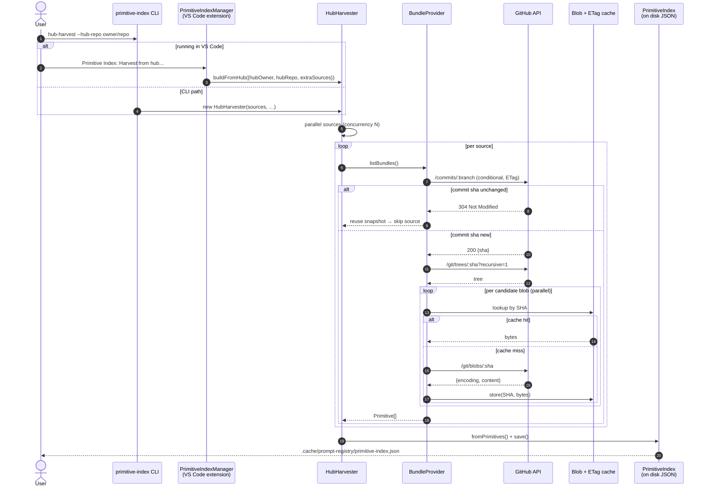
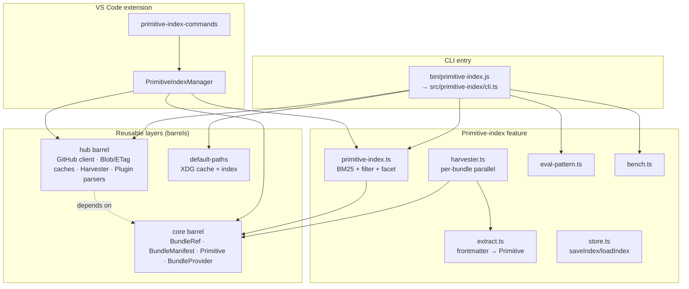
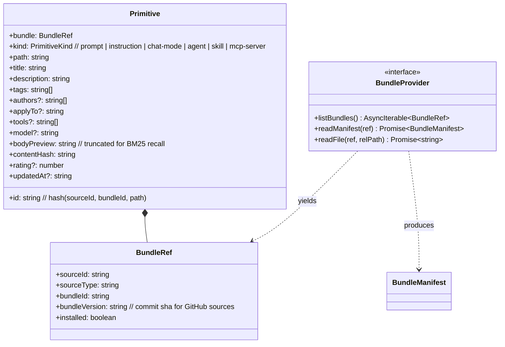
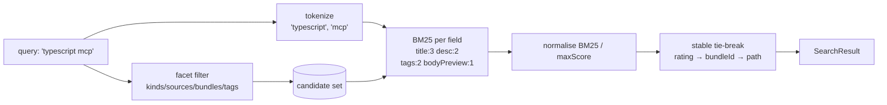
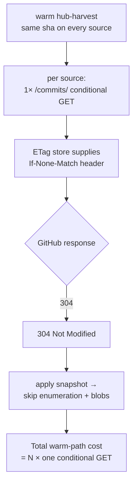

# Primitive Index — developer architecture

This document is the contributor-facing "engine-room" view of the
primitive index: the lifecycle, layers, data flow, and extension
points. For the product-level user guide, see
[`../user-guide/primitive-index.md`](../user-guide/primitive-index.md).
For the authoritative written spec with the BM25 math and ranking
tuning, see [`spec-primitive-index.md`](spec-primitive-index.md).

## High-level lifecycle



## Layer map



All hub / bundle / primitive machinery is pure TypeScript with **zero
VS Code dependencies** — the extension consumes the same API surface
that the CLI does.

## Primitive data shape



Every bundle source — `GitHubSingleBundleProvider`,
`AwesomeCopilotPluginBundleProvider`, `LocalFolderBundleProvider` —
implements the same three-method `BundleProvider` interface. Adding a
new source type = drop a class in `hub/`, wire it into
`HubHarvester.processSource()`'s dispatch on `spec.type`, register it
on the `hub/index.ts` barrel.

## Search ranking



Key properties (from `src/primitive-index/index.ts` + `bm25.ts`):

- **Field weights** (`tuning.ts`): `title=3`, `description=2`, `tags=2`,
  `bodyPreview=1`. Raise title's weight and short titles dominate;
  balance as shown today keeps longer descriptions competitive.
- **IDF is clamped to ≥0** so a term appearing in every document
  contributes zero — no degenerate "return everything".
- **Empty-query fallback** (line 217 of `index.ts`): when `q` is absent
  but facet filters are present, the candidate set is returned with
  score 0 sorted by tie-breakers. A *present-but-non-matching* query
  returns **zero hits** (regression test pins this behaviour).

## Warm-path cost model



On the combined 20-source (343-primitive) live index this yields
**1.3s warm / ~83 HTTP calls** (all 304s). The cost is linear in the
source count, not in the primitive count.

## Extension points

| You want to… | Touch | Don't touch |
|---|---|---|
| Add a new source type (e.g. `gitlab`, `zip-over-http`) | Add `hub/<name>-bundle-provider.ts` implementing `BundleProvider`; register in `HubHarvester.processSource()` and `hub/index.ts` | `harvester.ts` (per-bundle pipeline) |
| Change ranking weights | `primitive-index/tuning.ts` | The BM25 engine (`bm25.ts`) |
| Store extra metadata on primitives | `types.ts` `Primitive` + `extract.ts` | The hub layer — the hub layer doesn't know about primitives |
| Add a new subcommand (list/install/…) | Consume `registry` barrel from `lib/src/registry/` | Internals of `primitive-index/` |
| Expose new facets | `primitive-index/index.ts` `facetCounts()` + `filter()` | `bm25.ts` |

## Testing strategy

- **Pure unit** (no filesystem, no network): `bm25.ts`, `extract.ts`,
  `plugin-manifest.ts`, `extra-source.ts`, `default-paths.ts`,
  `eval-pattern.ts`, `bench.ts`.
- **Adapter-level with fake fetch**: `github-bundle-provider.ts`,
  `plugin-bundle-provider.ts`, `plugin-tree-enumerator.ts`,
  `github-api-client.ts` (nock-style injected `fetch`).
- **End-to-end in-memory**: `hub-harvester.test.ts` drives multi-source
  runs through fake trees; covers skip/error/plugin branches + MCP
  primitive extraction.
- **CLI integration**: `cli.test.ts` builds fixtures on disk, drives
  every subcommand, asserts JSON output and exit codes.
- **Relevance gate (CI-optional)**: `eval-pattern` subcommand + the
  20-query `lib/fixtures/golden-queries.json` golden set. `bench`
  captures p50/p95 + QPS for regression detection.

Run everything:

```bash
cd lib
npm run compile-tests
npm test              # 285+ tests, <5s
npx eslint src test   # 0 errors
```

## See also

- [`spec-primitive-index.md`](spec-primitive-index.md) — authoritative spec.
- [`primitive-index-hub-iterations.md`](primitive-index-hub-iterations.md) — sprint iteration log.
- [`primitive-index-reusable-layers.md`](primitive-index-reusable-layers.md) — barrel namespace guide.
- [`../user-guide/primitive-index.md`](../user-guide/primitive-index.md) — end-user how-to.
- [`../../lib/PRIMITIVE_INDEX_DESIGN.md`](../../lib/PRIMITIVE_INDEX_DESIGN.md) — engine-level design.
