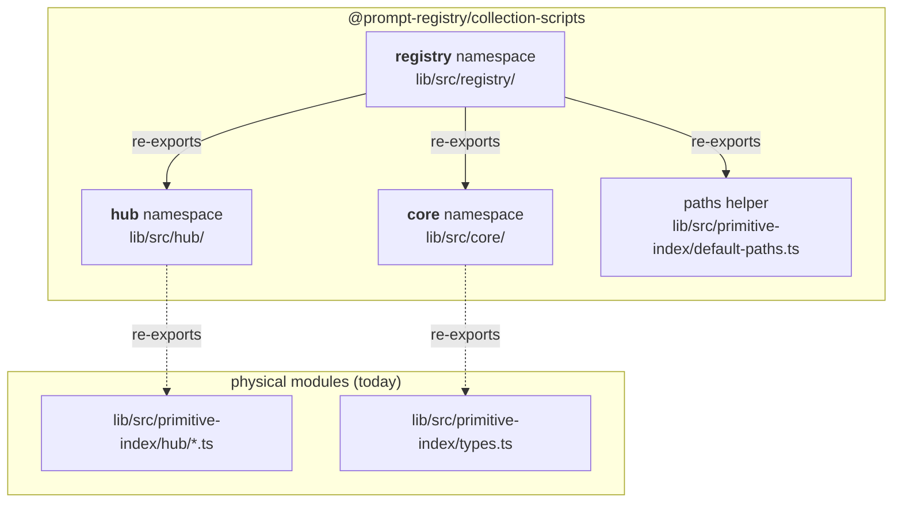
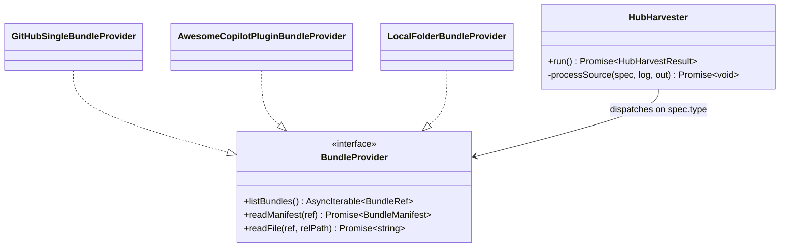

# Reusable layers for a generic prompt-registry CLI

The primitive-index CLI is the first consumer of a planned generic
`prompt-registry` CLI with subcommands like `list`, `install`,
`uninstall`, and `search`. To keep future CLI work friction-free, the
building blocks are exposed via three stable barrel namespaces under
`@prompt-registry/collection-scripts`.

## Namespace map



The physical modules stay under `primitive-index/` today; the barrels
are logical re-exports so future PRs can physically relocate the files
without breaking import sites.

## When to use which

| You are building... | Import from |
|---|---|
| A new subcommand (list / install / uninstall / search) | `import { core, hub, paths } from '@prompt-registry/collection-scripts/registry'` |
| Something that only needs types | `import { BundleProvider, Primitive } from '@prompt-registry/collection-scripts/core'` |
| A one-off script talking to GitHub | `import { GitHubApiClient, BlobCache } from '@prompt-registry/collection-scripts/hub'` |
| Existing primitive-index code | Keep using the direct `primitive-index/...` paths; they still work |

## Hub-level contracts



Every bundle source today — and every bundle source we may add later
— implements the same three-method interface. `HubHarvester` picks the
right provider based on `spec.type`, so adding a new source type (e.g.
npm, git-submodule, zip-over-HTTP) is a self-contained change: drop a
new `BundleProvider` implementation in `hub/`, register it in the
harvester's dispatch, and expose it from the `hub/index.ts` barrel.

## Example: a tiny `list` subcommand

```ts
import {
  core,
  hub,
  paths,
} from '@prompt-registry/collection-scripts/registry';
import { loadIndex } from '@prompt-registry/collection-scripts';

async function listPrimitives(): Promise<void> {
  const idx = loadIndex(paths.defaultIndexFile());
  for (const p of idx.all() as core.Primitive[]) {
    console.log(`[${p.kind}] ${p.title}  (${p.bundle.sourceId}/${p.bundle.bundleId})`);
  }
}
```

The `list` subcommand above uses:
- `core.Primitive` — the shared type (zero-runtime import).
- `paths.defaultIndexFile()` — the XDG-style default resolver.
- `loadIndex()` — the existing persistent-index loader.

And that is all the integration surface a new subcommand needs.

## Example: a tiny `install` subcommand (sketch)

```ts
import { core, hub } from '@prompt-registry/collection-scripts/registry';

async function install(provider: core.BundleProvider, bundleId: string): Promise<void> {
  for await (const ref of provider.listBundles()) {
    if (ref.bundleId !== bundleId) {
      continue;
    }
    const manifest = await provider.readManifest(ref);
    // Delegate to BundleInstaller (from the VS Code extension) or to
    // any other strategy. The hub layer stops here — `install` is a
    // downstream concern.
  }
}
```

## See also

- `lib/PRIMITIVE_INDEX_DESIGN.md` — primitive-index design doc (sections 12a–12c).
- `lib/src/registry/index.ts` — barrel source.
- `lib/src/hub/index.ts` — hub barrel source.
- `lib/src/core/index.ts` — core barrel source.
- `docs/contributor-guide/spec-primitive-index.md` — authoritative spec.
