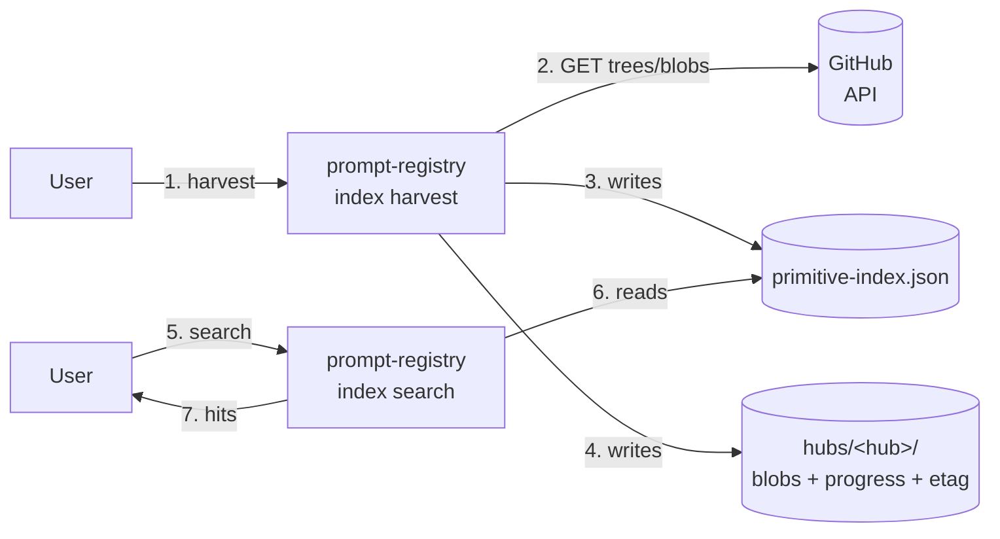

# Primitive Index — user guide

The primitive index is a **local, BM25-backed search engine** for agentic
primitives (agents, chat-modes, instructions, MCP servers, prompts, and
skills) across every Copilot-style bundle published under a registry
hub. One command harvests a hub, another searches it.

## Who should use this?

- **Prompt-pack shoppers** who want to discover a skill/agent/prompt that
  already does what they need, before writing their own.
- **Hub maintainers** reviewing what is (and isn't) covered across their
  federated sources.
- **Extension users** who rely on the VS Code command *"Primitive Index:
  Harvest from hub…"* and the QuickPick search.
- **CI gatekeepers** validating ranking quality via a golden-set.

## Install

From the repository root:

```bash
# One-off build of the library (also needed for contributors).
cd lib
npm install
npm run build
```

The CLI lives at `lib/bin/prompt-registry.js`. Add it to PATH or alias:

```bash
alias prompt-registry='node /path/to/prompt-registry/lib/bin/prompt-registry.js'
```

All primitive-index features ship as the `index <verb>` subcommand of the
unified CLI. The legacy standalone `primitive-index` binary was removed in
the `index` consolidation; rewrite every script as
`prompt-registry index <verb> [...]`.

## Authenticate with GitHub

Hub harvesting requires a GitHub token. The CLI resolves one from, in
order:

1. `GITHUB_TOKEN` env var
2. `GH_TOKEN` env var
3. The `gh` CLI (`gh auth status`)

For public repositories a fine-grained PAT with "Public Repositories
(read-only)" is enough.

## Default paths

The CLI writes to an XDG-style cache so **you rarely need flags**:

| What | Default path | Overrides |
|------|--------------|-----------|
| Cache root | `$PROMPT_REGISTRY_CACHE` → `$XDG_CACHE_HOME/prompt-registry` → `~/.cache/prompt-registry` | env var, then `--cache-dir` |
| Index file | `<cache>/primitive-index.json` | `--index` or `--out` |
| Hub cache | `<cache>/hubs/<owner>_<repo>/` | `--cache-dir` |
| Progress log | `<hub-cache>/progress.jsonl` | `--progress` |

On Linux with no overrides: `~/.cache/prompt-registry/primitive-index.json`.

## Lifecycle



**Step 1** hits every source in `hub-config.yml` (plus any
`--extra-source`). **Step 2–4** populate the content-addressed blob
cache and write the searchable index. **Step 5–7** are offline: the
index is a self-contained JSON file you can copy between machines.

Warm re-harvests are near-free because:

- Each source is skipped when its `/commits/` SHA is unchanged (1 HTTP
  round-trip total, answered by a conditional 304).
- Blobs are keyed by git SHA and reused across sources.

## First harvest (validated walkthrough)

```bash
# 1. Harvest the Amadeus hub.
prompt-registry index harvest --hub-repo Amadeus-xDLC/genai.prompt-registry-config

# Expected text output:
#   done=19 error=0 skip=0 primitives=210 wallMs=7200 totalMs=7300
#
# JSON output (-o json) returns the canonical envelope with full stats,
# rate-limit telemetry, and the resolved out-file path.
```

That single command:

1. Downloads + parses the hub's `hub-config.yml`.
2. Harvests every source in parallel (default concurrency: 4).
3. Writes the searchable index to the default path (no flags needed).

### Add the upstream `github/awesome-copilot` plugins

The `awesome-copilot` repo uses the new **plugin layout** (one
`plugin.json` per `plugins/<id>/.github/plugin/` directory). Inject
it without editing `hub-config.yml`:

```bash
prompt-registry index harvest \
  --hub-repo Amadeus-xDLC/genai.prompt-registry-config \
  --extra-source 'id=upstream-ac,type=awesome-copilot-plugin,url=https://github.com/github/awesome-copilot,branch=main,pluginsPath=plugins'
```

Live result (combined 20 sources): **343 primitives / 74 bundles /
7.3s cold / 1.3s warm / 0 errors.**

## Search

```bash
# Plain keyword search (defaults to the default index).
prompt-registry index search --q "code review"

# Filter by kind + source, JSON envelope output.
prompt-registry index search --q "kubernetes" --kinds skill --sources offer-agent-skills -o json

# Explain top hits (show per-field BM25 contributions).
prompt-registry index search --q "typescript mcp" --explain --limit 3
```

**Output formats**: `-o text` (default, human-friendly table), `-o json`
(canonical envelope with `data.hits`/`data.total`), `-o yaml`, `-o ndjson`.

**Filter flags**: `--kinds`, `--sources`, `--bundles`, `--tags`,
`--installed-only`, `--limit`, `--offset`, `--explain`.

### Sample output

```text
$ prompt-registry index search --q "azure pricing"
total: 15  took: 2ms
1.000  [skill] azure-pricing  (upstream-ac/azure-cloud-development)
      Fetches real-time Azure retail pricing using the Azure Retail Prices API…
0.963  [skill] az-cost-optimize  (upstream-ac/azure-cloud-development)
      Analyze Azure resources used in the app and optimize costs…
0.841  [skill] azure-resource-health-diagnose  (upstream-ac/azure-cloud-development)
      Analyze Azure resource health, diagnose issues from logs and telemetry…
```

## Relevance + speed metrics

The project ships with a 20-query **golden set** under
`lib/fixtures/golden-queries.json`. Gate ranking quality in CI:

```bash
prompt-registry index eval --gold lib/fixtures/golden-queries.json
# Cases: 20
# Passed: 20 / 20 (100.0%)
```

And benchmark the search loop:

```bash
prompt-registry index bench --gold lib/fixtures/golden-queries.json --iterations 100
# Throughput: 19,410 queries/sec
# Global median: 0.038 ms / p95: 0.115 ms
```

These numbers are from a 343-primitive live combined index on a
developer laptop. The QuickPick search in the extension easily fits in
the 16ms frame budget even for very broad queries.

## Shortlist + export

The CLI ships with a shortlist workflow so you can curate a personal or
team-wide "favourite" set of primitives and emit a hub-schema-valid
profile YAML.

```bash
# Create a new shortlist.
prompt-registry index shortlist new --name "my-favorites"

# Add a primitive to it (id comes from `index search`).
prompt-registry index shortlist add --id sl_xxx --primitive prim_yyy

# Inspect.
prompt-registry index shortlist list -o json

# Remove an entry.
prompt-registry index shortlist remove --id sl_xxx --primitive prim_yyy
```

When you're happy with the contents, export the shortlist as a hub
profile (and, optionally, as a curated collection bundling the loose
primitives):

```bash
prompt-registry index export \
  --shortlist sl_xxx \
  --profile-id my-shortlist-profile \
  --out-dir ./out \
  --suggest-collection
```

## Troubleshooting

| Symptom | Likely cause | Fix |
|---------|--------------|-----|
| `error[INDEX.NOT_FOUND]: index not found …` | Ran `index search`/`index stats`/etc. before harvesting | `prompt-registry index harvest --hub-repo …` first |
| `error[USAGE.MISSING_FLAG]: index harvest: --hub-repo …` | Forgot the hub repo (and didn't pass `--no-hub-config` / `--hub-config-file`) | Add `--hub-repo OWNER/REPO` |
| `No GitHub token available` | No env var + no gh CLI | `export GITHUB_TOKEN=...` or `gh auth login` |
| Harvest fetches everything every run | Missing ETag store | Pass the same `--cache-dir` / default path every time |

All commands honour `-o json` and emit the canonical envelope
(`{schemaVersion, command, status, data, errors, warnings, meta}`),
so scripts can branch on `errors[0].code` (e.g. `INDEX.NOT_FOUND`,
`INDEX.SHORTLIST_NOT_FOUND`, `USAGE.MISSING_FLAG`).

## See also

- [`docs/contributor-guide/spec-primitive-index.md`](../contributor-guide/spec-primitive-index.md) — authoritative design spec.
- [`lib/PRIMITIVE_INDEX_DESIGN.md`](../../lib/PRIMITIVE_INDEX_DESIGN.md) — engine-level design.
- [`docs/contributor-guide/primitive-index-reusable-layers.md`](../contributor-guide/primitive-index-reusable-layers.md) — reusable barrels for future CLI subcommands.
- [`docs/reference/commands.md`](../reference/commands.md) — VS Code commands reference.
