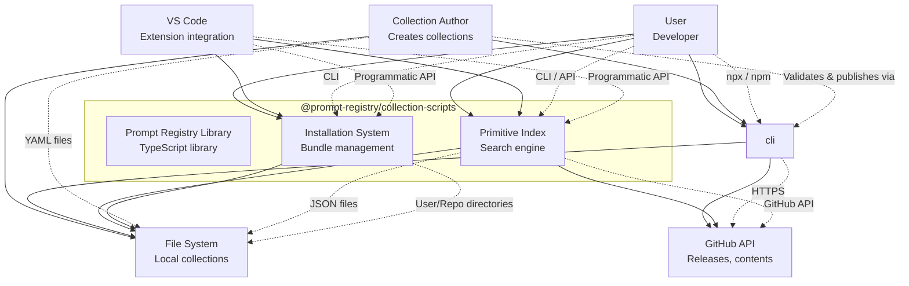

# @prompt-registry/collection-scripts Documentation

Comprehensive documentation for the Prompt Registry library.

## Documentation Structure

```
docs/
├── README.md                    # This file
├── architecture/                # C4 Model diagrams and architecture
│   ├── c4-system-context.md     # System Context diagram (Level 1)
│   ├── c4-container.md          # Container diagram (Level 2)
│   ├── c4-component.md          # Component diagrams (Level 3)
│   └── data-flow.md             # Key data flows
├── developer-guide/             # Developer documentation
│   ├── getting-started.md
│   ├── cli-framework.md
│   ├── primitive-index.md
│   ├── installation-system.md
│   └── testing.md
└── reference/                   # API reference
    ├── public-api.md
    ├── cli-commands.md
    └── types.md
```

## Quick Navigation

| Role | Start Here |
|------|-----------|
| **Library User** | [User Guide](../README.md) |
| **CLI Developer** | [CLI Framework](./developer-guide/cli-framework.md) |
| **Contributor** | [Getting Started](./developer-guide/getting-started.md) |
| **Architect** | [C4 System Context](./architecture/c4-system-context.md) |

## Architecture Overview (C4 Level 1)



## Key Capabilities

### 1. Collection Management
- **Validate**: YAML schema validation with helpful error messages
- **Build**: Create deterministic ZIP bundles from collections
- **Publish**: GitHub release automation with affected collection detection

### 2. Primitive Index
- **Search**: BM25-based full-text search over agentic primitives
- **Harvest**: Lazy loading from GitHub hubs with smart caching
- **Export**: Convert shortlists to installable profiles

### 3. Installation System
- **Multi-target**: Install to VS Code, Copilot CLI, Kiro, Windsurf
- **Scoped**: User, workspace, or repository-level installation
- **Lockfile**: Git-trackable installation state

## See Also

- [Architecture](./architecture/) — C4 Model diagrams
- [Developer Guide](./developer-guide/) — Implementation details
- [Reference](./reference/) — API documentation
