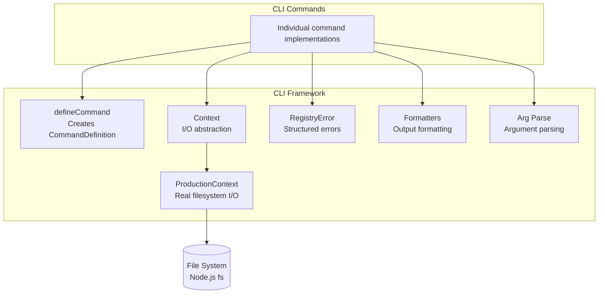
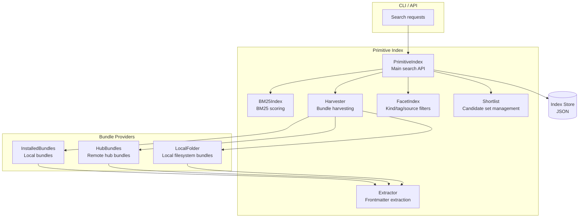
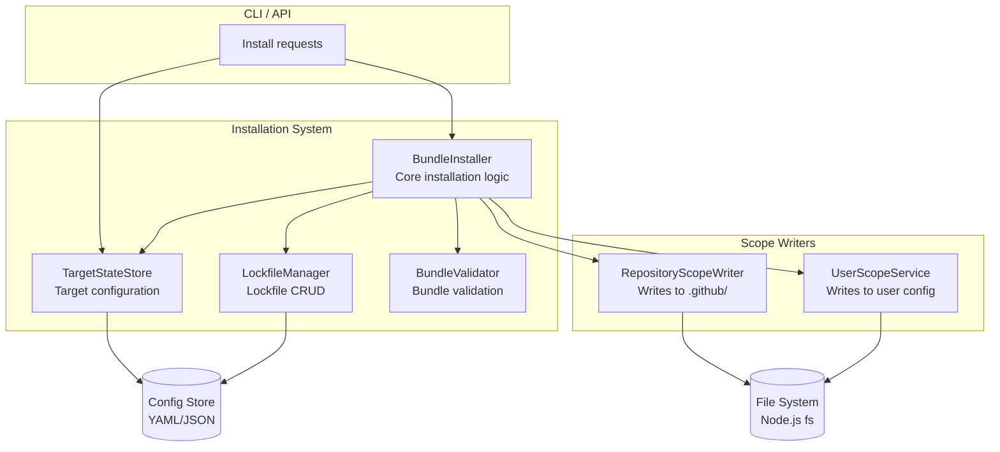
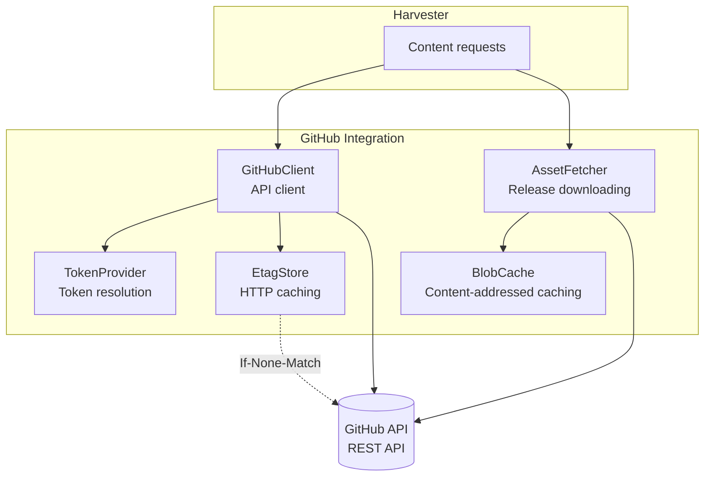
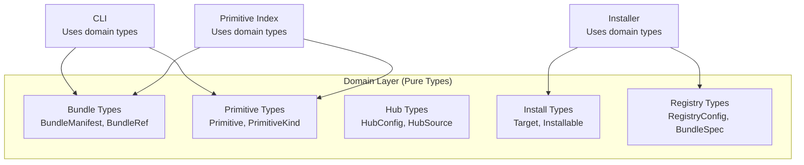
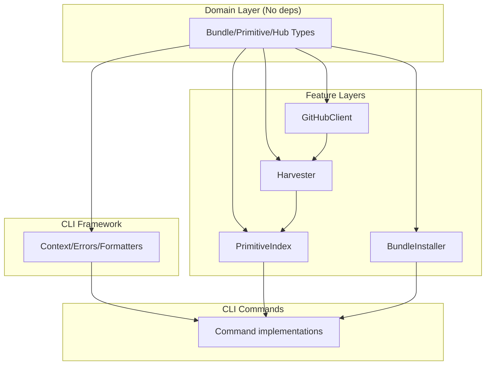

# C4 Component Diagrams (Level 3)

Detailed component diagrams for key subsystems.

## CLI Framework Components

### Key Components

| Component | Responsibility | Key Methods/Properties |
|-----------|----------------|------------------------|
| `defineCommand` | Factory for command definitions | `defineCommand(opts): CommandDefinition` |
| `Context` | I/O abstraction | `cwd()`, `fs.*`, `stdout`, `stderr`, `env` |
| `RegistryError` | Structured errors | `code`, `message`, `hint`, `context`, `toJSON()` |
| `Formatters` | Output formatting | `formatOutput()`, `renderError()` |
| `ArgParse` | Argument parsing | `parseSingleArg()`, `parseMultiArg()`, `hasFlag()` |

---

## Primitive Index Components

### Key Components

| Component | Responsibility | Key Methods |
|-----------|----------------|-------------|
| `PrimitiveIndex` | Search API | `search()`, `facet()`, `shortlist()`, `exportProfile()` |
| `BM25Index` | BM25 scoring | `index()`, `search()`, `scoreTerm()` |
| `Harvester` | Bundle discovery | `harvest()`, `harvestBundle()` |
| `Extractor` | Content parsing | `extractFromFile()`, `extractMcpPrimitives()` |
| `FacetIndex` | Filtering | `filter()`, `intersect()` |
| `Shortlist` | Candidate sets | `create()`, `add()`, `remove()`, `list()` |

---

## Installation System Components

### Key Components

| Component | Responsibility | Key Methods |
|-----------|----------------|-------------|
| `BundleInstaller` | Installation orchestration | `install()`, `uninstall()` |
| `TargetStateStore` | Target management | `add()`, `remove()`, `list()`, `get()` |
| `LockfileManager` | Lockfile operations | `addBundle()`, `removeBundle()`, `load()` |
| `BundleValidator` | Bundle validation | `validateBundle()`, `validateManifest()` |
| `RepositoryScopeWriter` | Repo-scoped writes | `install()`, `remove()` |
| `UserScopeService` | User-scoped writes | `install()`, `remove()` |

---

## GitHub Integration Components

### Key Components

| Component | Responsibility | Key Methods |
|-----------|----------------|-------------|
| `GitHubClient` | API operations | `getContents()`, `getTree()`, `getRateLimit()` |
| `AssetFetcher` | Release downloads | `fetchAsset()`, `fetchBundle()` |
| `BlobCache` | Content caching | `get()`, `set()`, `has()` |
| `EtagStore` | HTTP caching | `getEtag()`, `setEtag()` |
| `TokenProvider` | Auth tokens | `getToken()`, `resolveToken()` |

---

## Domain Layer Components

### Key Types

| Type | Purpose | Key Properties |
|------|---------|----------------|
| `BundleManifest` | Bundle metadata | `id`, `version`, `name`, `items[]` |
| `Primitive` | Union of all kinds | `kind`, `id`, `title/description` |
| `HubConfig` | Hub definition | `sources[]`, `id`, `name` |
| `Target` | Install destination | `id`, `type`, `path` |
| `RegistryConfig` | Settings | `targets[]`, `sources[]` |

## Component Dependencies

**Key Rule**: Domain has no dependencies. Feature layers depend only on Domain and Framework. CLI depends on everything.

## See Also

- [System Context](./c4-system-context.md) — External view
- [Container Diagram](./c4-container.md) — High-level containers
- [Data Flow](./data-flow.md) — Process flows
