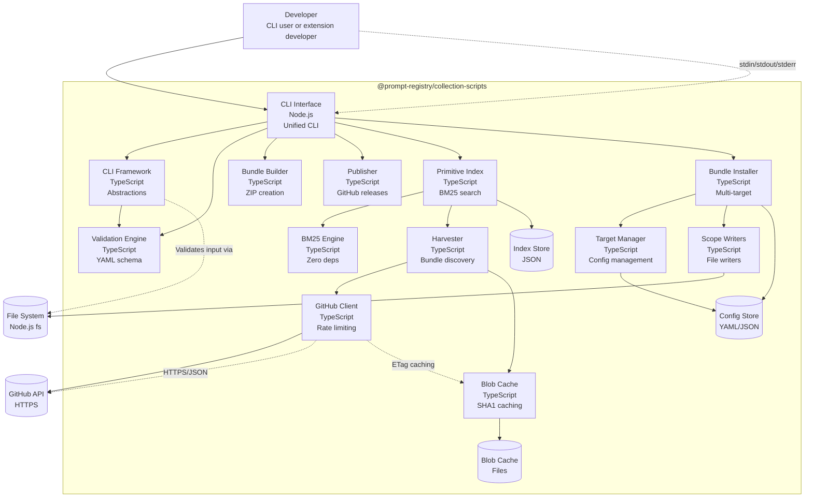

# C4 Container Diagram (Level 2)

The Container diagram shows the high-level technology choices and how responsibilities are distributed.

## Diagram

## Container Descriptions

### CLI Interface
The entry point for users. Provides a unified `prompt-registry` binary with subcommands:
- `collection validate|list`
- `bundle build|manifest`
- `index search|harvest|shortlist`
- `install|target|doctor`

**Technology**: Node.js 18+, TypeScript, compiled to JavaScript

### CLI Framework
Abstractions that make CLI commands testable and framework-agnostic:
- **Context**: I/O abstraction (fs, stdout, env)
- **CommandDefinition**: Standard command interface
- **RegistryError**: Structured error types
- **Formatters**: Text, JSON, YAML, ndjson output

### Validation Engine
Schema validation for collection YAML files:
- Collection ID format (lowercase, kebab-case)
- Semantic version validation
- Item kind validation (prompt, skill, agent, etc.)
- File existence checks
- Cross-reference validation

### Bundle Builder
Creates reproducible ZIP bundles:
- Deterministic timestamps (fixed to 1980-01-01)
- Sorted file entries
- Maximum compression
- Includes deployment manifest

### Primitive Index
The core search engine:
- BM25 full-text search
- Faceted filtering (kind, tag, source)
- Shortlist management
- Profile export
- Resumable harvesting

### Harvester
Discovers and fetches bundle content:
- GitHub API integration
- Local folder providers
- Smart caching with ETags
- Concurrent fetching with rate limiting
- Progress tracking (JSONL)

### Bundle Installer
Multi-target installation system:
- Validates bundles before install
- Handles target-specific paths
- Manages lockfiles
- Supports rollback on failure

### GitHub Client
GitHub API integration:
- Rate limit awareness
- Exponential backoff with jitter
- ETag caching for 304 responses
- Token resolution (env, gh CLI)

### Storage
- **Index Store**: JSON files with schema versioning
- **Blob Cache**: Content-addressed SHA1 storage
- **Config Store**: YAML configs and JSON lockfiles

## Container Relationships

| From | To | Relationship |
|------|-----|--------------|
| CLI | Framework | Uses for I/O abstraction |
| CLI | Validation | Validates collections |
| CLI | Builder | Creates bundles |
| CLI | Publisher | Manages releases |
| CLI | Index | Searches primitives |
| CLI | Installer | Installs bundles |
| Index | Harvester | Populates from sources |
| Harvester | GitHub | Fetches content |
| Installer | Targets | Manages destinations |
| Installer | Scopes | Writes files |

## Technology Choices

| Component | Technology | Rationale |
|-----------|-----------|-----------|
| Language | TypeScript | Type safety, VS Code ecosystem |
| Runtime | Node.js 18+ | Matches VS Code's Node version |
| Search | Hand-rolled BM25 | Zero deps, deterministic, inspectable |
| HTTP | axios | Familiar, interceptors for retry |
| YAML | js-yaml | Already a dependency |
| ZIP | adm-zip | Pure JS, no native deps |
| Testing | Mocha + Chai | Existing test suite |

## See Also

- [System Context](./c4-system-context.md) — External relationships
- [Component Diagrams](./c4-component.md) — Detailed internals
- [Data Flow](./data-flow.md) — Process flows
