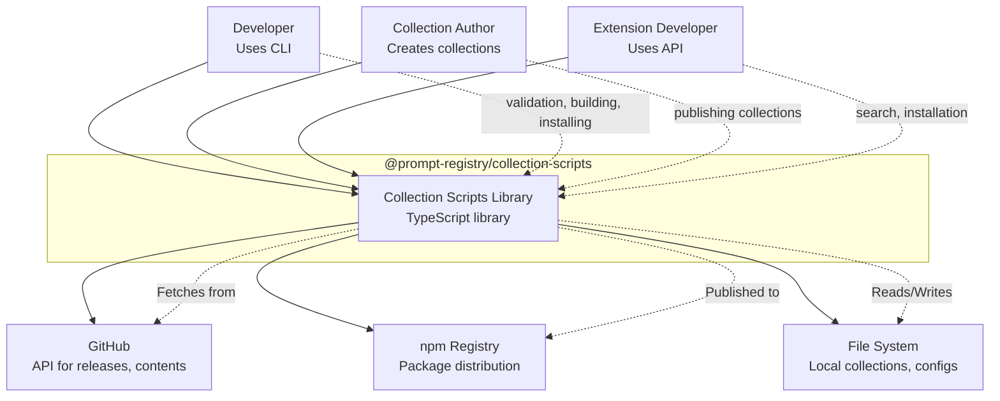

# C4 System Context (Level 1)

The System Context diagram shows the library as a black box and its relationships with users and external systems.

## Diagram

## Personas

### Developer
Uses the CLI tools for day-to-day operations:
- Validate collection YAML files
- Build and publish bundles
- Search for primitives in hubs
- Install bundles to their development environment

### Collection Author
Creates and maintains prompt collections:
- Defines collection metadata in YAML
- Creates primitive content (prompts, skills, agents)
- Publishes collections to GitHub releases
- Manages versioning with semantic versioning

### Extension Developer
Integrates the library into VS Code extensions or other tools:
- Uses the PrimitiveIndex API for search
- Uses the installation system for bundle management
- Leverages the domain types for type safety

## External Systems

### GitHub
Primary integration point for:
- **Releases**: Download published collection bundles
- **Contents**: Fetch hub configuration files
- **Trees**: Enumerate repository contents for harvesting
- **Rate Limiting**: Respects GitHub API limits with backoff

### npm Registry
Distribution channel:
- Package published as `@prompt-registry/collection-scripts`
- Consumed via `npx` or `npm install`
- Supports provenance attestation for supply chain security

### File System
Local storage for:
- **Collections**: YAML files defining primitives
- **Configuration**: `prompt-registry.yml` for targets
- **Cache**: Primitive index and blob cache
- **Lockfiles**: `prompt-registry.lock.json` for repo installs

## User Stories

| As a... | I want to... | So that... |
|---------|-------------|------------|
| Developer | Validate my collection YAML | I catch errors before publishing |
| Collection Author | Build a deterministic bundle | Users get identical content |
| Extension Developer | Search primitives by keyword | I can recommend relevant prompts |
| Developer | Install a bundle to VS Code | I can use the primitives immediately |
| Collection Author | Detect affected collections on commit | I only publish what changed |

## See Also

- [Container Diagram](./c4-container.md) — Internal architecture
- [Component Diagrams](./c4-component.md) — Detailed component views
- [Data Flow](./data-flow.md) — Key process flows
