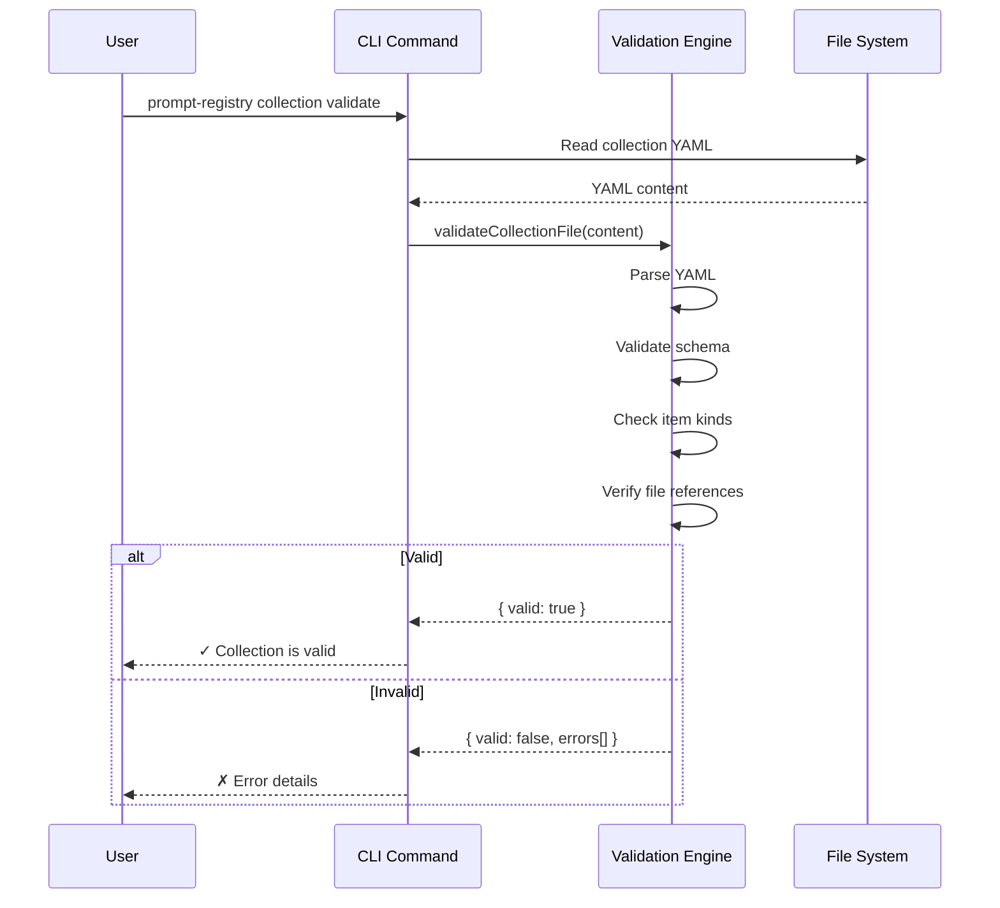
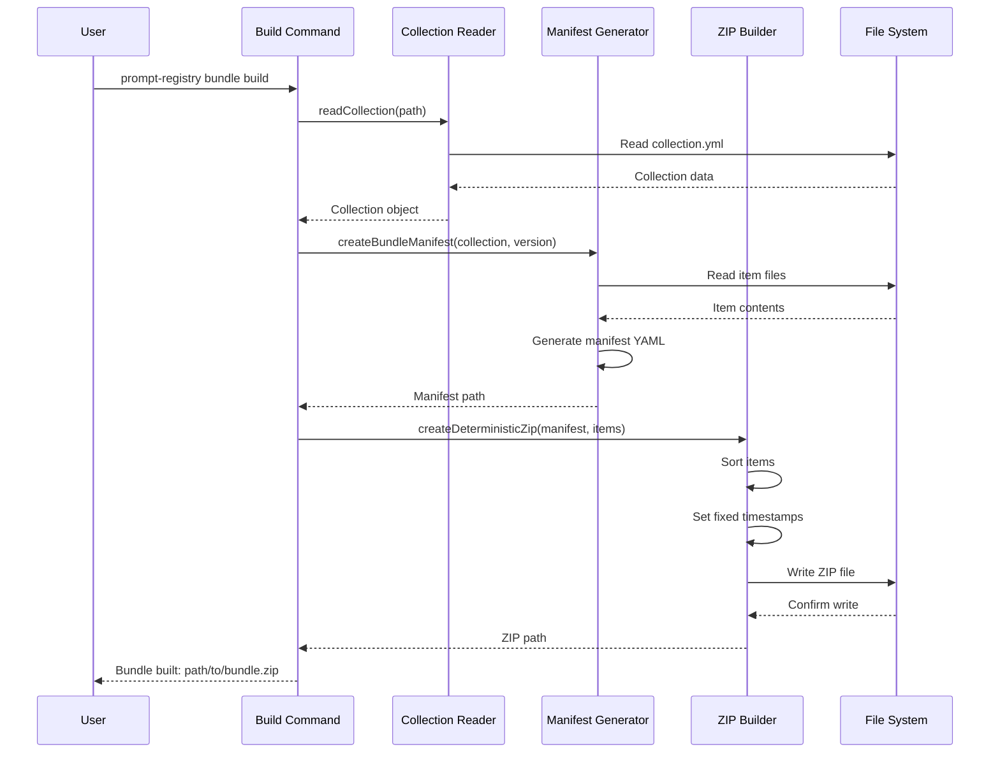
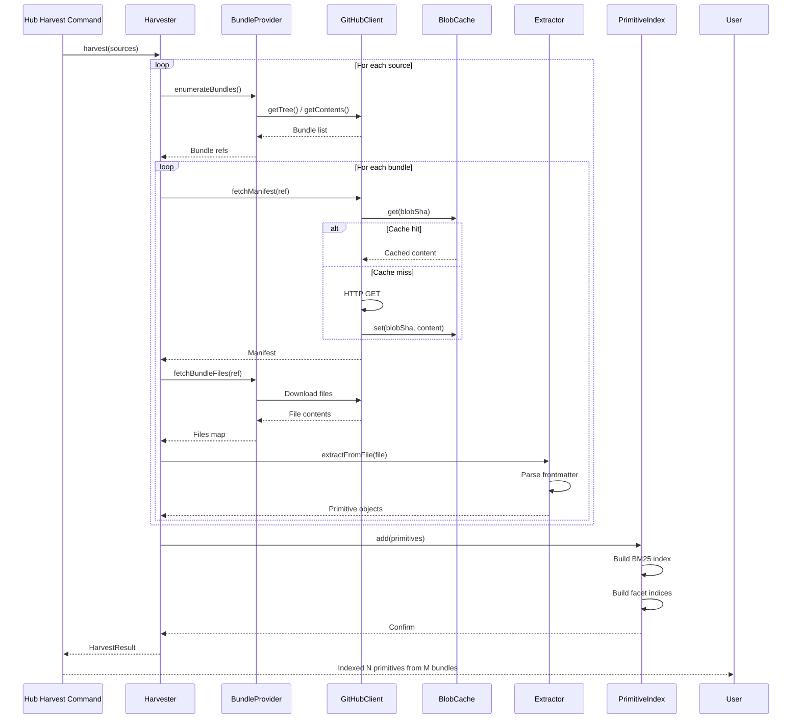
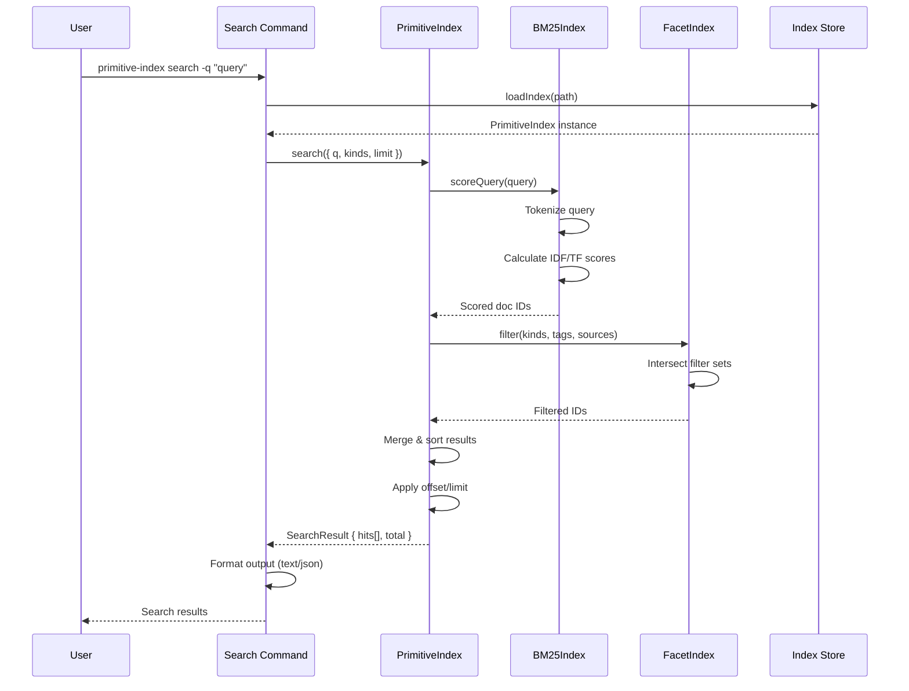
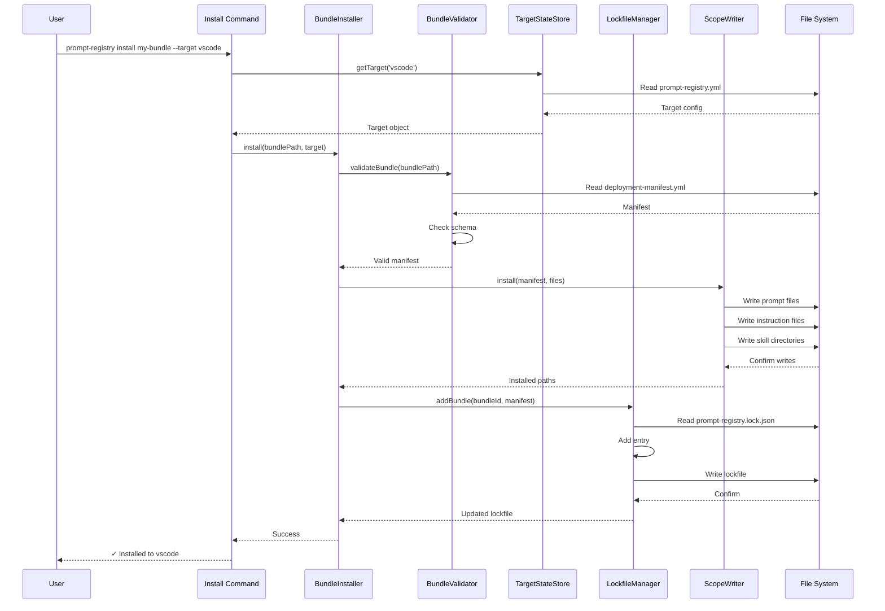
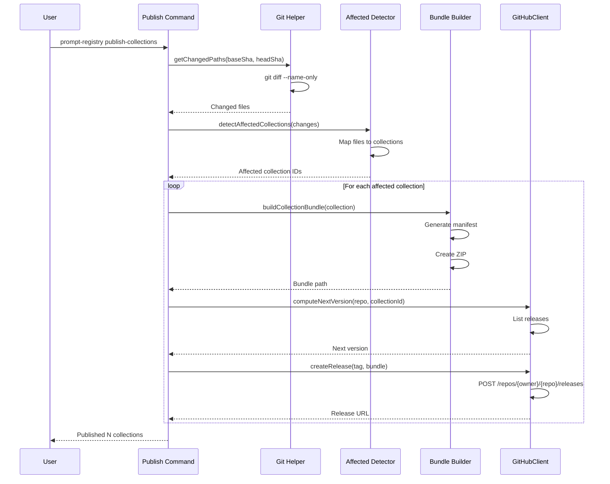
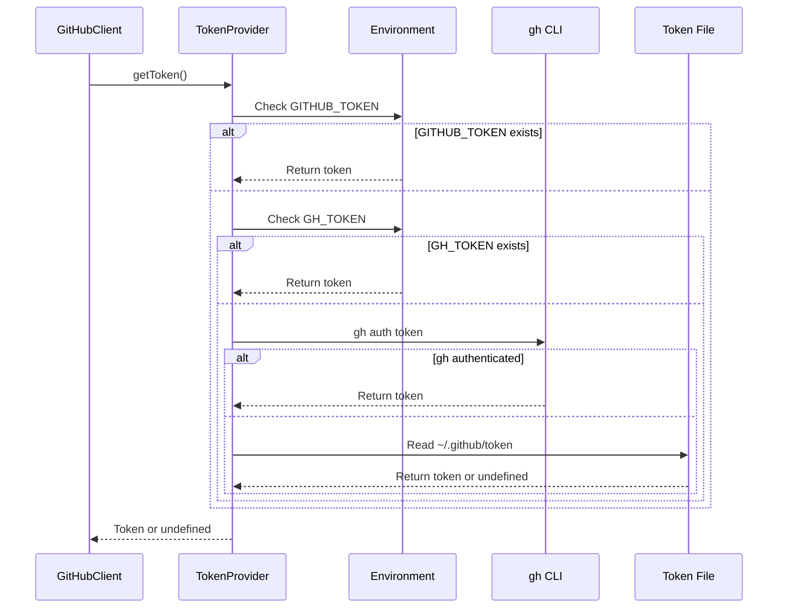
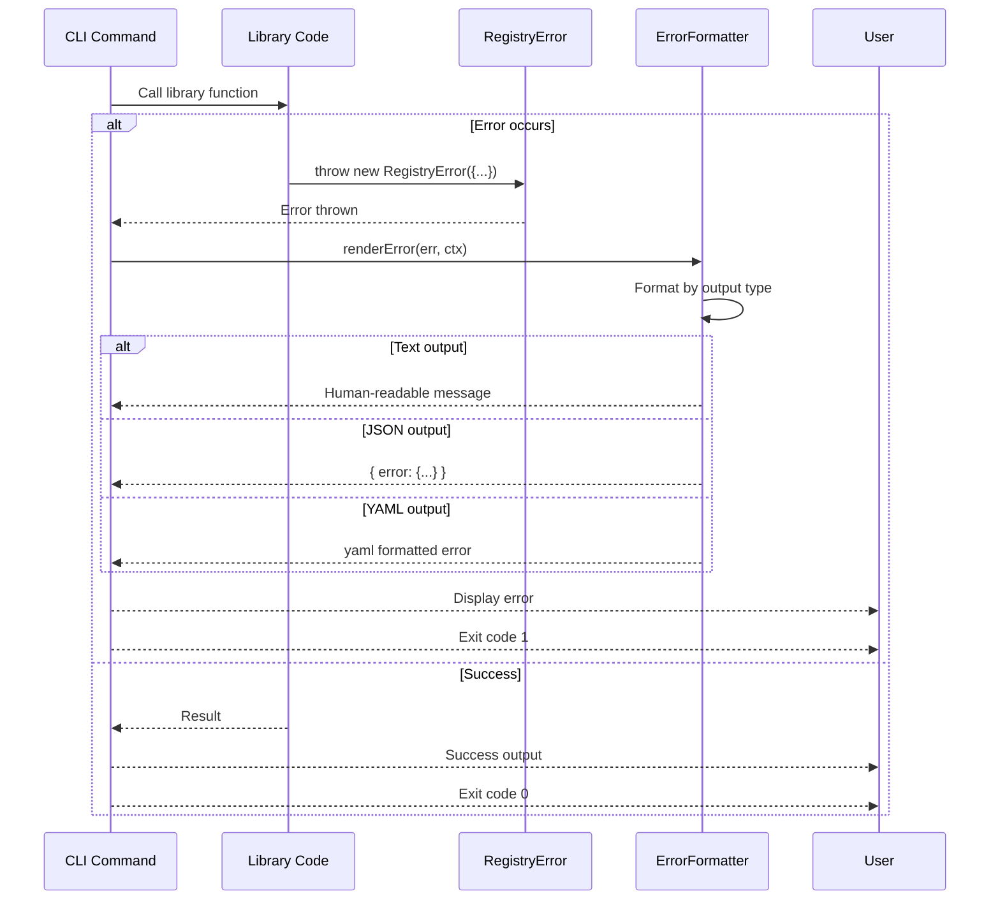

# Key Data Flows

Sequence diagrams showing how data flows through the system for key operations.

## 1. Collection Validation Flow

## 2. Bundle Build Flow

## 3. Primitive Index Harvest Flow

## 4. Search Flow

## 5. Bundle Installation Flow

## 6. Publish Flow

## 7. Token Resolution Flow

## 8. Error Handling Flow

## Performance Characteristics

| Flow | Typical Duration | Bottleneck |
|------|-----------------|------------|
| Collection validation | <100ms | YAML parsing |
| Bundle build | 1-5s | File I/O + ZIP compression |
| Cold index harvest | 7-30s | GitHub API calls |
| Warm index harvest | 1-3s | ETag 304 responses |
| Search query | <10ms | BM25 scoring (in-memory) |
| Bundle install | <1s | File writes |
| Publish | 10-60s | GitHub release creation |

## Error Recovery

| Flow | Failure Mode | Recovery |
|------|--------------|----------|
| Harvest | Network error | Retry with exponential backoff |
| Harvest | Partial failure | Resume from progress log |
| Install | Target not found | Suggest running target add |
| Install | Validation fail | Report specific errors |
| Publish | Rate limit | Wait and retry |
| Search | Index missing | Suggest running harvest |

## See Also

- [System Context](./c4-system-context.md) — External view
- [Container Diagram](./c4-container.md) — High-level containers
- [Component Diagrams](./c4-component.md) — Detailed internals
