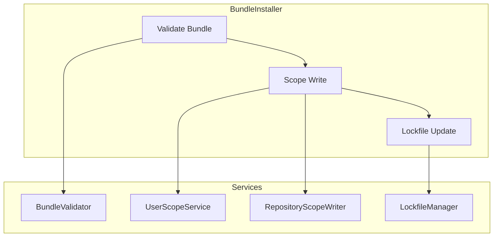

# Installation System Developer Guide

Guide for working with the bundle installation system.

## Overview

The installation system manages bundle installation to various targets with support for multiple scopes.

**Key Features:**
- Multi-target installation (VS Code, Copilot CLI, Kiro, Windsurf)
- Three scopes: user, workspace, repository
- Lockfile tracking for repository scope
- Atomic operations with rollback
- Target-specific path resolution

## Architecture



## Key Components

### 1. BundleInstaller

Orchestrates the installation process:

```typescript
import { BundleInstaller } from './install';

const installer = new BundleInstaller({
  targetStore,
  lockfileManager,
  userScopeService,
  repositoryScopeWriter
});

// Install
await installer.install({
  bundlePath: './my-bundle/',
  targetId: 'my-vscode',
  scope: 'repository'
});

// Uninstall
await installer.uninstall({
  bundleId: 'my-bundle',
  targetId: 'my-vscode',
  scope: 'repository'
});
```

### 2. TargetStateStore

Manages target configurations:

```typescript
import { TargetStateStore } from './target-state-store';

const store = new TargetStateStore(configDir);

// Add target
await store.addTarget({
  id: 'my-vscode',
  type: 'vscode',
  path: '/custom/path'  // Optional override
});

// Get target
const target = await store.getTarget('my-vscode');
// → { id, type, path }

// List targets
const targets = await store.listTargets();
```

### 3. Scope Writers

#### UserScopeService

Writes to user configuration directories:

```typescript
import { UserScopeService } from './user-scope-service';

const service = new UserScopeService();

await service.install(bundleId, manifest, files, target);
// Writes to:
// - ~/.config/Code/User/prompts/ (Linux)
// - ~/Library/Application Support/Code/User/prompts/ (macOS)
// - %APPDATA%/Code/User/prompts/ (Windows)
```

#### RepositoryScopeWriter

Writes to `.github/` directory:

```typescript
import { RepositoryScopeWriter } from './repository-scope-writer';

const writer = new RepositoryScopeWriter(workspaceRoot);

await writer.install(bundleId, manifest, files);
// Writes to:
// - .github/prompts/
// - .github/instructions/
// - .github/skills/
```

### 4. LockfileManager

Manages `prompt-registry.lock.json`:

```typescript
import { LockfileManager } from './lockfile-manager';

const manager = new LockfileManager(workspaceRoot);

// Add bundle
await manager.addBundle({
  id: 'my-bundle',
  version: '1.0.0',
  installedAt: new Date().toISOString(),
  manifest: deploymentManifest
});

// Load lockfile
const lockfile = await manager.load();
// → { version, bundles: [...] }

// Remove bundle
await manager.removeBundle('my-bundle');
```

## Installation Flow

### 1. Validation

```typescript
// Validate bundle structure
const manifest = await validator.validateBundle(bundlePath);

// Checks:
// - deployment-manifest.yml exists
// - Schema is valid
// - All referenced files exist
// - Version matches
```

### 2. Scope Selection

```typescript
// Determine installation directory based on scope
switch (scope) {
  case 'user':
    baseDir = userScopeService.getTargetPath(target);
    break;
  case 'workspace':
    baseDir = workspaceConfigDir;
    break;
  case 'repository':
    baseDir = path.join(workspaceRoot, '.github');
    break;
}
```

### 3. File Writing

```typescript
// Write files to appropriate directories
for (const [bundlePath, content] of files) {
  const targetPath = mapBundlePathToTarget(bundlePath);
  await fs.writeFile(targetPath, content);
}

// Mappings:
// - prompts/* → .github/prompts/
// - instructions/* → .github/instructions/
// - skills/* → .github/skills/
```

### 4. Lockfile Update (Repository Scope)

```typescript
// Add entry to lockfile
await lockfileManager.addBundle({
  id: bundleId,
  version: manifest.version,
  installedAt: new Date().toISOString(),
  manifest: deploymentManifest
});
```

## Target Types

### Reserved Target Types

| Type | Default Path | Description |
|------|-------------|-------------|
| `vscode` | `~/.config/Code/User/` | VS Code stable |
| `vscode-insiders` | `~/.config/Code - Insiders/User/` | VS Code Insiders |
| `copilot-cli` | Platform-specific | GitHub Copilot CLI |
| `kiro` | Platform-specific | Kiro IDE |
| `windsurf` | Platform-specific | Windsurf IDE |

### Target Resolution

```typescript
// Resolve target path
function resolveTargetPath(target: Target): string {
  if (target.path) {
    // Custom path specified
    return target.path;
  }
  
  // Use default based on type and platform
  switch (target.type) {
    case 'vscode':
      return getVSCodeUserPath();
    // ...
  }
}
```

## File Mappings

### Collection Items to Target Paths

```typescript
const mappings: Record<string, string> = {
  // Prompts
  'prompts/*.md': 'prompts/',
  
  // Instructions
  'instructions/*.md': 'instructions/',
  
  // Skills (special handling)
  'skills/*/SKILL.md': 'skills/*/',
  'skills/*/*.md': 'skills/*/*.md',
  
  // Chat modes
  'chat-modes/*.md': 'chat-modes/',
  
  // Agents
  'agents/*.md': 'agents/'
};
```

### Skill Directory Handling

Skills are directories, not single files:

```typescript
// Bundle structure:
// skills/my-skill/
//   SKILL.md
//   helper.md

// Installed to:
// .github/skills/my-skill/
//   SKILL.md
//   helper.md
```

## Atomic Operations

### Install with Rollback

```typescript
const writtenFiles: string[] = [];

try {
  // Write files, track for rollback
  for (const [src, dest] of fileMap) {
    await fs.writeFile(dest, await fs.readFile(src));
    writtenFiles.push(dest);
  }
  
  // Update lockfile
  await lockfileManager.addBundle(bundleInfo);
  
} catch (error) {
  // Rollback on failure
  for (const file of writtenFiles) {
    await fs.unlink(file).catch(() => {});
  }
  throw error;
}
```

## Testing Installation

### Mock Setup

```typescript
import mockFs from 'mock-fs';

beforeEach(() => {
  mockFs({
    'bundle/': {
      'deployment-manifest.yml': '...',
      'prompts/': {
        'test.md': 'content'
      }
    }
  });
});

afterEach(() => {
  mockFs.restore();
});
```

### Test Installation

```typescript
it('should install to repository scope', async () => {
  const installer = createInstaller();
  
  await installer.install({
    bundlePath: 'bundle/',
    targetId: 'my-vscode',
    scope: 'repository'
  });
  
  // Verify files written
  expect(await fs.exists('.github/prompts/test.md')).to.be.true;
  
  // Verify lockfile updated
  const lockfile = JSON.parse(
    await fs.readFile('prompt-registry.lock.json', 'utf-8')
  );
  expect(lockfile.bundles).to.have.length(1);
});
```

## Error Handling

### Common Errors

```typescript
// Target not found
throw new RegistryError({
  code: 'INSTALL.TARGET_NOT_FOUND',
  message: `Target '${targetId}' not found`,
  hint: 'Run "prompt-registry target add" to create it'
});

// Invalid bundle
throw new RegistryError({
  code: 'INSTALL.INVALID_BUNDLE',
  message: 'Bundle validation failed',
  hint: 'Check deployment-manifest.yml exists and is valid'
});

// Permission denied
throw new RegistryError({
  code: 'FS.PERMISSION_DENIED',
  message: `Cannot write to ${path}`,
  hint: 'Check file permissions or run with appropriate privileges'
});
```

## Best Practices

### 1. Validate Before Install

Always validate the bundle before attempting installation:

```typescript
const manifest = await validator.validateBundle(bundlePath);
if (!manifest) {
  return 1;  // Validation failed
}
```

### 2. Atomic Writes

Write to temporary location, then rename:

```typescript
const tmpPath = `${dest}.tmp.${Date.now()}`;
await fs.writeFile(tmpPath, content);
await fs.rename(tmpPath, dest);
```

### 3. Backup Before Destructive Operations

```typescript
if (await fs.exists(dest)) {
  await fs.copyFile(dest, `${dest}.backup`);
}
```

### 4. Clean Up Temp Files

```typescript
finally {
  await fs.unlink(tmpPath).catch(() => {});
}
```

## Platform Differences

### Path Handling

```typescript
// Always use path.join()
const fullPath = path.join(baseDir, 'prompts', fileName);

// Never hardcode separators
// ❌ Bad: baseDir + '/prompts/' + fileName
```

### VS Code Paths

```typescript
function getVSCodeUserPath(): string {
  const home = os.homedir();
  
  switch (process.platform) {
    case 'darwin':
      return path.join(home, 'Library', 'Application Support', 'Code', 'User');
    case 'win32':
      return path.join(process.env.APPDATA!, 'Code', 'User');
    default:
      return path.join(home, '.config', 'Code', 'User');
  }
}
```

## See Also

- [Data Flow](../architecture/data-flow.md) — Installation sequence diagram
- [C4 Component](../architecture/c4-component.md) — Component diagram
- [CLI Framework](./cli-framework.md) — Install command implementation
