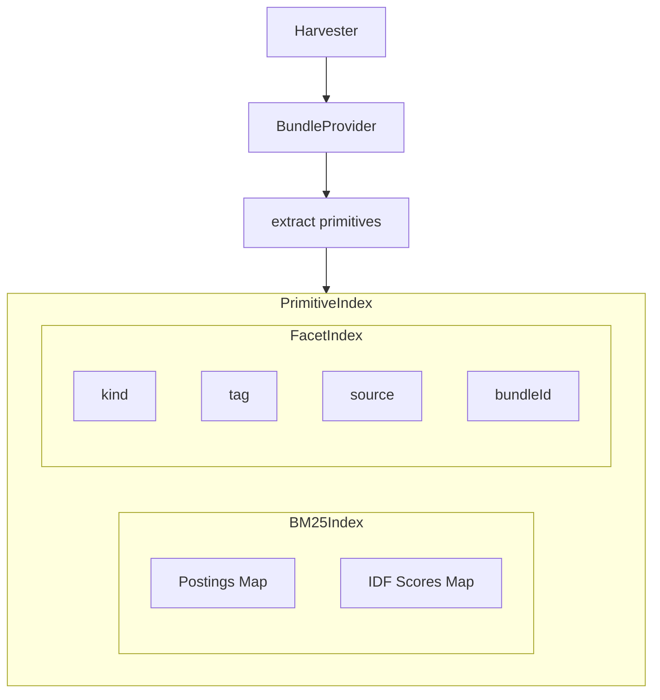

# Primitive Index Developer Guide

Guide for working with the primitive indexing and search system.

## Overview

The Primitive Index is a LLM-free, deterministic search engine over agentic primitives (prompts, skills, agents, chat-modes, instructions, MCP servers).

**Key Features:**
- BM25 full-text search (hand-rolled, zero dependencies)
- Faceted filtering (kind, tag, source, bundle)
- Shortlist management and profile export
- Resumable harvesting from GitHub hubs
- Content-addressed blob caching
- Smart caching with ETags and commit SHAs

## Architecture



## Core Components

### 1. PrimitiveIndex (Main API)

```typescript
import { PrimitiveIndex } from './primitive-index';

// Build from provider
const idx = await PrimitiveIndex.buildFrom(provider, { cacheDir });

// Search
const results = idx.search({
  q: 'code review',
  kinds: ['prompt'],
  limit: 10,
  explain: true  // Include scoring details
});

// Facet
const prompts = idx.facet({ kind: 'prompt' });

// Shortlist
const shortlist = idx.createShortlist('my-shortlist');
shortlist.add(primitiveId);
```

### 2. BM25Index

Hand-rolled BM25 implementation:

```typescript
import { BM25Index } from './bm25';

const index = new BM25Index({
  k1: 1.2,  // Term saturation
  b: 0.75   // Length normalization
});

// Index documents
index.index(docId, tokens, fieldWeights);

// Search
const scores = index.search(queryTokens, candidateSet);
```

**BM25 Formula:**
```
score = Σ idf(t) * (tf(t,d) * (k1 + 1)) / (tf(t,d) + k1 * (1 - b + b * |d|/avgdl))
```

### 3. Harvester

Discovers and fetches bundle content:

```typescript
import { Harvester } from './harvester';

const harvester = new Harvester({
  provider: bundleProvider,
  cacheDir: './.cache',
  concurrency: 5,
  onEvent: (event) => console.log(event.type)
});

const result = await harvester.harvest();
```

### 4. BundleProvider Interface

```typescript
interface BundleProvider {
  enumerateBundles(): Promise<BundleRef[]>;
  fetchBundle(ref: BundleRef): Promise<Bundle>;
}
```

**Implementations:**
- `InstalledBundles` — Local installed bundles
- `HubBundles` — Remote hub bundles via GitHub
- `LocalFolderBundleProvider` — Local filesystem bundles

## Primitive Extraction

### From Markdown Files

```typescript
import { extractFromFile, detectKindFromPath } from './extract';

// Detect kind from path
const kind = detectKindFromPath('prompts/code-review.prompt.md');
// → 'prompt'

// Extract frontmatter and body
const extracted = await extractFromFile(content, path);
// → { frontmatter: {...}, body: '...' }
```

### Supported Kinds

| Kind | File Pattern | Extracted Fields |
|------|-------------|------------------|
| `prompt` | `*.prompt.md` | title, description, tags |
| `instruction` | `*.instructions.md` | title, applyTo, tags |
| `chat-mode` | `*.chatmode.md` | title, description, tools |
| `agent` | `*.agent.md` | title, description, model |
| `skill` | `skills/*/SKILL.md` | name, description |
| `mcp-server` | From manifest | id, command, url |

### Primitive ID Generation

```typescript
const primitiveId = sha1(
  `${sourceId}|${bundleId}|${relativePath}`
).slice(0, 16);
```

## Search Query Syntax

### Basic Search

```typescript
// Simple term search
idx.search({ q: 'terraform' });

// Multi-term (OR by default)
idx.search({ q: 'code review' });

// Phrase search (exact match)
idx.search({ q: '"pull request"' });
```

### Faceted Search

```typescript
idx.search({
  q: 'review',
  kinds: ['prompt', 'instruction'],
  sources: ['github/awesome-copilot'],
  tags: ['git', 'pr'],
  limit: 10
});
```

### Filtering

```typescript
// Filter only, no text search
idx.facet({ kind: 'skill' });

// Combined with search
idx.search({ q: 'test', kinds: ['skill'] });
```

## Harvesting

### Cold Harvest

```typescript
// Full harvest from hub
const result = await harvester.harvest({ force: true });
// Builds index from scratch
```

### Warm Harvest

```typescript
// Smart rebuild using ETags and commit SHAs
const result = await harvester.harvest({ force: false });
// Only fetches changed content
```

### Resumable Harvest

```typescript
// Uses JSONL progress log
const result = await harvester.harvest({
  progressFile: './progress.jsonl',
  resume: true
});
```

## Caching Strategy

### Blob Cache

Content-addressed caching by SHA1:

```typescript
import { BlobCache } from './blob-cache';

const cache = new BlobCache(cacheDir);

// Get or fetch
const content = await cache.get(sha, async () => {
  return await fetchFromGitHub(sha);
});
```

### ETag Store

HTTP caching for GitHub API:

```typescript
import { EtagStore } from './etag-store';

const store = new EtagStore(cacheDir);
const etag = await store.getEtag(url);

// Include in request headers
const response = await fetch(url, {
  headers: { 'If-None-Match': etag }
});

// Store on 200
if (response.status === 200) {
  await store.setEtag(url, response.headers.get('ETag'));
}
// 304 = use cached
```

## Shortlist Workflow

### Create and Populate

```typescript
// Create shortlist
const shortlist = idx.createShortlist('rust-onboarding');

// Add primitives
shortlist.add('abc123...');
shortlist.add('def456...');

// Remove
shortlist.remove('abc123...');
```

### Export as Profile

```typescript
import { exportShortlistAsProfile } from './export';

const profile = await exportShortlistAsProfile({
  index: idx,
  shortlistId: 'sl_xxx',
  profileId: 'rust-onboarding',
  outDir: './profiles'
});
```

## Performance Tuning

### Index Size

| Corpus Size | Memory | Build Time | Query Time |
|-------------|--------|------------|------------|
| 1k primitives | ~5 MB | ~2s | <1ms |
| 10k primitives | ~20 MB | ~7s | <5ms |
| 25k primitives | ~50 MB | ~20s | <10ms |

### Concurrency

```typescript
// Adjust based on rate limits
const harvester = new Harvester({
  concurrency: 5,  // GitHub API calls
  manifestConcurrency: 3  // Manifest parsing
});
```

### BM25 Parameters

```typescript
const index = new BM25Index({
  k1: 1.2,  // Lower = less term saturation
  b: 0.75   // Lower = less length normalization
});
```

## Testing

### Mock Provider

```typescript
const mockProvider: BundleProvider = {
  enumerateBundles: async () => [
    { id: 'test', version: '1.0.0', url: '...' }
  ],
  fetchBundle: async (ref) => ({
    manifest: { ... },
    files: new Map([['file.md', Buffer.from('content')]])
  })
};

const idx = await PrimitiveIndex.buildFrom(mockProvider);
```

### Golden Query Testing

```typescript
import goldenQueries from '../../test/fixtures/golden-queries.json';

for (const query of goldenQueries) {
  const results = idx.search({ q: query.q, limit: 5 });
  expect(results.hits[0].id).to.equal(query.expectedTopResult);
}
```

## Debugging

### Verbose Logging

```bash
DEBUG=primitive-index:* primitive-index search -q "test"
```

### Index Statistics

```typescript
const stats = idx.stats();
console.log(stats);
// {
//   primitiveCount: 343,
//   bundleCount: 74,
//   termCount: 1247,
//   avgDocLength: 45.2
// }
```

### Explain Scoring

```typescript
const results = idx.search({
  q: 'code review',
  explain: true
});

// results.hits[0].explanation:
// {
//   score: 2.45,
//   term: 'code',
//   field: 'title',
//   weight: 2.0,
//   contribution: 1.23
// }
```

## Common Patterns

### Periodic Refresh

```typescript
// In extension activation
setInterval(async () => {
  await idx.refreshFromHub({ force: false });
}, 30 * 60 * 1000);  // Every 30 minutes
```

### Search on Keystroke

```typescript
// VS Code QuickPick
const idx = await loadIndex();

quickPick.onDidChangeValue(async (value) => {
  const results = idx.search({ q: value, limit: 30 });
  quickPick.items = results.hits.map(h => ({
    label: h.primitive.title,
    description: h.primitive.description
  }));
});
```

### Batch Export

```typescript
const shortlists = idx.listShortlists();
for (const sl of shortlists) {
  await exportShortlistAsProfile({
    index: idx,
    shortlistId: sl.id,
    outDir: './profiles'
  });
}
```

## See Also

- [PRIMITIVE_INDEX_DESIGN.md](../../PRIMITIVE_INDEX_DESIGN.md) — Full design document
- [Data Flow](../architecture/data-flow.md) — Harvest and search flows
- [C4 Component](../architecture/c4-component.md) — Component diagrams
